# System Architecture and Design

## Table of Contents
- [Project Overview](#project-overview)
- [Module Architecture](#module-architecture)
- [Build System Architecture](#build-system-architecture)
- [Test System Architecture](#test-system-architecture)
- [Code Generation Architecture](#code-generation-architecture)
- [Coverage Analysis Flow](#coverage-analysis-flow)
- [Deployment View](#deployment-view)

## Project Overview

The MyDsl Xtext project is a domain-specific language (DSL) implementation that generates C++ and Protobuf code from high-level type definitions. The system uses a multi-module Maven architecture with Tycho for Eclipse plugin development.

### High-Level Architecture

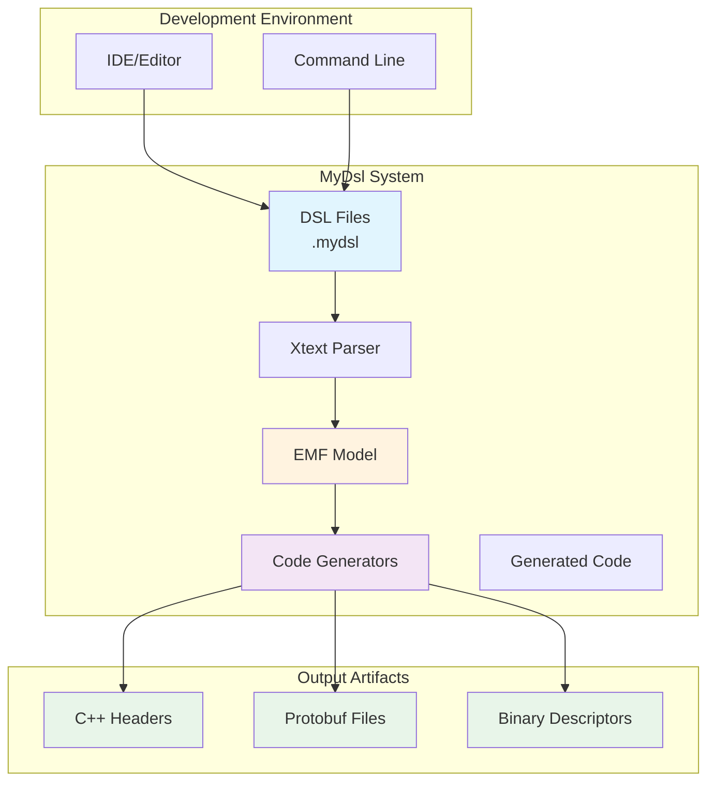

## Module Architecture

### Project Structure

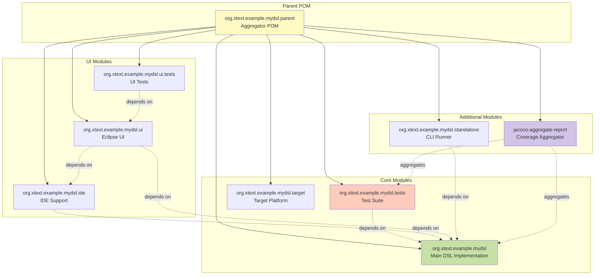

### Module Dependencies

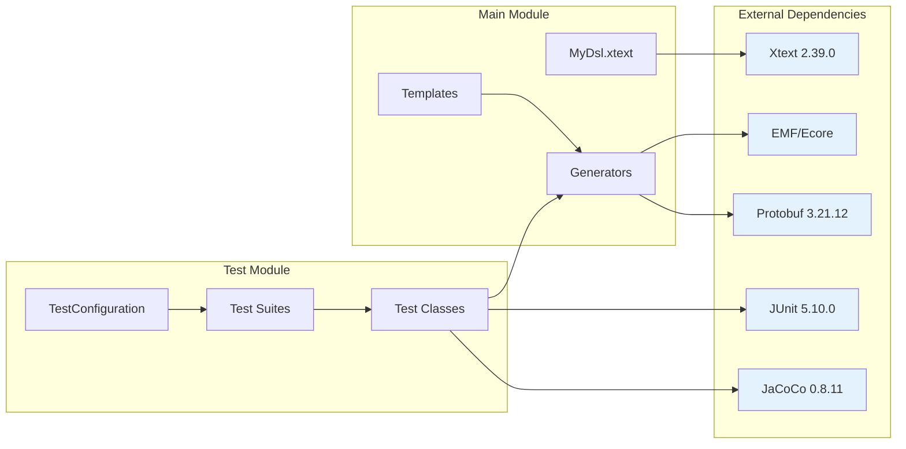

## Build System Architecture

### Maven/Tycho Build Flow

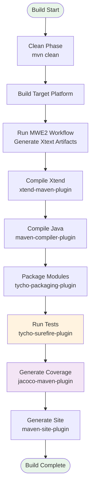

### Build Script Execution Flow

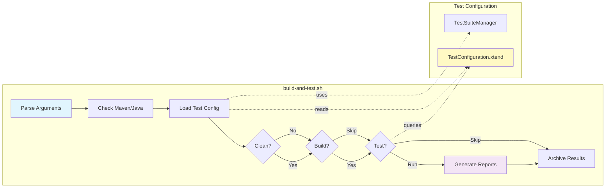

## Test System Architecture

### Test Execution Flow

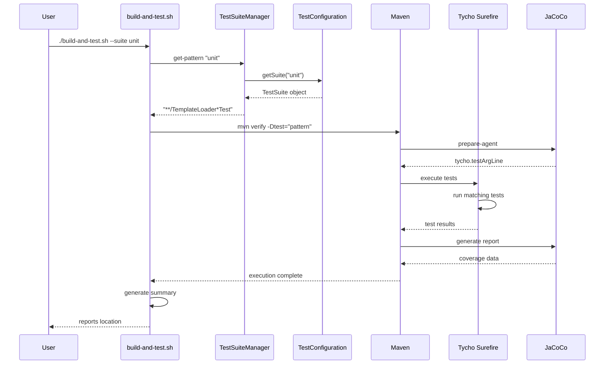

### Test Suite Configuration Architecture

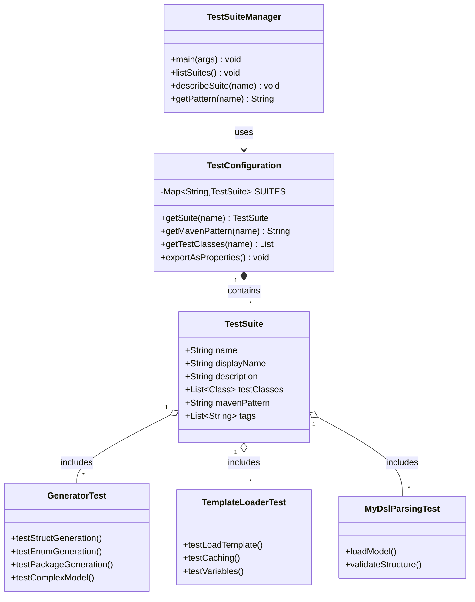

## Code Generation Architecture

### Generator Components

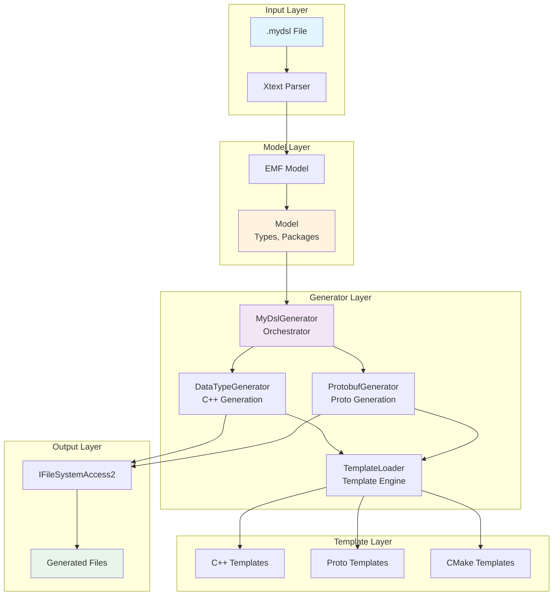

### Template Processing Flow

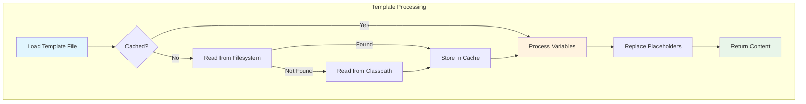

### Code Generation Detailed Flow

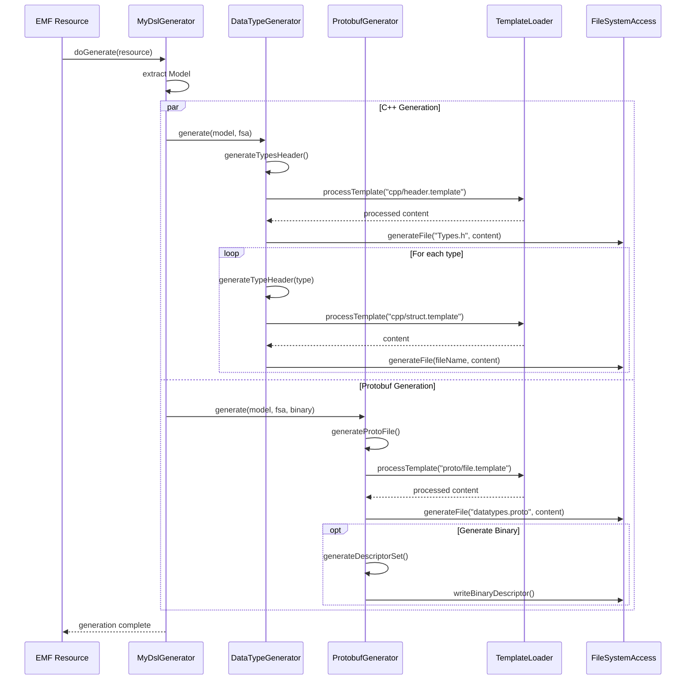

## Coverage Analysis Flow

### JaCoCo Coverage Collection

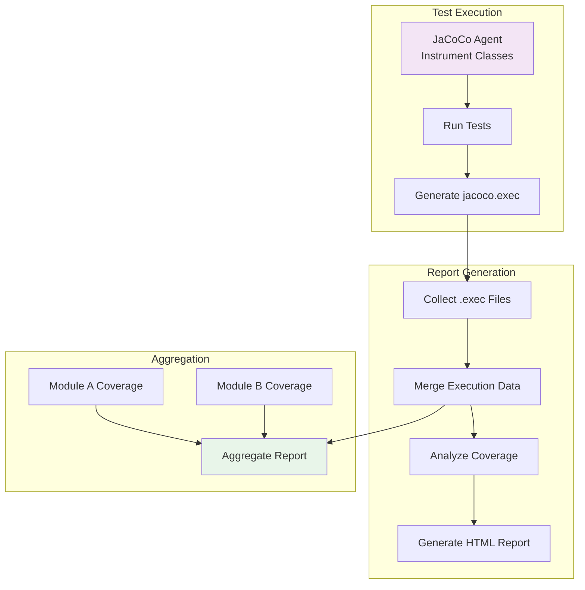

### Coverage Report Structure

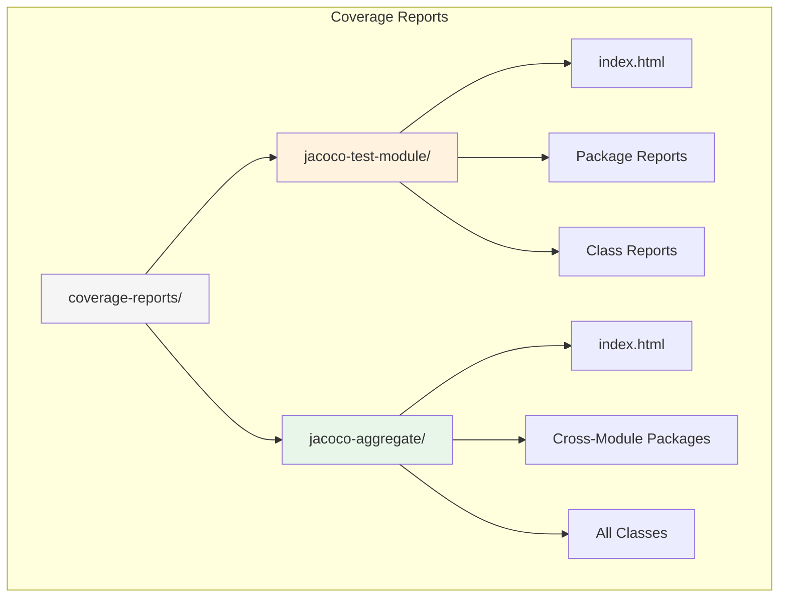

## Deployment View

### Build Pipeline

```mermaid
flowchart LR
    subgraph "Development"
        Dev[Developer<br/>Workstation]
        Git[Git Repository]
    end
    
    subgraph "CI/CD Pipeline"
        Trigger[Build Trigger]
        CI[CI Server]
        BuildJob[Build Job]
        TestJob[Test Job]
        Package[Package]
        Artifacts[Artifact Store]
    end
    
    subgraph "Deployment"
        P2[P2 Repository]
        UpdateSite[Update Site]
        Users[End Users]
    end
    
    Dev --> Git
    Git --> Trigger
    Trigger --> CI
    CI --> BuildJob
    BuildJob --> TestJob
    TestJob --> Package
    Package --> Artifacts
    Artifacts --> P2
    P2 --> UpdateSite
    UpdateSite --> Users
    
    style Dev fill:#e1f5fe
    style CI fill:#fff3e0
    style UpdateSite fill:#e8f5e9
```

### Component Deployment

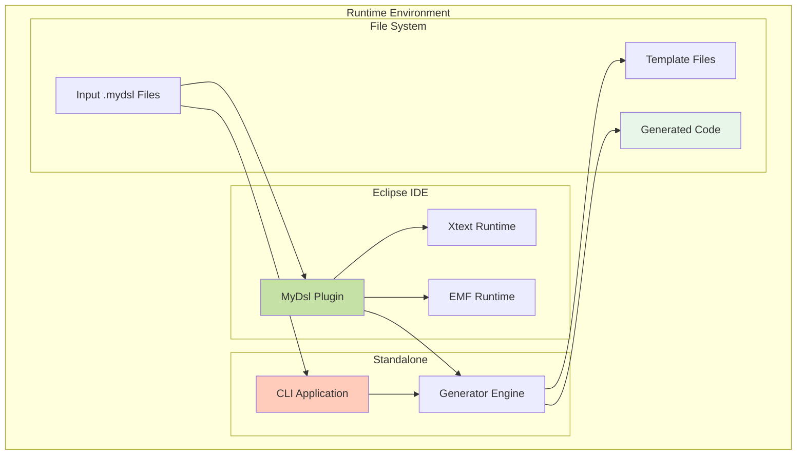

## Key Design Decisions

### 1. Centralized Test Configuration
- **Decision**: All test suite definitions in `TestConfiguration.xtend`
- **Rationale**: Single source of truth, type safety, easier maintenance
- **Trade-offs**: Requires recompilation for changes

### 2. Template-Based Generation
- **Decision**: External template files with variable substitution
- **Rationale**: Separation of concerns, easier template updates
- **Trade-offs**: Additional I/O overhead, caching complexity

### 3. Multi-Module Maven Structure
- **Decision**: Separate modules for different concerns
- **Rationale**: Clear separation, parallel builds, independent versioning
- **Trade-offs**: Complex dependency management, longer initial setup

### 4. Tycho for Eclipse Plugin Development
- **Decision**: Use Tycho instead of pure Maven
- **Rationale**: Eclipse plugin compatibility, OSGi support
- **Trade-offs**: Learning curve, limited to Eclipse ecosystem

### 5. JaCoCo for Coverage Analysis
- **Decision**: JaCoCo with aggregate reporting
- **Rationale**: Xtend support, cross-module coverage, good IDE integration
- **Trade-offs**: Configuration complexity, performance overhead

## Performance Considerations

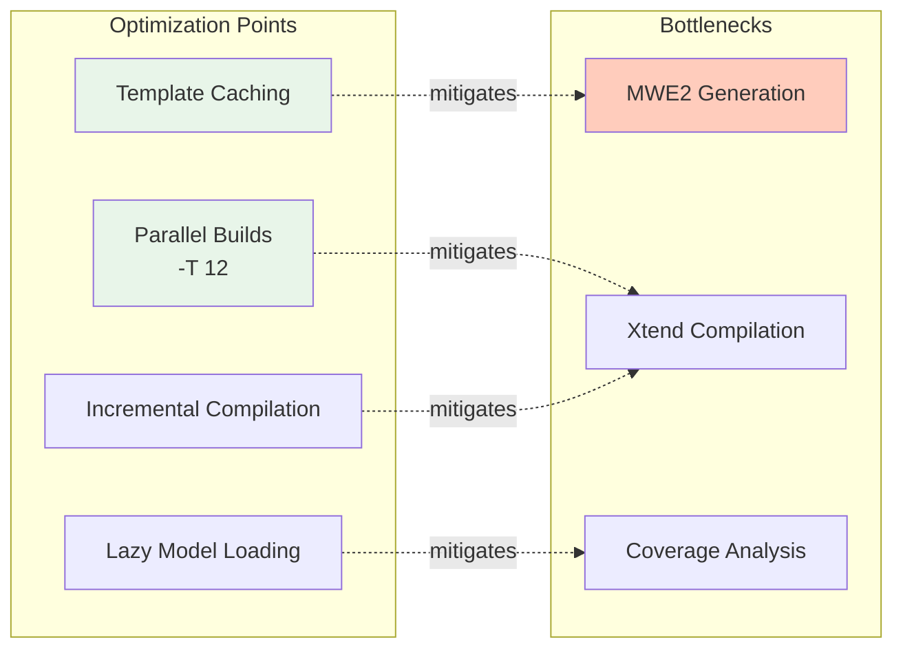

## Security Considerations

1. **Template Injection**: Templates use simple string replacement, not evaluation
2. **File System Access**: Controlled through `IFileSystemAccess2` interface
3. **Binary Generation**: Protobuf descriptors validated before writing
4. **Dependency Management**: All dependencies from trusted repositories
5. **Code Generation**: No execution of generated code during build

## Future Enhancements

1. **Incremental Generation**: Only regenerate changed files
2. **Distributed Testing**: Run test suites in parallel on multiple machines
3. **Cloud-Based CI/CD**: Integrate with cloud build services
4. **Language Server Protocol**: Add LSP support for broader IDE compatibility
5. **Real-Time Validation**: Validate DSL as user types
6. **Generated Code Optimization**: Analyze and optimize generated code patterns