# MyDsl Xtext Project Architecture Design Document

## 1. Executive Summary

This document describes the architecture of the MyDsl Xtext project, a Domain Specific Language (DSL) implementation for defining data types with automatic code generation capabilities for C++ and Protocol Buffers. The project uses Maven for build management, Xtext for DSL implementation, and Xtend for code generation.

## 2. System Overview

### 2.1 High-Level Architecture

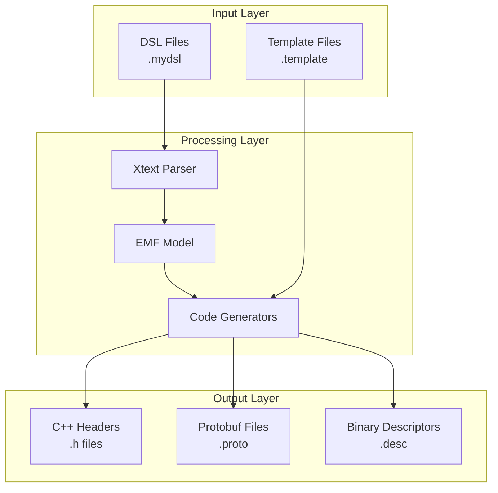

### 2.2 Module Dependencies

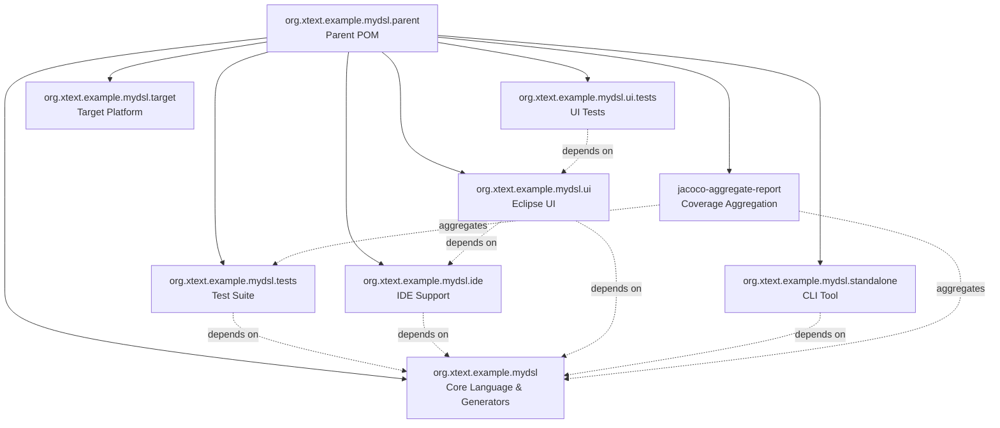

## 3. Core Module Architecture

### 3.1 Generator Components

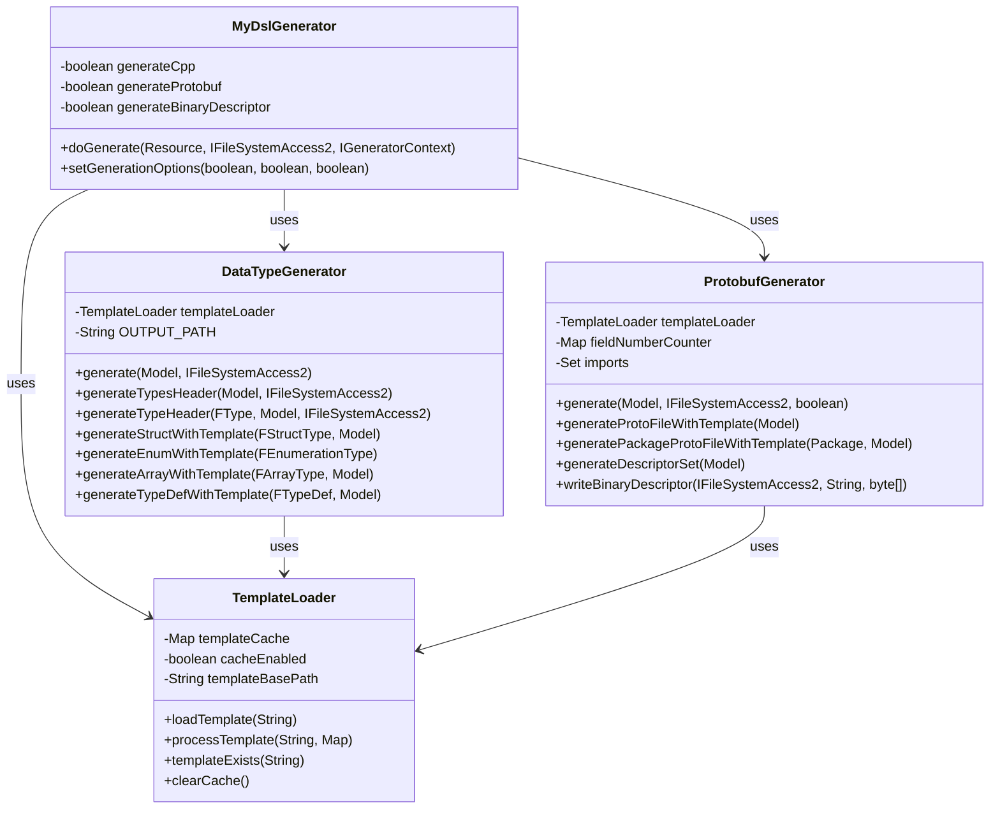

### 3.2 DSL Model Structure

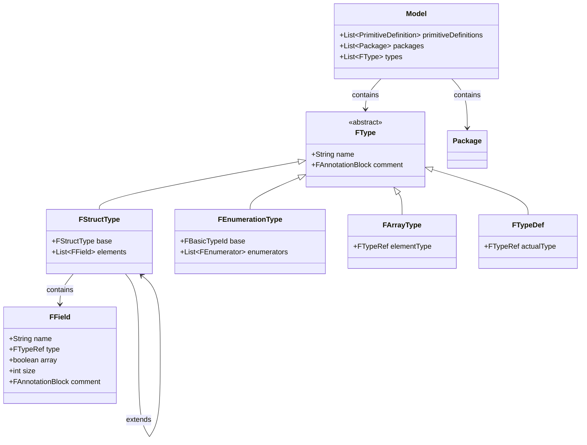

## 4. Test Architecture

### 4.1 Test Suite Organization

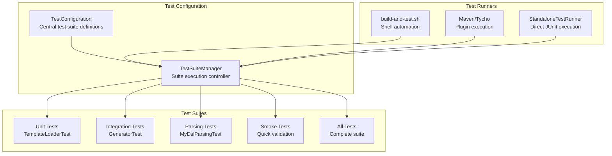

### 4.2 Test Execution Flow

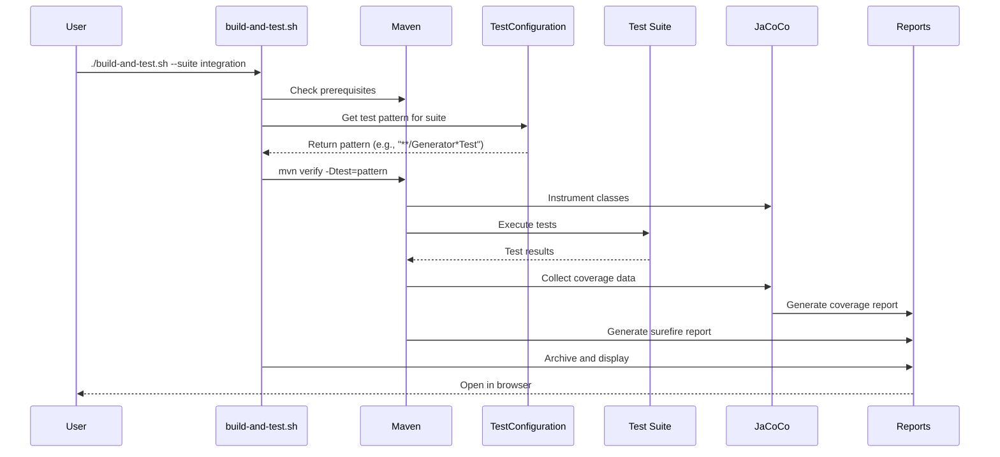

## 5. Build System Architecture

### 5.1 Build Pipeline

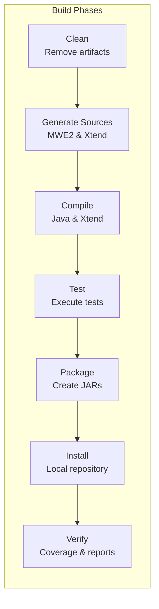

### 5.2 Maven Profile Structure

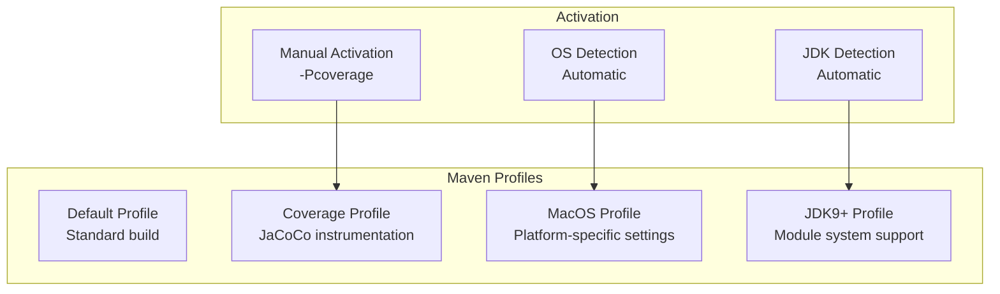

## 6. Code Generation Process

### 6.1 Template Processing Pipeline

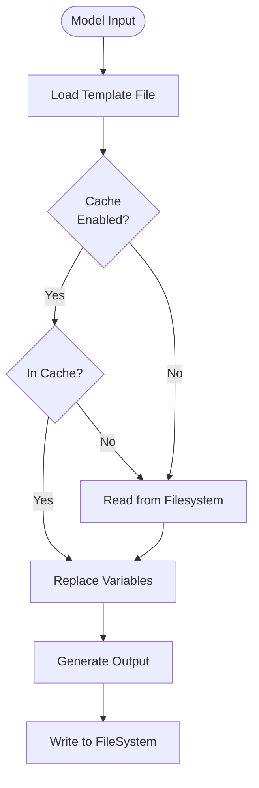

### 6.2 Type Mapping Strategy

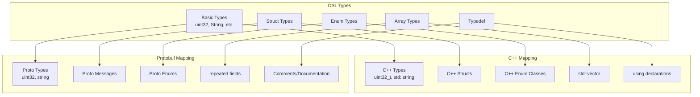

## 7. Coverage Architecture

### 7.1 Coverage Collection Flow

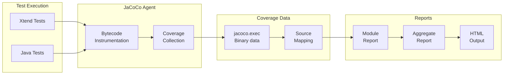

### 7.2 Cross-Module Coverage Aggregation

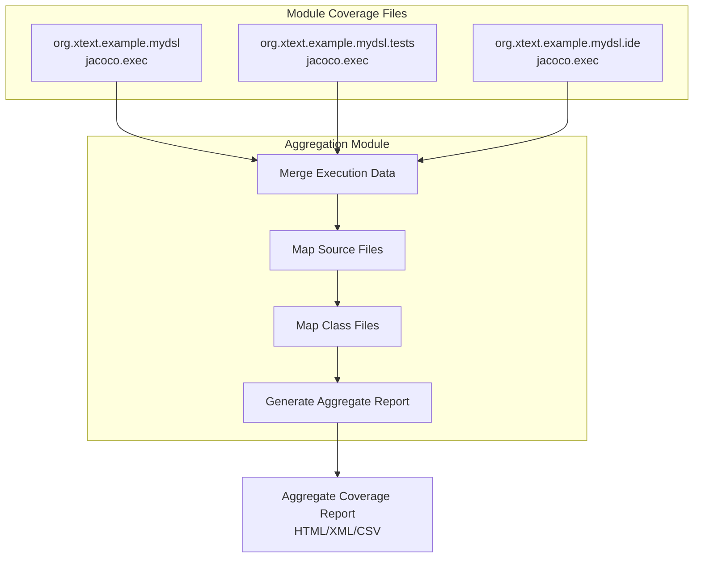

## 8. File System Organization

### 8.1 Project Directory Structure

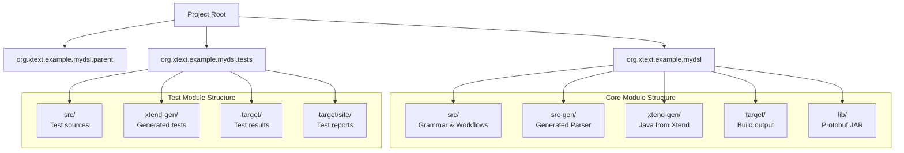

## 9. Deployment Architecture

### 9.1 Standalone Deployment

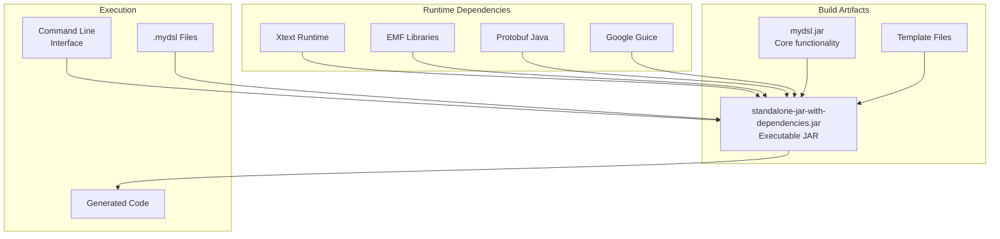

## 10. Error Handling and Recovery

### 10.1 Error Handling Strategy

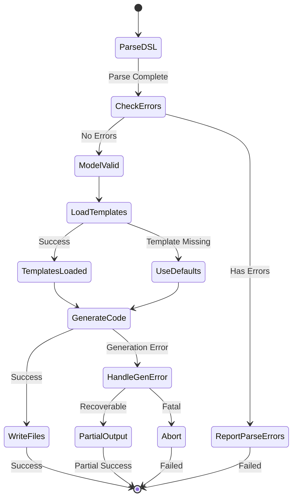

## 11. Template System Architecture

### 11.1 Template Resolution Strategy

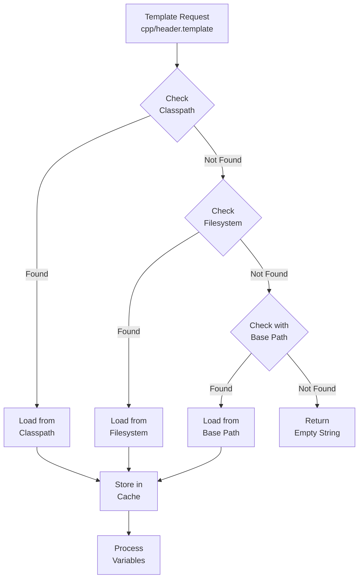

## 12. Key Design Patterns

### 12.1 Design Patterns Used

| Pattern             | Usage                            | Components                                           |
| ------------------- | -------------------------------- | ---------------------------------------------------- |
| **Singleton**       | Template loader, generators      | `@Singleton` annotation on generator classes         |
| **Template Method** | Code generation process          | Abstract generation methods overridden for each type |
| **Strategy**        | Type mapping                     | Different strategies for C++ vs Protobuf mapping     |
| **Builder**         | Protobuf descriptor construction | `FileDescriptorProto.Builder`                        |
| **Factory**         | Test suite creation              | `TestConfiguration` creates test suites              |
| **Visitor**         | Model traversal                  | EMF model navigation                                 |
| **Cache**           | Template caching                 | `TemplateLoader` cache mechanism                     |
| **Command**         | Build script operations          | Shell script command processing                      |

## 13. Performance Considerations

### 13.1 Optimization Strategies

- **Parallel Build**: Maven uses `-T 12` for parallel module builds
- **Template Caching**: Templates cached in memory to avoid repeated I/O
- **Lazy Loading**: Cross-references resolved only when needed
- **Incremental Build**: Only modified files recompiled
- **Test Filtering**: Selective test execution based on suites

## 14. Security Considerations

### 14.1 Security Measures

- **Input Validation**: DSL parser validates input syntax
- **Path Traversal Prevention**: Template paths sanitized
- **Binary File Handling**: Secure writing of binary descriptor files
- **Dependency Management**: Fixed versions for all dependencies
- **Code Injection Prevention**: Template variable replacement sanitized

## 15. Extensibility Points

### 15.1 Extension Mechanisms

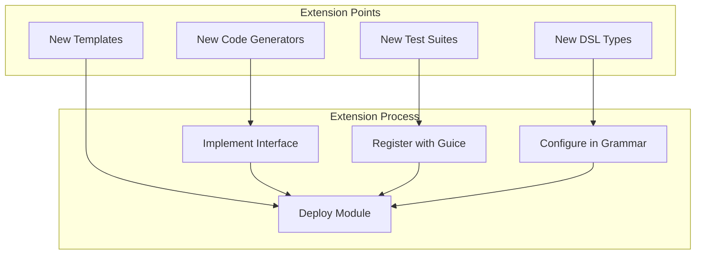

## 16. Conclusions

The MyDsl Xtext project demonstrates a well-architected DSL implementation with:

- **Modular Design**: Clear separation of concerns across modules
- **Extensible Generation**: Template-based code generation for multiple targets
- **Comprehensive Testing**: Multi-level test suite architecture with coverage
- **Build Automation**: Sophisticated build pipeline with Maven and shell scripting
- **Error Resilience**: Graceful error handling and partial output generation
- **Performance Optimization**: Caching, parallel builds, and incremental compilation

The architecture supports both IDE integration (Eclipse) and standalone command-line usage, making it suitable for various deployment scenarios.