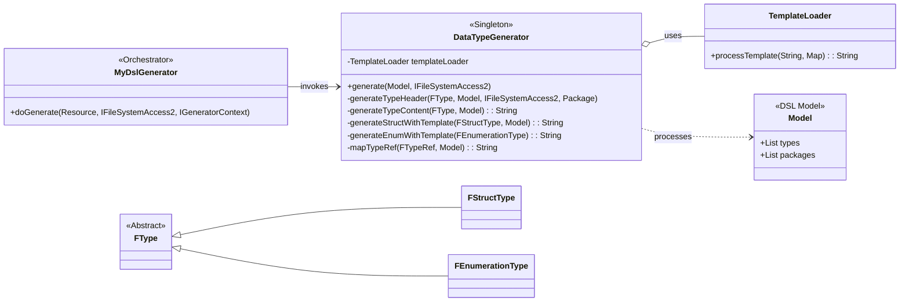
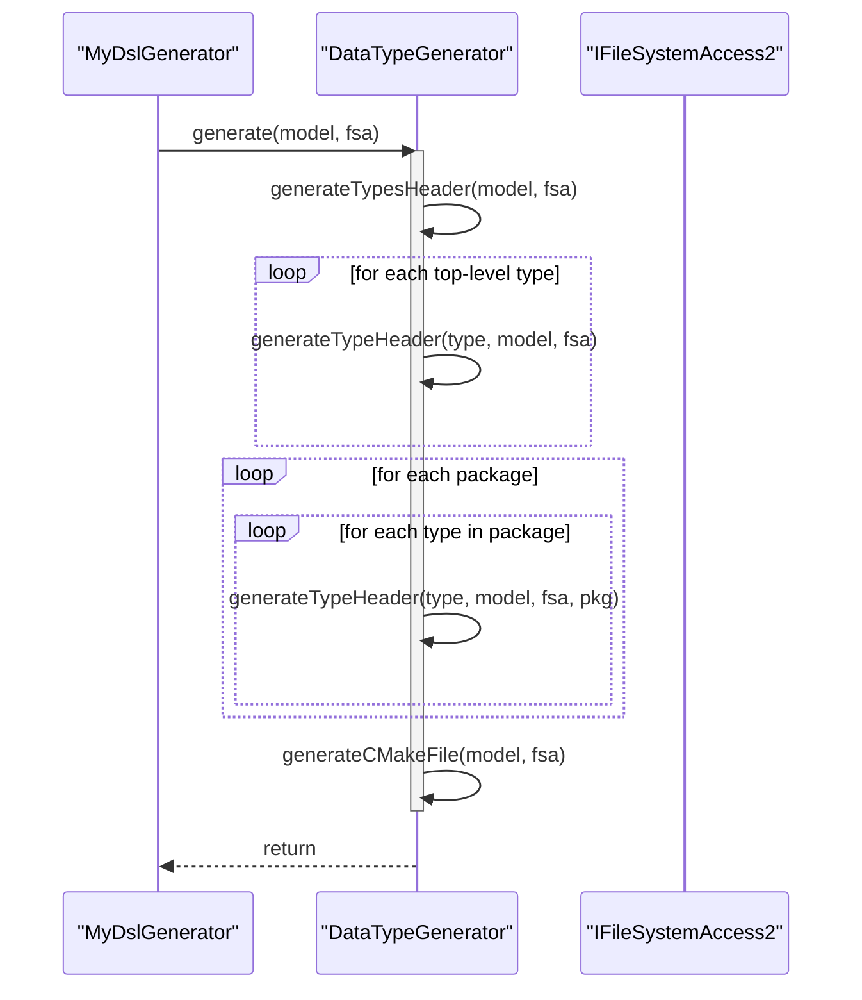
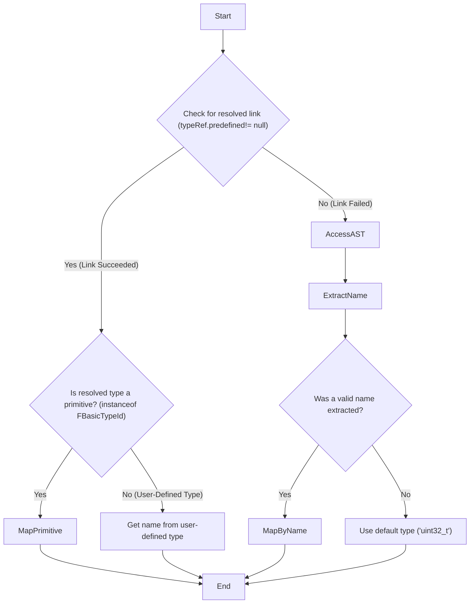

# A Deep Dive into the `DataTypeGenerator` C++ Subsystem

### Executive Summary

The `DataTypeGenerator.xtend` file contains the complete implementation for the C++ code generation subsystem. It is a highly specialized, template-driven component responsible for translating the abstract semantic model of a `.mydsl` file into a set of concrete, compilable C++ header files. Its architecture is defined by a central orchestration method, `generate`, which delegates tasks to a series of specialized methods for handling different DSL constructs like structs, enums, and typedefs. A key design feature is its exceptionally robust, two-tiered type resolution system, which combines semantic model linking with a syntactic fallback mechanism to ensure successful code generation even in the presence of unresolved type references.

## Section 1: Overall Design and Architecture

#### Design Analysis

- **Why? (Purpose):** The primary purpose of the `DataTypeGenerator` is to serve as the dedicated engine for transforming the platform-agnostic DSL model into a platform-specific C++ representation. It encapsulates all the logic, rules, and conventions required for this translation, separating C++ concerns from other potential target languages like Protobuf.
- **What? (Functionality):** The class is responsible for a complete, end-to-end generation workflow. This includes:
  - Iterating through all types defined in the DSL model, both at the top level and within packages.
  - Generating an individual, self-contained C++ header file (`.h`) for each DSL type.
  - Correctly handling C++ namespaces for types defined within DSL packages.
  - Generating standard C++ boilerplate, including header guards, standard library includes, and basic class structure (constructors, destructors).
  - Translating DSL types (e.g., `uint32`, `String`, user-defined structs) into their corresponding C++ equivalents (e.g., `uint32_t`, `std::string`, `MyStruct`).
  - Generating a main `Types.h` header that includes all other generated headers for convenience.
  - Generating a `CMakeLists.txt` file to make the generated code immediately usable as a header-only library.
- **When? (Triggers):** The `DataTypeGenerator` is activated by the main `MyDslGenerator` orchestrator. Its `generate` method is invoked when the `generateCpp` flag is set to `true` during the Xtext generation lifecycle, which typically occurs when a `.mydsl` file is saved or built.
- **How? (Implementation):** The generator is implemented as a Singleton class, ensuring a single instance is used throughout the generation process. It relies heavily on a `TemplateLoader` utility, which is provided via dependency injection. The core implementation follows the **Template Method Pattern**: a high-level `generate` method defines the overall workflow, while smaller, specialized helper methods are called to handle the specific details of generating content for each type of DSL element (structs, enums, etc.). This approach promotes modularity and makes the code easier to maintain and extend.

#### Architectural Diagrams

##### Static Class Diagram

This diagram illustrates the key components and their relationships. The `DataTypeGenerator` is the central class, using the `TemplateLoader` and processing various `FType` model elements.




##### Dynamic Sequence Diagram (`generate` method)

This diagram shows the sequence of method calls during a typical generation run, highlighting the orchestration role of the `generate` method.



## Section 2: Detailed Field and Method Analysis

This section provides a line-by-line breakdown of the `DataTypeGenerator.xtend` source file.

------

### **Lines 1-20: Package, Imports, and Class Definition**

```java
  1: package org.xtext.example.mydsl.generator
  2: 
  3: import org.xtext.example.mydsl.myDsl.*
  4: import org.eclipse.xtext.generator.IFileSystemAccess2
  5: import com.google.inject.Singleton
  6: import com.google.inject.Inject
  7: import java.time.LocalDateTime
  8: import java.time.format.DateTimeFormatter
  9: import java.util.HashMap
 10: import java.util.Map
 11: import org.eclipse.xtext.nodemodel.util.NodeModelUtils
 12: import org.eclipse.xtext.nodemodel.ILeafNode
 13: import org.eclipse.emf.ecore.util.EcoreUtil
 14: import org.eclipse.emf.ecore.EObject
 15: 
 16: /**
 17:  * C++ code generator for DataType DSL using external templates
 18:  */
 19: @Singleton
 20: class DataTypeGenerator {
```

- **Lines 3-14:** These lines import necessary classes. Key imports include:
  - `org.xtext.example.mydsl.myDsl.*`: Imports all classes representing the DSL's grammar elements (e.g., `Model`, `FStructType`).
  - `IFileSystemAccess2`: The Xtext interface for writing generated files to disk.
  - `@Singleton`, `@Inject`: Google Guice annotations for dependency injection.
  - `NodeModelUtils`: A crucial Xtext utility for accessing the raw parse tree (AST), used for the generator's resilient type mapping.
- **Line 19 (`@Singleton`):** This annotation ensures that the dependency injection framework creates only one instance of `DataTypeGenerator` for the entire application lifecycle. This is efficient and necessary for stateful components it might use (like a caching `TemplateLoader`).
- **Line 20:** Defines the `DataTypeGenerator` class.

------

### **Lines 22-25: Fields**

```java
 22: 	@Inject TemplateLoader templateLoader
 23: 
 24: 	static val String OUTPUT_PATH = "generated/"
```

- **Line 22 (`@Inject TemplateLoader`):** This declares a field for the `TemplateLoader` utility. The `@Inject` annotation tells the Guice DI container to automatically provide a singleton instance of `TemplateLoader` when a `DataTypeGenerator` is created.
- **Line 24 (`OUTPUT_PATH`):** A static constant defining the root directory for all generated C++ files.

------

### **Lines 29-68: `generate` Method**

This is the main entry point and orchestrator for the C++ generation process.

```java
 29: 	def void generate(Model model, IFileSystemAccess2 fsa) {
 30: 		// Initialize template loader
 31: 		if (templateLoader === null) {
 32: 			templateLoader = new TemplateLoader()
 33: 		}
 34: 		templateLoader.setTemplateBasePath("/templates/")
 35: 
 36: 		try {
 37: 			// Generate types header file
 38: 			generateTypesHeader(model, fsa)
 39: 	
 40: 			// Generate individual headers for each type
 41: 			for (type : model.types) {
 42: 				try {
 43: 					generateTypeHeader(type, model, fsa)
 44: 				} catch (Exception e) { /*... error handling... */ }
 48: 			}
 49: 	
 50: 			// Generate headers for types in packages
 51: 			for (pkg : model.packages) {
 52: 				for (type : pkg.types) {
 53: 					try {
 54: 						generateTypeHeader(type, model, fsa, pkg)
 55: 					} catch (Exception e) { /*... error handling... */ }
 59: 				}
 60: 			}
 61: 	
 62: 			// Generate CMakeLists.txt
 63: 			generateCMakeFile(model, fsa)
 64: 		} catch (Exception e) { /*... error handling... */ }
 68: 	}
```

- **Lines 31-34:** Initializes the injected `templateLoader`, setting the base path from which to load template files (e.g., `struct.template`).
- **Line 38:** Calls `generateTypesHeader` to create the main `Types.h` file.
- **Lines 41-48:** Iterates through all top-level types defined directly within the `Model` and calls `generateTypeHeader` for each. The `try-catch` block ensures that an error generating one file does not stop the entire process.
- **Lines 51-60:** Iterates through all defined `packages`, and for each type within a package, it calls the overloaded `generateTypeHeader` method that accepts a `Package` object. This allows the generator to handle namespaces and subdirectories correctly.
- **Line 63:** Calls `generateCMakeFile` to create the build system file.

------

### **Lines 73-93: `generateTypesHeader` Method**

This method creates a single header file that includes all other generated type headers for user convenience.

Code snippet

```java
 73: 	def void generateTypesHeader(Model model, IFileSystemAccess2 fsa) {
 74: 		val fileName = '''«OUTPUT_PATH»include/Types.h'''
 75: 
 76: 		// Build includes list
 77: 		val includes = new StringBuilder()
 78: 		for (type : model.types) { /*... appends #include "MyType.h"... */ }
 81: 		for (pkg : model.packages) {
 82: 			for (type : pkg.types) { /*... appends #include "pkg/MyType.h"... */ }
 85: 		}
 86: 
 87: 		val variables = new HashMap<String, String>()
 88: 		variables.put("TIMESTAMP", /*...*/)
 89: 		variables.put("TYPE_INCLUDES", includes.toString())
 90: 
 91: 		val content = templateLoader.processTemplate("/templates/cpp/types_header.template", variables)
 92: 		fsa.generateFile(fileName, content)
 93: 	}
```

- **Line 74:** Defines the output path and name for the file: `generated/include/Types.h`.
- **Lines 77-85:** Programmatically builds a string containing all the necessary `#include` directives, correctly handling subdirectory paths for packaged types.
- **Lines 87-90:** Creates a map to hold variables that will be substituted into the template. `TYPE_INCLUDES` will replace the `{{TYPE_INCLUDES}}` placeholder in `types_header.template`.
- **Lines 91-92:** Uses the `templateLoader` to process the template and then writes the final content to the file system.

------

### **Lines 98-144: `generateTypeHeader` Methods**

These methods are responsible for generating a single `.h` file for one DSL type.

```java
 98: 	def void generateTypeHeader(FType type, Model model, IFileSystemAccess2 fsa) {
 99: 		generateTypeHeader(type, model, fsa, null)
100: 	}
101: 
102: 	def void generateTypeHeader(FType type, Model model, IFileSystemAccess2 fsa, Package pkg) {
104: 			val typeName = getTypeName(type)
105: 			val path = if (pkg!== null) '''«pkg.name»/''' else ""
106: 			val fileName = '''«OUTPUT_PATH»include/«path»«typeName».h'''
108: 			val guardName = '''«IF pkg!== null»«pkg.name.toUpperCase.replace(".", "_")»_«ENDIF»«typeName.toUpperCase»_H'''
110: 			// Build includes
112: 			includesVars.put("CUSTOM_INCLUDES", generateCustomIncludes(type, model))
113: 			val includes = templateLoader.processTemplate("/templates/cpp/includes.template", includesVars)
115: 			// Build namespace
116: 			val namespaceBegin = if (pkg!== null) '''namespace «pkg.name.replace(".", "::")» {''' else ""
117: 			val namespaceEnd = if (pkg!== null) '''} // namespace «pkg.name.replace(".", "::")»''' else ""
119: 			// Generate type content
120: 			val typeContent = generateTypeContent(type, model)
122: 			// Process main header template
123: 			val variables = new HashMap<String, String>()
            /*... puts all variables (GUARD_NAME, INCLUDES, CONTENT, etc.) into map... */
134: 			val content = templateLoader.processTemplate("/templates/cpp/header.template", variables)
136: 			fsa.generateFile(fileName, content)
144: 	}
```

- **Lines 98-100:** A simple overload that calls the main implementation with a `null` package, used for top-level types.
- **Lines 105-106:** Constructs the output file path, creating a subdirectory if the type is in a package (e.g., `generated/include/com.example/MyType.h`).
- **Line 108:** Generates a standard C++ header guard (e.g., `COM_EXAMPLE_MYTYPE_H`).
- **Lines 110-113:** Generates the `#include` section by calling `generateCustomIncludes` and processing the `includes.template`.
- **Lines 116-117:** Generates the `namespace` block if the type belongs to a package.
- **Line 120:** Calls the `generateTypeContent` dispatch method to get the actual C++ code for the struct, enum, etc.
- **Lines 123-136:** Assembles all the generated parts (guard, includes, content) into a map and uses `templateLoader` to populate the main `header.template`, finally writing the result to a file.

------

### **Lines 166-174: `generateTypeContent` Dispatch Method**

This method acts as a router, delegating to the correct generation logic based on the specific type of the DSL element.

```java
166: 	def String generateTypeContent(FType type, Model model) {
167: 		switch (type) {
168: 			FStructType: generateStructWithTemplate(type, model)
169: 			FEnumerationType: generateEnumWithTemplate(type)
170: 			FArrayType: generateArrayWithTemplate(type, model)
171: 			FTypeDef: generateTypeDefWithTemplate(type, model)
172: 			default: ""
173: 		}
174: 	}
```

- **Line 167:** The `switch` statement checks the runtime class of the `type` object.
- **Lines 168-171:** Based on the type, it calls the corresponding specialized method (e.g., `generateStructWithTemplate` for an `FStructType`). This is a clean way to handle polymorphism.

------

### **Lines 210-260 & 318-349: Field and Typedef Generation with Resilient Type Mapping**

The methods `generateFieldWithTemplate` and `generateTypeDefWithTemplate` contain nearly identical logic for resolving a DSL type reference (`FTypeRef`) into a C++ type string. This logic is a cornerstone of the generator's robustness.

Code snippet

```java
// Simplified logic from generateFieldWithTemplate
215: 		var fieldType = "uint32_t" // Better default than void
218: 		fieldType = mapTypeRef(field.type, model)
221: 		if (fieldType == "void" |

| fieldType.empty) {
223: 			val node = NodeModelUtils.findActualNodeFor(field.type)
227: 			val typeName = leaves.head.text.trim
233: 			fieldType = mapBasicTypeByName(typeName, field.type)
239: 			if (fieldType == "void" |

| fieldType.empty) {
240: 				fieldType = "uint32_t"
241: 			}
242: 		}
```

- **Line 218:** It first attempts to map the type using the primary `mapTypeRef` method.
- **Line 221:** If the result is "void" or empty (indicating a potential failure in `mapTypeRef`), it triggers the fallback mechanism.
- **Line 223:** It uses `NodeModelUtils.findActualNodeFor` to get the raw parse tree node for the type reference. This bypasses the semantic model and looks directly at the text the user wrote.
- **Line 227:** It extracts the raw text of the type name from the parse tree's leaf nodes.
- **Line 233:** It attempts to map the type again, this time using the extracted raw name (`mapBasicTypeByName`).
- **Line 240:** If all attempts fail, it assigns a safe default (`uint32_t`) to ensure the generated C++ code is still syntactically valid, preventing a single unresolved type from causing a cascade of compiler errors.

------

### **Lines 371-429: `mapTypeRef` Method**

This is the most critical and complex method in the class, responsible for the primary type translation logic.

#### Low-Level Design: `mapTypeRef` Method

- **Why? (Purpose):** To provide a single, robust, and fault-tolerant point of translation between the DSL's abstract type system (`FTypeRef`) and the concrete C++ type system.
- **What? (Functionality):** It accepts an `FTypeRef` and returns the corresponding C++ type as a `String`. It is designed to handle both successfully linked references and unresolved references gracefully.
- **When? (Triggers):** Called whenever the C++ type is needed for a field, array element, or typedef.
- **How? (Implementation):** It employs a two-tiered strategy:
  1. **Semantic Resolution:** It first tries to use the cross-reference populated by the Xtext linker (`typeRef.predefined`). This is the "happy path."
  2. **Syntactic Fallback:** If the link is unresolved (`predefined` is null), it switches to analyzing the raw text from the Abstract Syntax Tree (AST) using `NodeModelUtils`. This makes the generator resilient to scoping errors in the DSL model.

```java
371: 	def String mapTypeRef(FTypeRef typeRef, Model model) {
377: 		val refType = typeRef.predefined
379: 		if (refType!== null) {
381: 			if (refType instanceof FBasicTypeId) { /* map basic type */ }
386: 			if (refType instanceof FType) { /* return user-defined type name */ }
389: 		}
391: 		// If the reference is null or unresolved, extract the type name from the AST
395: 		val node = NodeModelUtils.findActualNodeFor(typeRef)
410: 		extractedTypeName = extractTypeNameFromLeafNodes(node.leafNodes)
418: 		if (extractedTypeName!== null &&!extractedTypeName.empty) {
424: 			return mapBasicTypeByName(extractedTypeName, typeRef)
425: 		}
428: 		return "uint32_t" // Last resort
429: 	}
```

#### Dynamic Activity Diagram (`mapTypeRef` Logic)

This diagram visualizes the two-tiered resolution strategy.



------

### **Lines 497-573 & 578-628: `mapBasicTypeByName` and `mapBasicType` Methods**

These methods contain the concrete mapping rules from DSL primitive types to C++ types.

```java
497: 	def String mapBasicTypeByName(String typeName, FTypeRef typeRef) {
504: 		switch (typeName) {
506: 			case "String": return "std::string"
507: 			case "uint8": return "uint8_t"
            /*... many other cases... */
526: 			case "string": return "std::string"
530: 		}
541: 		if (Character.isUpperCase(typeName.charAt(0))) {
542: 			return typeName
543: 		}
        /*... more fallback cases... */
572: 		return "uint32_t"
573: 	}
```

- `mapBasicTypeByName` takes a raw `String` (e.g., "uint32", "String") and uses a large `switch` statement to find the corresponding C++ type. It is designed to be flexible, checking for exact matches, common variations (e.g., "int" and "int32"), and case-insensitive fallbacks. It also intelligently assumes that an unknown, capitalized type name is a user-defined struct and returns the name as-is.
- `mapBasicType` works on a resolved `FBasicTypeId` object, providing a more direct mapping when the Xtext linker has succeeded.

------

### **Lines 669-680: `generateCMakeFile` Method**

This final helper method generates a `CMakeLists.txt` file, making the output a complete, ready-to-use C++ header-only library.

```java
671: 	def void generateCMakeFile(Model model, IFileSystemAccess2 fsa) {
672: 		val fileName = '''«OUTPUT_PATH»CMakeLists.txt'''
674: 		val variables = new HashMap<String, String>()
675: 		variables.put("PROJECT_NAME", "DataTypes")
676: 		variables.put("VERSION", "1.0.0")
678: 		val content = templateLoader.processTemplate("/templates/cmake/CMakeLists.template", variables)
679: 		fsa.generateFile(fileName, content)
680: 	}
```

- This method simply populates the `CMakeLists.template` with a project name and version and writes the resulting file to the `generated/` directory.