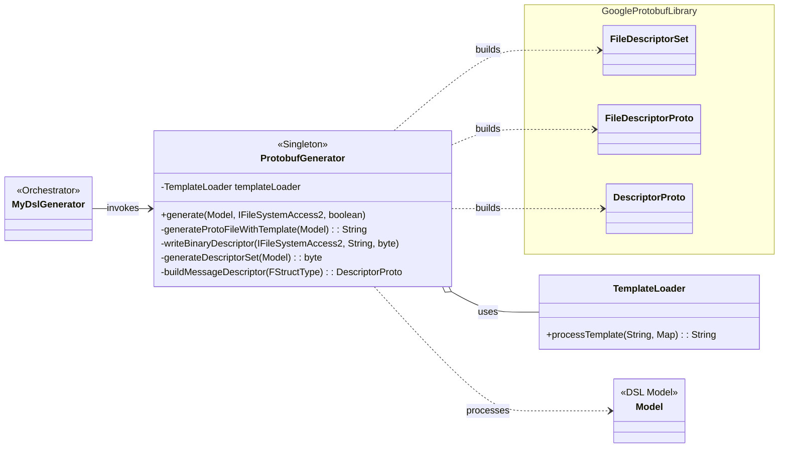
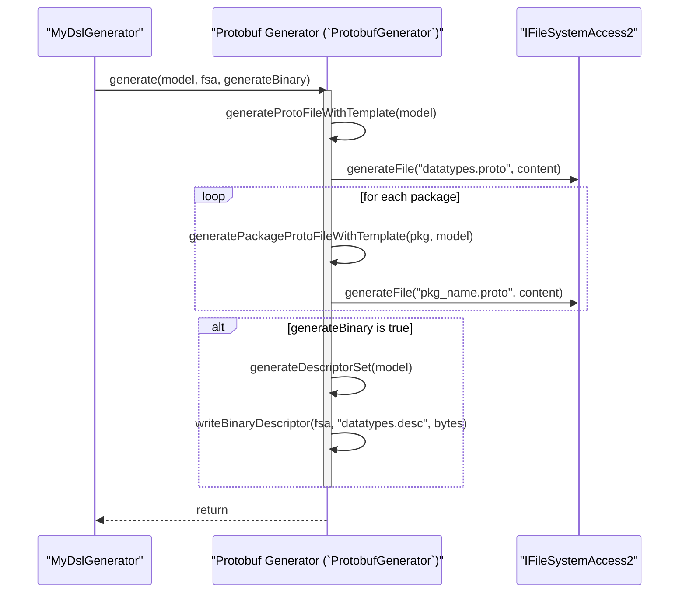

# A Deep Dive into the `ProtobufGenerator` Subsystem

### Executive Summary

The `ProtobufGenerator.xtend` file implements a sophisticated, dual-purpose generation subsystem. Its primary role is to translate the abstract DSL model into Google Protocol Buffers (Protobuf) artifacts, which are essential for cross-language data serialization and communication. The generator produces two distinct outputs: human-readable `.proto` text files, which define the data schema, and a machine-readable binary descriptor file (`.desc`), which enables advanced runtime schema reflection and dynamic message processing. Key design features include a robust, multi-layered file writing strategy for binary data, resilient type mapping that gracefully handles unresolved model references, and adherence to Protobuf best practices, such as ensuring zero-valued enum defaults.

## Section 1: Overall Design and Architecture

#### Design Analysis

- **Why? (Purpose):** The `ProtobufGenerator` exists to bridge the gap between the platform-agnostic DSL and the widely-used Protobuf ecosystem. It encapsulates all the rules, conventions, and logic required to produce both compile-time artifacts (`.proto` files) for generating language-specific stubs and runtime artifacts (`.desc` file) for dynamic systems. This separation of concerns isolates all Protobuf-related logic from other generators, like the C++ one.
- **What? (Functionality):** The class manages a comprehensive Protobuf generation workflow:
  - **Textual `.proto` Generation:** It translates DSL structs and enums into Protobuf messages and enums, using external templates for structure and boilerplate.
  - **Binary Descriptor Generation:** It programmatically constructs an in-memory representation of the entire schema using the official Google Protobuf Java library and serializes it into a `.desc` file.
  - **Type Mapping:** It translates DSL types into their corresponding Protobuf scalar types (e.g., `uint32`, `string`, `double`).
  - **Convention Adherence:** It automatically converts field names to `snake_case` and ensures all enums have a default zero value, following Protobuf style guides and requirements.
  - **Robust File I/O:** It implements a specialized, multi-fallback mechanism to write binary data directly to the filesystem, bypassing the limitations of Xtext's text-based file access APIs.
- **When? (Triggers):** The `ProtobufGenerator` is invoked by the main `MyDslGenerator` orchestrator whenever the `generateProtobuf` flag is enabled. The generation of the binary descriptor is further controlled by the `generateBinaryDescriptor` flag.
- **How? (Implementation):** The generator is a Singleton class managed by Guice. It employs a hybrid strategy:
  1. For `.proto` file generation, it uses the familiar **Template Method Pattern**, leveraging the injected `TemplateLoader` to populate `file.template`, `message.template`, etc.
  2. For `.desc` file generation, it uses the **Builder Pattern** provided by the `com.google.protobuf` library. It programmatically constructs `FileDescriptorProto` and `DescriptorProto` objects in memory, which provides complete control and avoids the limitations of text templating for binary formats. Its type mapping logic mirrors the resilient, two-tiered (semantic then syntactic) approach of the `DataTypeGenerator`.

#### Architectural Diagrams

##### Static Class Diagram

This diagram shows the `ProtobufGenerator`'s dependencies, including the `TemplateLoader`, the DSL model, and the key classes from the Google Protobuf library used for binary descriptor generation.



##### Dynamic Sequence Diagram (`generate` method)

This diagram illustrates the control flow within the `generate` method, showing the generation of textual `.proto` files followed by the conditional generation of the binary `.desc` file.



## Section 2: Detailed Field and Method Analysis

This section provides a line-by-line breakdown of the `ProtobufGenerator.xtend` source file. 

------

### **Lines 1-45: Package, Imports, and Class Definition**

```java
  1: package org.xtext.example.mydsl.generator
  2: 
  3: import org.xtext.example.mydsl.myDsl.*
  /*... other java imports... */
 13: import com.google.protobuf.DescriptorProtos
 14: import com.google.protobuf.DescriptorProtos.FileDescriptorSet
 15: import com.google.protobuf.DescriptorProtos.FileDescriptorProto
 /*... other protobuf imports... */
 21: import org.eclipse.xtext.generator.JavaIoFileSystemAccess
 /*... other xtext and io imports... */
 36: @Singleton
 37: class ProtobufGenerator {
 39:     @Inject TemplateLoader templateLoader
 41:     Map<String, Integer> fieldNumberCounter
 42:     Set<String> imports
 45:     static val Map<String, byte> binaryDataCache = new HashMap<String, byte>()
```

- **Lines 13-20:** These are critical imports from the Google Protobuf Java library. They provide the builder classes (`FileDescriptorSet`, `DescriptorProto`, etc.) necessary for programmatically constructing the binary schema descriptor.
- **Line 36 (`@Singleton`):** Ensures that only one instance of `ProtobufGenerator` is created by the dependency injection framework.
- **Line 39 (`@Inject`):** Injects the singleton instance of `TemplateLoader` for processing `.proto` templates.
- **Lines 41-42:** Instance fields for tracking state during a generation run. `fieldNumberCounter` is used to assign unique numbers to message fields, and `imports` tracks necessary imports for `.proto` files.
- **Line 45 (`binaryDataCache`):** A static map used to cache the generated binary `.desc` data. This is primarily a testing hook, allowing test classes to retrieve and inspect the binary output without reading it from the filesystem.

------

### **Lines 50-107: `generate` Method**

This is the main entry point and orchestrator for the entire Protobuf generation process.

```java
 50:     def void generate(Model model, IFileSystemAccess2 fsa, boolean generateBinary) {
 52:         fieldNumberCounter = new HashMap()
 53:         imports = new HashSet()
 58:         templateLoader.setTemplateBasePath("/templates/")
 62:         val protoFileName = '''generated/proto/datatypes.proto'''
 63:         val protoContent = generateProtoFileWithTemplate(model)
 65:         fsa.generateFile(protoFileName, protoContent)
 71:         for (pkg : model.packages) {
 73:             val pkgProtoFileName = '''generated/proto/«pkg.name.replace(".", "_")».proto'''
 74:             val pkgContent = generatePackageProtoFileWithTemplate(pkg, model)
 76:             fsa.generateFile(pkgProtoFileName, pkgContent)
 82:         }
 85:         if (generateBinary) {
 87:             val descFileName = '''generated/proto/datatypes.desc'''
 88:             val descriptorBytes = generateDescriptorSet(model)
 92:             writeBinaryDescriptor(fsa, descFileName, descriptorBytes)
 96:             fsa.generateFile(infoFileName, generateDescriptorInfo(model, descriptorBytes))
102:         }
107:     }
```

- **Lines 52-58:** Initializes state for the current generation run and configures the `templateLoader`.
- **Lines 62-68:** Generates the main `datatypes.proto` file for all top-level types in the model.
- **Lines 71-82:** Iterates through all packages in the model and generates a separate `.proto` file for each (e.g., `com_example.proto`), ensuring a modular and organized output.
- **Lines 85-102:** This block conditionally executes the binary descriptor generation.
  - **Line 88:** Calls `generateDescriptorSet` to create the binary data in a `byte`.
  - **Line 92:** Calls the specialized `writeBinaryDescriptor` method to save the `byte` to a file.
  - **Line 96:** Generates a companion `.desc.info` text file that provides metadata and usage instructions for the binary file.

------

### **Lines 113-203: `writeBinaryDescriptor` Method**

This method is a critical piece of engineering designed to reliably write raw binary data, a task for which Xtext's standard file access API is not suited.

#### Low-Level Design: `writeBinaryDescriptor` Method

- **Why?** Xtext's `IFileSystemAccess2.generateFile` is designed for text and applies character encodings, which would corrupt binary data. This method is necessary to bypass that and perform a direct, raw byte write.
- **How?** It uses a multi-layered strategy:
  1. It tries to intelligently determine the correct output directory by inspecting the `fsa` object's type and configuration.
  2. It uses standard Java I/O (`FileOutputStream`) to write the `byte` directly to disk.
  3. If the primary write fails, it attempts to write to a list of common alternative directories (e.g., "src-gen", "target/generated-sources").
  4. As a final "last resort" if all binary writes fail, it calls `generateBase64Fallback` to save the data in a text-safe format.

```java
113:     def void writeBinaryDescriptor(IFileSystemAccess2 fsa, String fileName, byte data) {
118:         binaryDataCache.put(fileName, data)
124:         if (fsa instanceof JavaIoFileSystemAccess) {
128:             outputDir = outputConfig.outputDirectory
130:         }
152:         val file = new File(outputDir, fileName)
153:         file.parentFile.mkdirs()
155:         val fos = new FileOutputStream(file)
157:         fos.write(data)
166:         if (!success) {
167:             val alternativePaths = #["src-gen", /*... */]
173:             for (altPath : alternativePaths) { /*... try writing to altFile... */ }
194:         }
196:     } catch (Exception e) {
201:         generateBase64Fallback(fsa, fileName, data)
202:     }
203: }
```

- **Line 118:** Caches the binary data for testing.
- **Lines 124-130:** Intelligently inspects the `fsa` to find the project's configured output directory, ensuring it respects the build configuration.
- **Lines 152-159:** Performs the direct binary write using `FileOutputStream`.
- **Lines 166-194:** The fallback loop that tries alternative, common output directories if the first attempt fails.
- **Line 201:** The final safety net. If all attempts to write the binary file fail (e.g., due to filesystem permissions), it generates a Base64-encoded text file so the valuable descriptor data is not lost.

------

### **Lines 687-938: Binary Descriptor Generation (`generateDescriptorSet` and helpers)**

This block of methods represents the most advanced feature of the generator. It does not use templates but instead directly manipulates the Google Protobuf library's builder objects.

#### Low-Level Design: `generateDescriptorSet` Method

- **Why?** To create a self-contained, machine-readable binary representation of the schema (`FileDescriptorSet`). This enables dynamic use cases like schema reflection, runtime data validation, and generic message processing without needing the language-specific compiled Protobuf classes.
- **How?** It programmatically builds up the entire schema description using the builder objects provided by `com.google.protobuf.DescriptorProtos`.

```java
687:     def byte generateDescriptorSet(Model model) {
688:         val fileBuilder = FileDescriptorProto.newBuilder()
691:         fileBuilder.setName("datatypes.proto")
693:         fileBuilder.setPackage("datatypes")
704:         for (type : model.types) {
705:             addTypeToDescriptor(type, fileBuilder)
706:         }
709:         val setBuilder = FileDescriptorSet.newBuilder()
710:         setBuilder.addFile(fileBuilder.build())
713:         for (pkg : model.packages) {
714:             val pkgFileBuilder = FileDescriptorProto.newBuilder()
            /*... configure and populate pkgFileBuilder... */
723:             setBuilder.addFile(pkgFileBuilder.build())
724:         }
726:         return setBuilder.build().toByteArray()
727:     }
```

- **Line 688:** Creates a `FileDescriptorProto.Builder`, which represents a single `.proto` file.
- **Lines 691-701:** Sets file-level metadata like name, package, and options.
- **Lines 704-706:** Iterates through the DSL model's types and calls `addTypeToDescriptor` to add them to the file builder.
- **Line 709:** Creates the top-level `FileDescriptorSet.Builder`, which can contain multiple file descriptors.
- **Lines 713-724:** Creates and populates a separate `FileDescriptorProto` for each package in the DSL model.
- **Line 726:** Finalizes the build process and serializes the entire `FileDescriptorSet` object into a `byte` array.

The helper methods like `buildMessageDescriptor` (lines 742-779) and `buildEnumDescriptor` (lines 906-938) dive deeper, using `DescriptorProto.Builder` and `FieldDescriptorProto.Builder` to meticulously reconstruct every message and field from the DSL model within the Protobuf object model before serialization.

------

### **Lines 471-643: Type Mapping and Convention Methods**

This group of methods handles the translation from DSL concepts to Protobuf concepts.

```java
471:     def String mapToProtoType(FTypeRef typeRef) { /*... */ }
563:     def String mapBasicToProtoByName(String typeName, FTypeRef typeRef) { /*... */ }
677:     def String toSnakeCase(String camelCase) {
681:         return camelCase.replaceAll("([a-z])([A-Z])", "$1_$2").toLowerCase
682:     }
418:     def String generateProtoEnumWithTemplate(FEnumerationType enumType) {
426:         if (!hasZero) {
428:             enumerators.append("    ").append(enumType.name.toUpperCase).append("_UNSPECIFIED = 0;\n")
429:         }
450:     }
```

- **`mapToProtoType` and its helpers:** These methods form the resilient type mapping system. Like in `DataTypeGenerator`, they first attempt to use the resolved semantic model link (`typeRef.predefined`). If that fails, they fall back to parsing the raw text from the AST node to determine the type. They contain the specific rules for converting DSL types to Protobuf types (e.g., `uint16` -> `uint32`, `String` -> `string`).
- **`toSnakeCase` (Line 677):** A simple but vital utility that converts the DSL's `camelCase` field names into the `snake_case` convention preferred by Protobuf.
- **`generateProtoEnumWithTemplate` (Line 418):** This method contains a crucial piece of logic (lines 426-429) that enforces a Protobuf best practice: if an enum does not have an entry with the value 0, it automatically injects a default `_UNSPECIFIED = 0` enumerator. This is required by Protobuf 3, where the default value for an enum field is its zero-numbered entry.