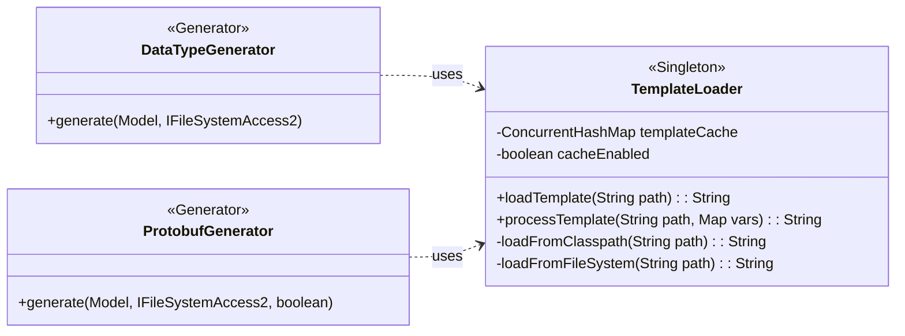
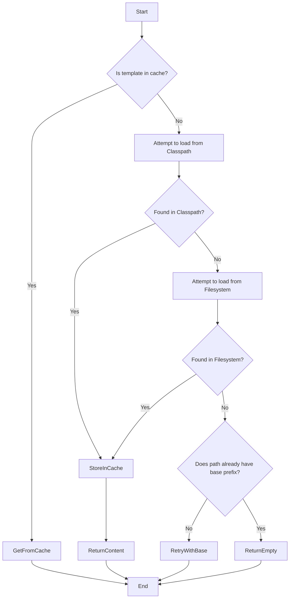

# A Deep Dive into the `TemplateLoader` Utility

### Executive Summary

The `TemplateLoader.xtend` file defines a foundational utility class for the entire code generation framework. Its purpose is to provide a centralized, robust, and efficient mechanism for loading external template files and performing simple variable substitution. Key design features include a multi-layered loading strategy that searches the classpath and multiple filesystem locations, and an in-memory cache to significantly improve performance by minimizing redundant file I/O. This class effectively decouples the static structure of the generated code (the templates) from the dynamic, model-driven logic of the generators.

## Section 1: Overall Design and Architecture

#### Design Analysis

- **Why? (Purpose):** The `TemplateLoader` exists to enforce the **Separation of Concerns** principle. By externalizing the boilerplate and syntax of the target languages (C++, Protobuf) into `.template` files, the core Java/Xtend generator logic can focus solely on processing the DSL model and preparing data. This allows the templates to be modified by developers who may not be familiar with the generator's internal logic, making the system more maintainable and flexible. It also provides a single, reusable component for all file-loading and processing needs, avoiding code duplication across different generators.
- **What? (Functionality):** The class provides a simple but powerful set of features:
  - **Template Loading:** It can load text files from multiple, prioritized locations.
  - **Caching:** It maintains an in-memory cache of loaded templates to boost performance during the generation of many files.
  - **Processing:** It offers a method to take a loaded template and a map of key-value pairs, replacing all occurrences of `{{KEY}}` with the corresponding value.
  - **Configuration:** It allows for enabling/disabling the cache and setting a base path for templates.
- **When? (Triggers):** An instance of `TemplateLoader` is used whenever a generator component, such as `DataTypeGenerator` or `ProtobufGenerator`, needs to create a file from a template. Its `processTemplate` method is called for every single file that is generated this way.
- **How? (Implementation):** The `TemplateLoader` is designed as a **Singleton**, ensuring that its cache is shared across the entire application. Its core `loadTemplate` method implements a **Chain of Responsibility** pattern for locating files: it first checks the cache, then the Java classpath, and finally a series of predefined filesystem paths. This multi-pronged approach makes the loader highly resilient and adaptable to different execution environments (e.g., running within an Eclipse IDE versus a headless Maven build). The template processing itself is a straightforward string replacement algorithm, chosen for its simplicity and performance over more complex templating engines.

#### Architectural Diagrams

##### Static Class Diagram

This diagram shows the `TemplateLoader` as a central utility used by the concrete generator classes.




##### Dynamic Activity Diagram (`loadTemplate` method)

This diagram visualizes the chain-of-responsibility logic within the `loadTemplate` method, showing how it searches for a template file.



## Section 2: Detailed Field and Method Analysis

This section provides a line-by-line breakdown of the `TemplateLoader.xtend` source file.

------

### **Lines 1-21: Package, Imports, and Class Definition**

```java
  1: package org.xtext.example.mydsl.generator
  2: 
  3: import java.io.InputStream
  4: import java.io.InputStreamReader
  5: import java.io.BufferedReader
  6: import java.util.Map
  7: import java.util.HashMap
  8: import java.util.concurrent.ConcurrentHashMap
  9: import com.google.inject.Singleton
 10: import java.nio.charset.StandardCharsets
 11: import java.nio.file.Files
 12: import java.nio.file.Paths
 13: import java.nio.file.Path
 14: 
 15: /**
 16:  * Template loader utility for loading external template files
 17:  * 
 18:  * @author DataType DSL Generator Framework
 19:  */
 20: @Singleton
 21: class TemplateLoader {
```

- **Lines 3-13:** These lines import necessary Java classes for file I/O (`InputStream`, `BufferedReader`, `Files`), data structures (`Map`, `ConcurrentHashMap`), and character encoding (`StandardCharsets`).
- **Line 9 (`import com.google.inject.Singleton`):** This import brings in the annotation used for dependency injection.
- **Line 20 (`@Singleton`):** This annotation instructs the Google Guice dependency injection framework to create only one instance of `TemplateLoader` for the entire application. This is crucial for the template cache to be effective, as it ensures all components share the same cache instance.

------

### **Lines 23-29: Fields**

```java
 23: 	// Cache for loaded templates
 24: 	val templateCache = new ConcurrentHashMap<String, String>()
 25: 
 26: 	// Configuration
 27: 	var boolean cacheEnabled = true
 28: 	var String templateBasePath = "/templates/"
 29: 
```

- **Line 24 (`templateCache`):** This field is the heart of the caching mechanism. A `ConcurrentHashMap` is used to allow thread-safe access, which is good practice in a potentially multi-threaded environment. It stores the template path as the key and the file's string content as the value.
- **Line 27 (`cacheEnabled`):** A simple boolean flag that can be used to disable caching, primarily for debugging purposes. It defaults to `true`.
- **Line 28 (`templateBasePath`):** Defines the default root directory within the project where templates are located. This is used as a fallback path.

------

### **Lines 33-35: `setCacheEnabled` Method**

```java
 33: 	def void setCacheEnabled(boolean enabled) {
 34: 		this.cacheEnabled = enabled
 35: 	}
```

- A simple setter method that allows other parts of the application (like the main `MyDslGenerator`) to enable or disable the template cache at runtime.

------

### **Lines 40-72: `loadTemplate` Method**

This is the main public method for retrieving a template's content.

```java
 40: 	def String loadTemplate(String templatePath) {
 41: 		// Check cache first
 42: 		if (cacheEnabled && templateCache.containsKey(templatePath)) {
 43: 			return templateCache.get(templatePath)
 44: 		}
 45: 
 46: 		var String content = null
 47: 
 48: 		// Try loading from classpath first
 49: 		content = loadFromClasspath(templatePath)
 50: 
 51: 		// If not found in classpath, try file system
 52: 		if (content === null) {
 53: 			content = loadFromFileSystem(templatePath)
 54: 		}
 55: 
 56: 		// If still not found, try with base path
 57: 		if (content === null &&!templatePath.startsWith(templateBasePath)) {
 58: 			content = loadTemplate(templateBasePath + templatePath)
 59: 		}
 60: 
 61: 		if (content === null) {
 62: 			// Return empty string instead of throwing exception
 63: 			return ""
 64: 		}
 65: 
 66: 		// Cache the loaded template
 67: 		if (cacheEnabled) {
 68: 			templateCache.put(templatePath, content)
 69: 		}
 70: 
 71: 		return content
 72: 	}
```

- **Lines 42-44:** The first step is to check the cache. If caching is enabled and the template has been loaded before, it is returned immediately, avoiding all file I/O.
- **Line 49:** If not in the cache, it makes its first attempt: loading from the Java classpath via the `loadFromClasspath` helper. This is the standard way to access resources within a bundled application or plugin.
- **Lines 52-54:** If the classpath search fails (`content` is still `null`), it proceeds to the second attempt: loading from the filesystem via the `loadFromFileSystem` helper. This provides flexibility for development environments.
- **Lines 57-59:** If both attempts fail, it makes a final recursive call, this time prepending the `templateBasePath` to the path. This handles cases where a relative path like `cpp/struct.template` was provided instead of the full `/templates/cpp/struct.template`.
- **Lines 61-64:** If the template is still not found after all attempts, the method returns an empty string. This is a crucial design choice for robustness: it prevents the entire generation process from crashing due to a single missing template file.
- **Lines 67-69:** If a template was successfully loaded, it is stored in the `templateCache` before being returned, ensuring subsequent requests for the same template are served instantly.

------

### **Lines 77-114: `loadFromClasspath` and `loadFromFileSystem` Methods**

These private helper methods implement the different loading strategies.

```java
 77: 	private def String loadFromClasspath(String templatePath) {
 78: 		try {
 79: 			val stream = class.getResourceAsStream(templatePath)
 80: 			if (stream!== null) {
 81: 				return readStream(stream)
 82: 			}
 83: 		} catch (Exception e) { /* Silent fail */ }
 86: 		return null
 87: 	}
 88: 
 92: 	private def String loadFromFileSystem(String templatePath) {
 93: 		try {
 94: 			// Try relative path first
 95: 			var Path path = Paths.get("src/resources" + templatePath)
 97: 			if (!Files.exists(path)) {
 99: 				path = Paths.get(templatePath)
100: 			}
102: 			if (!Files.exists(path)) {
104: 				path = Paths.get(System.getProperty("user.dir"), "src/resources", templatePath)
105: 			}
107: 			if (Files.exists(path)) {
108: 				return new String(Files.readAllBytes(path), StandardCharsets.UTF_8)
109: 			}
110: 		} catch (Exception e) { /* Silent fail */ }
113: 		return null
114: 	}
```

- **`loadFromClasspath`:** Uses the standard Java `class.getResourceAsStream` to find the file within the project's build path. It returns `null` if the resource is not found or an error occurs.
- **`loadFromFileSystem`:** This method demonstrates high adaptability by checking multiple common filesystem locations:
  1. Relative to a `src/resources` folder.
  2. As a direct path from the project root.
  3. Relative to the current working directory (`user.dir`). This ensures it works correctly in various launch configurations. It uses `java.nio.file.Files` for modern and efficient file reading.

------

### **Lines 119-138: `readStream` Method**

A private utility for reading an `InputStream` into a `String`.

```java
119: 	private def String readStream(InputStream stream) {
120: 		val reader = new BufferedReader(new InputStreamReader(stream, StandardCharsets.UTF_8))
121: 		val content = new StringBuilder()
123: 		try {
124: 			var line = reader.readLine()
125: 			while (line!== null) {
126: 				if (content.length > 0) {
127: 					content.append("\n")
128: 				}
129: 				content.append(line)
130: 				line = reader.readLine()
131: 			}
132: 		} finally {
133: 			reader.close()
134: 			stream.close()
135: 		}
137: 		return content.toString()
138: 	}
```

- This method correctly handles character encoding by specifying `StandardCharsets.UTF_8`. It reads the stream line-by-line, rebuilding the content with newline characters. The `finally` block ensures that the stream and reader are always closed to prevent resource leaks.

------

### **Lines 143-157: `processTemplate` Method**

This is the workhorse method that performs the variable substitution.

```java
143: 	def String processTemplate(String templatePath, Map<String, String> variables) {
144: 		var template = loadTemplate(templatePath)
145: 
146: 		if (template.empty) {
147: 			return ""
148: 		}
149: 
150: 		// Replace variables in format {{VARIABLE_NAME}}
151: 		for (entry : variables.entrySet) {
152: 			val placeholder = "{{" + entry.key + "}}"
153: 			template = template.replace(placeholder, entry.value?: "")
154: 		}
155: 
156: 		return template
157: 	}
```

- **Line 144:** It first calls `loadTemplate` to get the raw template content.
- **Lines 146-148:** If the template is empty (e.g., it couldn't be found), it returns an empty string immediately.
- **Lines 151-154:** It iterates through the provided `variables` map. For each entry:
  - It constructs the placeholder string, e.g., `{{CONTENT}}`.
  - It uses the standard `String.replace()` method to substitute all occurrences of the placeholder with its corresponding value. The `?: ""` is an Elvis operator that provides an empty string if the value is `null`, preventing `NullPointerException`.
- **Line 156:** Returns the final, processed string.

------

### **Lines 162-181: Utility Methods**

The class concludes with a few simple configuration and utility methods.

```java
162: 	def boolean templateExists(String templatePath) {
163: 		val content = loadTemplate(templatePath)
164: 		return content!== null &&!content.empty
165: 	}
166: 
170: 	def void clearCache() {
171: 		templateCache.clear()
172: 	}
173: 
177: 	def void setTemplateBasePath(String basePath) {
178: 		this.templateBasePath = basePath
179: 		clearCache()
180: 	}
```

- **`templateExists`:** A convenient method to check if a template can be successfully loaded.
- **`clearCache`:** Empties the `templateCache`.
- **`setTemplateBasePath`:** Sets a new base path for templates. Crucially, it calls `clearCache()` (line 179) because changing the base path may invalidate the paths of already-cached templates.