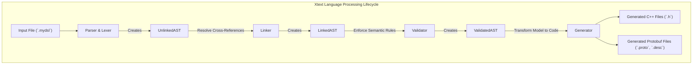
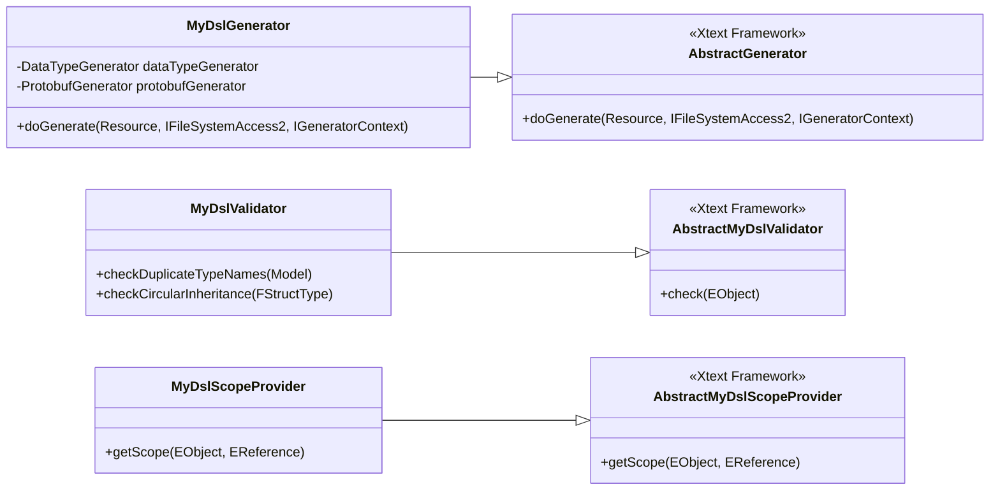
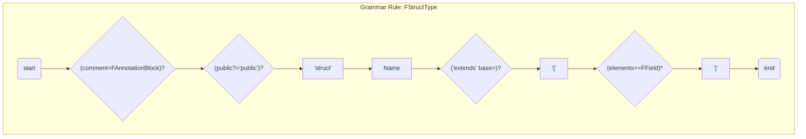
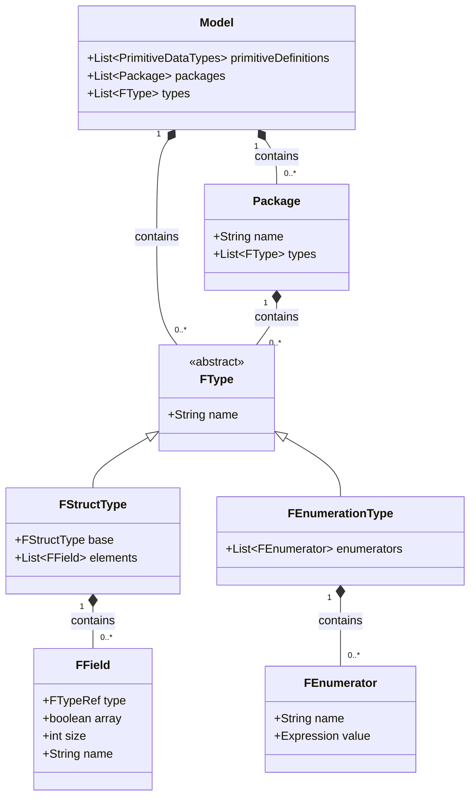
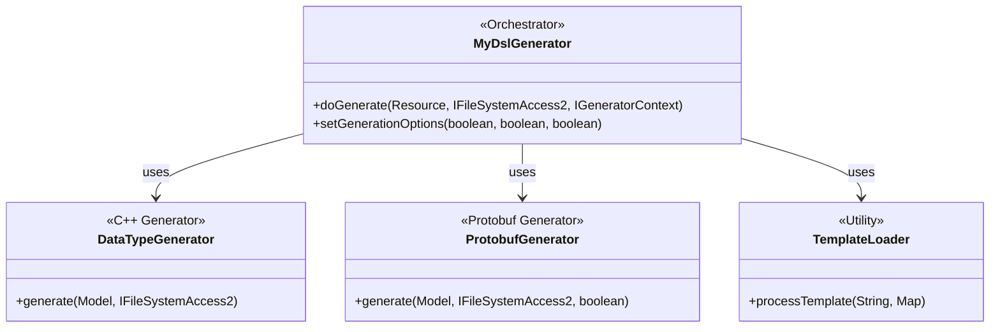
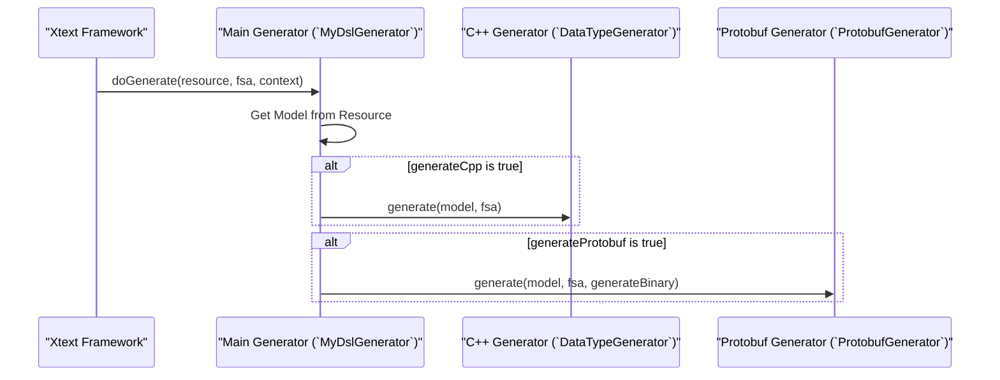
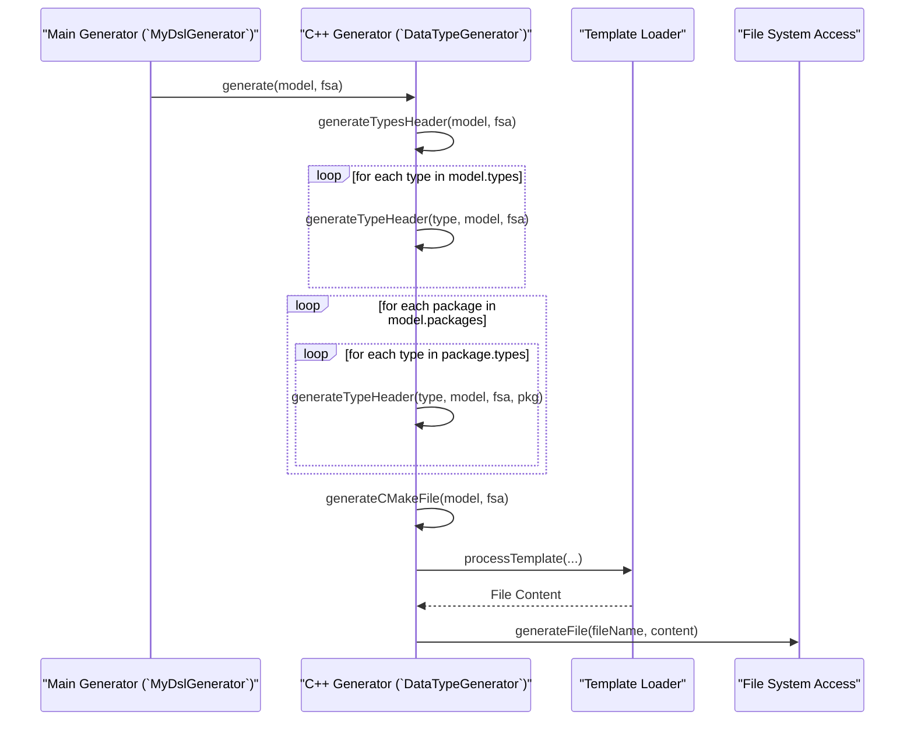
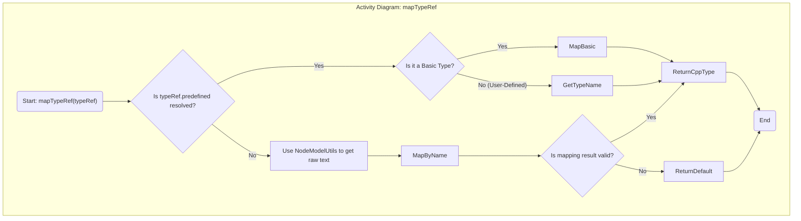
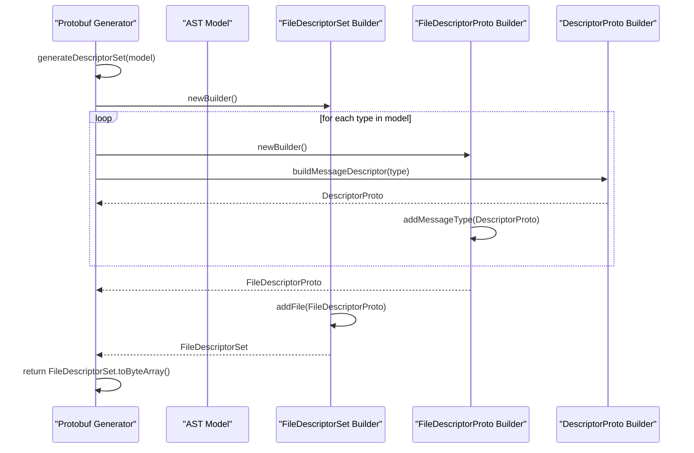

# A Deep Dive into the `org.xtext.example.mydsl` Code Generation Framework

### Executive Summary

The `org.xtext.example.mydsl` project is a comprehensive framework for developing a data-centric Domain-Specific Language (DSL). It leverages the Eclipse Xtext framework to provide a complete language infrastructure, including parsing, validation, and multi-target code generation. The core purpose of the project is to transform abstract data structure definitions, written in a custom `.mydsl` format, into concrete, usable artifacts for different technology stacks—specifically C++ header files and Google Protocol Buffers (`.proto`) definitions. The architecture demonstrates a robust, template-driven generation engine that cleanly separates the logic of model traversal from the syntax of the target languages. Furthermore, it incorporates sophisticated mechanisms for semantic validation and cross-reference resolution, ensuring model integrity and providing a rich, interactive development experience within an IDE. This report provides a block-by-block, line-by-line analysis of the project's source code, dissecting its architectural design, key components, and the intricate interplay between its various subsystems.

## Section 1: Architectural Overview of the MyDsl Xtext Framework

The `org.xtext.example.mydsl` project is built upon the Eclipse Xtext framework, a powerful tool for creating DSLs and their associated IDEs. The project's architecture is a direct reflection of the standard Xtext language development lifecycle, which provides a structured approach to transforming textual DSL specifications into tangible software artifacts.

### 1.1. The Xtext Language Development Lifecycle

The processing of a `.mydsl` file follows a well-defined lifecycle inherent to the Xtext framework. This lifecycle can be broken down into four primary stages: Parsing, Linking, Validation, and Code Generation. Each stage is handled by a dedicated component within the project, ensuring a modular and maintainable design.

1. **Parsing:** The raw text from a `.mydsl` file is first processed by a lexer and parser, which are automatically generated by Xtext from the grammar definition (`MyDsl.xtext`). This stage verifies the syntactic correctness of the input and constructs an in-memory representation of the code, known as an Abstract Syntax Tree (AST). The AST is an instance of an EMF Ecore model.
2. **Linking (Scoping):** After the initial AST is built, the linker resolves all cross-references within the model. For instance, when a `struct` field references a type like `uint32` or another `struct`, the `MyDslScopeProvider` is invoked to determine the set of valid elements that the reference can point to.
3. **Validation:** The `MyDslValidator` inspects the linked AST to enforce semantic rules that go beyond simple syntax. This includes checks for duplicate names, circular inheritance, and adherence to project-specific naming conventions.
4. **Code Generation:** Finally, the validated AST is passed to the `MyDslGenerator`, which serves as the entry point to the code generation engine. This component orchestrates the transformation of the abstract model into concrete C++ and Protobuf files.

The following diagram illustrates this data flow, showing how a `.mydsl` file is processed through the various stages of the Xtext lifecycle.

### 1.2. Project Structure and Key Components

The project's directory structure is organized logically, separating the DSL definition, the implementation of language services (generation, validation, scoping), and the resources required for code generation, such as templates.

- `src/org/xtext/example/mydsl/`: This is the main source directory containing the core Java and Xtend code.
  - `MyDsl.xtext`: The grammar file that defines the syntax of the DSL.
  - `generator/`: Contains all classes related to code generation, including the main orchestrator (`MyDslGenerator`) and target-specific generators (`DataTypeGenerator`, `ProtobufGenerator`).
  - `validation/`: Contains the `MyDslValidator` class, which implements custom semantic validation rules.
  - `scoping/`: Contains the `MyDslScopeProvider` class, responsible for resolving cross-references.
  - `MyDslRuntimeModule.java`: Configures the dependency injection framework (Google Guice) to wire together the custom components.
- `resources/templates/`: This directory holds all the template files used by the code generators. The templates are neatly organized by target language (`cpp`, `proto`) and build system (`cmake`), demonstrating a clean separation of generation logic from output syntax.
- `pom.xml`, `build.properties`, `plugin.xml`: These files manage the project's build process, dependencies, and its integration as an Eclipse plugin.

The architecture exhibits a strong adherence to the **Separation of Concerns** principle, a key feature of the Xtext framework. The grammar definition, validation logic, scoping rules, and code generation logic are encapsulated in distinct, loosely coupled components. This modularity is explicitly configured in `MyDslRuntimeModule.java`, where Google Guice is used to bind these separate implementations to the core Xtext interfaces (`IGenerator2`, `IScopeProvider`). This design allows each component to be developed, tested, and modified independently. For instance, the entire C++/Protobuf generation logic could be replaced with a Java generator without altering the parser or validator.

The high-level relationship between these key components is illustrated in the diagram below.

A recurring theme throughout the codebase is a design philosophy centered on **Resilience and Robustness in Code Generation**. The generator code is intentionally designed to produce usable, albeit potentially incomplete, output even when encountering errors or unresolved references in the source model, rather than failing catastrophically. This is evident in methods like `generateFieldWithTemplate` within `DataTypeGenerator`, which contain `try-catch` blocks that not only log an error but also generate placeholder code with comments indicating the failure. This approach prioritizes immediate developer feedback and supports an iterative refinement workflow, where a developer receives a compilable file with clear error markers instead of a cryptic build failure. This demonstrates a focus on the practical, non-functional requirements of the generator as a developer tool.

## Section 2: The Language Grammar and Abstract Syntax Tree (AST)

The foundation of the entire DSL is the grammar file, `MyDsl.xtext`. This file provides a formal definition of the language's syntax and dictates the structure of the in-memory Abstract Syntax Tree (AST) that the parser creates.

### 2.1. Grammar Analysis (`MyDsl.xtext`)

The grammar is defined using Xtext's specialized grammar language, which mixes concrete syntax rules with instructions for building an EMF Ecore model.

- **Header and Imports:** The file begins with standard declarations :
  - `grammar org.xtext.example.mydsl.MyDsl with org.eclipse.xtext.common.Terminals`: Declares the grammar's name and inherits common terminal rules (like `ID`, `STRING`, `INT`) from a standard Xtext library.
  - `import "http://www.eclipse.org/emf/2002/Ecore" as ecore`: Imports the Ecore metamodel, allowing the grammar to reference fundamental Ecore types.
  - `generate myDsl "http://www.xtext.org/example/mydsl/MyDsl"`: Instructs Xtext to infer an Ecore model from this grammar. The model will be named `myDsl` and will have the specified URI, which uniquely identifies it.
- **Top-Level Rules:** The structure of a `.mydsl` file is defined by the `Model` and `Package` rules :
  - `Model: (primitiveDefinitions+=PrimitiveDataTypes)* (packages+=Package)* (types+=FType)*;`: The `Model` rule is the entry point for the parser. It specifies that a model can contain zero or more `PrimitiveDataTypes` definitions, followed by zero or more `Package` definitions, and finally zero or more top-level `FType` definitions. The `+=` operator indicates that each matched element should be added to a list-like feature in the resulting `Model` AST object.
  - `Package: 'package' name=FQN '{' (types+=FType)* '}';`: This rule defines a namespace container. It requires the keyword `package`, followed by a fully qualified name (`FQN`), and contains zero or more `FType` definitions within curly braces.
- **Type Definition Rules:** The core of the DSL lies in its ability to define various data types. The `FType` rule acts as a dispatcher to more specific type rules :
  - `FType returns FType: FArrayType | FEnumerationType | FStructType | FTypeDef;`: This rule specifies that an `FType` can be one of four concrete types. The `returns FType` part indicates that all these concrete rules will result in AST objects that share a common supertype, `FType`.
  - `FStructType returns FStructType:... 'struct' name=ID ('extends' base=)? '{' (elements+=FField)* '}';`: This rule defines a structure. It consists of the keyword `struct`, a name (assigned to the `name` feature), an optional inheritance clause (`extends`), and a body containing a list of fields (`elements`).
- **Cross-References and Linking Syntax:** The grammar uses a special syntax to denote cross-references. In the `FStructType` rule, the `base=` part is a cross-reference. The square brackets tell the Xtext linker that `base` should refer to another `FStructType` element, which can be identified by its fully qualified name (`FQN`). The actual resolution of this link is handled by the `MyDslScopeProvider` during the linking phase.

The structure of the `FStructType` grammar rule can be visualized as follows:

The grammar's design is centered around a flexible, keyword-driven syntax that is easy for humans to read and write. However, this flexibility introduces complexities that must be managed by other components. The `FTypeRef` rule, for instance, allows a field's type to be either a primitive or a user-defined type. This powerful feature necessitates a complex implementation in the 

`MyDslScopeProvider`, which must gather all possible type definitions from various locations in the model into a single, resolvable scope. This is a clear example of how a design choice in the grammar directly influences the complexity of downstream language services.

### 2.2. The Inferred EMF Ecore Model (AST)

Xtext automatically translates the grammar rules into an EMF Ecore model, which defines the structure of the AST. Each parser rule that returns a type becomes an `EClass`, and each assignment (`=`, `+=`) within a rule becomes an `EAttribute` (for simple values like strings or integers) or an `EReference` (for links to other `EClass` instances).

The diagram below shows a simplified view of the key Ecore classes generated from the `MyDsl.xtext` grammar and their relationships. This represents the in-memory object graph that the validators and code generators operate on.

Code snippet

## Section 3: The Multi-Target Code Generation Engine (`generator` package)

The `generator` package is the core of the project, responsible for transforming the validated AST into source code for multiple target platforms. The design employs a clear separation between the orchestration logic, the target-specific generation logic, and the templating utility.

### 3.1. Generation Orchestrator: `MyDslGenerator.xtend`

#### Low-Level Design

- **Why?** To provide a single, centralized entry point for the entire code generation process. It decouples the Xtext framework from the individual target generators (C++, Protobuf), allowing for flexible configuration of the generation pipeline.
- **What?** This class extends Xtext's `AbstractGenerator` and uses Google Guice's `@Inject` annotation to obtain instances of the specialized generators (`DataTypeGenerator`, `ProtobufGenerator`) and the shared `TemplateLoader` utility. It acts as a dispatcher, delegating the generation tasks to the appropriate components.
- **When?** The `doGenerate` method is invoked by the Xtext framework automatically whenever a `.mydsl` file is saved in an Eclipse-based IDE or during a command-line build process.
- **How?** The `doGenerate` method first extracts the root `Model` object from the input `Resource`. It then initializes the `TemplateLoader` and uses simple boolean flags (`generateCpp`, `generateProtobuf`) to conditionally call the `generate` method of each injected generator. These flags can be configured via the `setGenerationOptions` method, which is particularly useful for controlling behavior during automated testing.

#### Diagrams

The following class diagram illustrates the dependencies of the `MyDslGenerator`.

The sequence diagram below shows the flow of control when `doGenerate` is called.

### 3.2. C++ Code Generation: `DataTypeGenerator.xtend`

#### Low-Level Design

- **Why?** To translate the platform-agnostic DSL model into concrete C++ header files (`.h`), enabling the use of the defined data structures in C++ applications.
- **What?** A complex, template-driven generator responsible for creating individual headers for each type (`struct`, `enum`, etc.), a main `Types.h` file that includes all generated headers, and a `CMakeLists.txt` file for building the code as a header-only library.
- **When?** This generator is invoked by `MyDslGenerator` if the `generateCpp` flag is set to true.
- **How?** The class orchestrates the generation process through a series of methods:
  - `generate(Model,...)`: The main entry point for C++ generation. It iterates through all types defined at the top level and within packages, invoking `generateTypeHeader` for each. The use of nested `try-catch` blocks at this level makes the process resilient; a failure to generate one header file will be logged, but it will not halt the generation of others.
  - `generateTypeHeader(FType,...)`: This method handles the creation of a single header file. It calculates the correct file path (including subdirectories for packages), generates a unique include guard, constructs the appropriate C++ namespace declarations, and assembles the final file content by calling helper methods and processing the `header.template`.
  - `generateTypeContent(FType,...)`: This method acts as a dispatcher. It uses a `switch` statement on the type of the AST node (`FStructType`, `FEnumerationType`, etc.) to delegate the generation of the core content to the appropriate specialized method (e.g., `generateStructWithTemplate`). This is a classic application of polymorphism over the AST's class hierarchy.
  - `mapTypeRef(FTypeRef,...)`: This is a critical and highly complex method responsible for translating a DSL type reference into a valid C++ type name (e.g., `uint32` becomes `uint32_t`, `String` becomes `std::string`). Its implementation reveals a key architectural characteristic: it first attempts to use the resolved cross-reference provided by the Xtext linker. If that reference is unresolved (which the code comments suggest is a known issue for primitive types), it employs a robust fallback mechanism. This fallback uses `NodeModelUtils` to directly inspect the low-level parse tree and extract the type name as raw text. This makes the generator resilient to linking failures but also tightly couples it to the concrete textual syntax of the DSL, which can be brittle if the grammar changes.
  - `mapBasicTypeByName(String,...)`: This helper method contains a large `switch` statement that performs the final mapping from a raw type name string to a C++ type string. It handles numerous common aliases (e.g., `int`, `int32`, `uint`) and provides a safe default type (`uint32_t`) to prevent generation failures.

#### Diagrams

The sequence of operations within the main `generate` method is shown below.

The decision-making process within the crucial `mapTypeRef` method is illustrated in the following activity diagram. It clearly shows the primary path for resolved references and the fallback path for unresolved ones.

### 3.3. Protocol Buffers Generation: `ProtobufGenerator.xtend`

#### Low-Level Design

- **Why?** To translate the DSL model into `.proto` files, enabling the defined data structures to be used in systems that rely on Google Protocol Buffers for efficient data serialization and cross-language communication. It also provides the capability to generate a binary descriptor set, which allows for dynamic schema interpretation at runtime without needing the original `.proto` source file.
- **What?** A generator that creates `.proto` files for the root model and for each package. It contains sophisticated logic to programmatically build a binary `FileDescriptorSet` using the official Protobuf Java library and includes complex workarounds to reliably write this binary data to the file system.
- **When?** Invoked by `MyDslGenerator` if the `generateProtobuf` flag is true.
- **How?**
  - `generate(Model,...)`: The main entry point, which orchestrates the generation of the main `datatypes.proto` file, per-package `.proto` files, and, if requested, the binary descriptor set (`.desc`) and an accompanying info file.
  - `generateProtoFileWithTemplate(Model)`: Assembles the content for a `.proto` file by generating the syntax declaration, package name, file options, and the message and enum definitions derived from the AST.
  - `mapToProtoType(FTypeRef)`: The Protobuf equivalent of the C++ type mapper. It translates DSL types into Protobuf scalar types (e.g., `uint32` -> `uint32`, `uint8` -> `uint32`, `String` -> `string`) or the names of other message types. It shares the same robust fallback mechanism using `NodeModelUtils` as its C++ counterpart to handle unresolved type references.
  - `generateDescriptorSet(Model)`: This highly technical method bypasses the need for an external `protoc` compiler. It directly uses the Google Protobuf Java library (`com.google.protobuf.DescriptorProtos`) to programmatically construct a `FileDescriptorSet` object in memory by traversing the AST and creating corresponding `FileDescriptorProto`, `DescriptorProto` (for messages), and `EnumDescriptorProto` objects. The final object is then serialized into a byte array.
  - `writeBinaryDescriptor(...)`: This method addresses a significant architectural challenge: reliably writing binary data using Xtext's `IFileSystemAccess2` interface, which is primarily designed for text files. The implementation is a multi-layered defense against potential file system issues. It first attempts to write the binary data to a standard location. If this fails, it cycles through a list of alternative common output directories (`src-gen`, `target/generated-sources`). As a final resort, if all direct write attempts fail, it calls `generateBase64Fallback`, which creates a text file containing the binary data encoded in Base64, along with instructions for the user on how to decode it manually. This elaborate sequence of fallbacks highlights a friction point between the generator's requirements and the framework's default capabilities, demonstrating a pragmatic solution to ensure the binary artifact is produced one way or another.

#### Diagrams

The process of programmatically building the binary descriptor set is shown in the sequence diagram below.

### 3.4. Utility and Infrastructure: `TemplateLoader.xtend`

#### Low-Level Design

- **Why?** To abstract and centralize the logic for loading template files and substituting variables. This decouples the generation logic (which deals with the AST and type mapping) from the presentation logic (the concrete syntax of the generated code), significantly improving maintainability.
- **What?** A singleton utility class that loads template files from either the application's classpath or the local file system. It caches the content of loaded templates in a `ConcurrentHashMap` to improve performance on subsequent requests and provides a simple method to replace placeholders with dynamic data.
- **When?** It is used extensively by both `DataTypeGenerator` and `ProtobufGenerator` every time they need to generate a piece of text output that is based on a file in the `resources/templates` directory.
- **How?**
  - `loadTemplate(String)`: This is the core loading method. It first checks the cache. If the template is not cached, it attempts to load it as a resource from the classpath (the standard way for deployed applications) and then falls back to loading it from the file system (useful for development environments). This dual-strategy approach makes the loader robust across different execution contexts.
  - `processTemplate(String, Map)`: This method orchestrates the two steps: it calls `loadTemplate` to get the raw template content and then iterates through the provided map of variables, performing a simple string replacement for placeholders formatted as `{{VARIABLE_NAME}}`.

The `TemplateLoader` is a key architectural component that enables the project's maintainability and extensibility. It enforces a clean separation between the complex AST traversal and type-mapping logic (written in Xtend) and the presentation-layer syntax (defined in the `.template` files). For example, if a project-wide C++ coding standard changes, a developer would only need to modify the relevant `.template` files in the `resources/cpp` directory, without touching the more complex Xtend generator code. This design pattern also makes it straightforward to add a new target language; one would simply create a new generator class (e.g., `PythonGenerator.xtend`) and a corresponding new set of templates in a `resources/python` directory.

### 3.5. DSL Type Mapping Comparison

The complex type mapping logic embedded within the `DataTypeGenerator` and `ProtobufGenerator` can be summarized in the following table. This provides a clear, at-a-glance comparison of how a single DSL type is represented across the different target platforms, distilling the logic from the various `map...` functions into an easily digestible format.

| DSL Type Name         | C++ Mapped Type (`DataTypeGenerator`) | Protobuf Mapped Type (`ProtobufGenerator`) | Notes                                                        |
| --------------------- | ------------------------------------- | ------------------------------------------ | ------------------------------------------------------------ |
| `uint8`, `byte`       | `uint8_t`                             | `uint32`                                   | Protobuf does not have 8-bit integer types and promotes them to 32-bit. |
| `uint32`, `uint`      | `uint32_t`                            | `uint32`                                   | Direct mapping for unsigned 32-bit integers.                 |
| `int32`, `int`        | `int32_t`                             | `int32`                                    | Direct mapping for signed 32-bit integers.                   |
| `String`, `string`    | `std::string`                         | `string`                                   | Mapped to standard string types in both targets.             |
| `float32`, `float`    | `float`                               | `float`                                    | Mapped to standard single-precision floating-point types.    |
| `float64`, `double`   | `double`                              | `double`                                   | Mapped to standard double-precision floating-point types.    |
| *User-Defined Struct* | *Struct Name*                         | *Message Name*                             | The name of the DSL struct is used directly as the C++ struct name and the Protobuf message name. |
| *User-Defined Enum*   | `enum class` *Enum Name*              | `enum` *Enum Name*                         | The name of the DSL enum is used directly. C++ generation uses `enum class` for type safety. |

## Section 4: Core Language Services (`validation` and `scoping` packages)

Beyond code generation, the project implements core language services that provide semantic analysis and enable IDE features like error checking and code navigation. These services are crucial for ensuring the correctness of the DSL models.

### 4.1. Semantic Validation: `MyDslValidator.java`

#### Low-Level Design

- **Why?** To enforce semantic rules and constraints that cannot be expressed by the grammar alone. This includes checking for logical errors, ensuring model consistency, and guiding the user toward best practices and conventions.
- **What?** A Java class that extends `AbstractMyDslValidator`. It contains methods annotated with `@Check`, which are automatically discovered and invoked by the Xtext framework on the corresponding AST elements during the validation phase.
- **When?** Validation is triggered continuously in the IDE as the user types, as well as upon saving the file or during an explicit build action.
- **How?** The class implements several specific validation rules :
  - `checkDuplicateTypeNames(Model)`: Traverses the model and uses a `Set` to detect if any two types (structs, enums, etc.) are defined with the same name within the same scope (either globally or within a package).
  - `checkUniqueFieldNames(FStructType)`: Ensures that a struct does not declare fields with duplicate names. Importantly, this check is inheritance-aware; it recursively collects field names from the base class hierarchy to prevent name clashes with inherited members.
  - `checkCircularInheritance(FStructType)`: Protects against invalid inheritance cycles (e.g., A extends B, and B extends A) by traversing the `base` reference chain of a struct and keeping track of visited types in a `Set`.
  - `checkEnumHasZeroValue(FEnumerationType)`: Issues a warning if an enum definition does not contain a member with the value 0. This is a pragmatic rule driven by a constraint from a target platform, as Protocol Buffers requires that the default value for any enum is the one with numeric value 0.
  - `check...NamingConvention(...)` methods: A suite of checks that enforce stylistic guidelines, such as requiring type names to start with an uppercase letter (PascalCase) and field names to start with a lowercase letter (camelCase). These rules promote consistency across different `.mydsl` files.

### 4.2. Scoping and Link Resolution: `MyDslScopeProvider.java`

#### Low-Level Design

- **Why?** To define the "visibility" of elements for cross-references. When the parser encounters a reference to a type (e.g., in a field definition like `MyStruct myField` or an inheritance clause like `extends Base`), the scope provider is responsible for supplying a list of all valid candidates that this reference could resolve to.
- **What?** A Java class extending `AbstractMyDslScopeProvider` that overrides the `getScope` method to implement custom linking logic.
- **When?** The `getScope` method is called by the Xtext linker during the linking phase (after parsing) whenever a cross-reference in the AST needs to be resolved to a concrete definition.
- **How?**
  - `getScope(EObject, EReference)`: This is the main entry point for the scoping service. It acts as a dispatcher, inspecting the type of the AST node (`context`) and the specific reference being resolved (`reference.getName()`) before delegating to a more specialized `scope_...` method.
  - `scope_FTypeRef_predefined(FTypeRef, EReference)`: This is the most critical scoping rule in the project, as it defines the scope for all type references. It constructs a comprehensive scope by traversing the entire model and collecting:
    1. All primitive types (`FBasicTypeId`) defined within `PrimitiveDataTypes` blocks.
    2. All user-defined types (`FType`) declared at the top level of the model.
    3. All user-defined types declared within `Package` blocks. For these types, it makes them available via both their simple name (e.g., `Data`) and their fully qualified name (e.g., `com.example.Data`), enabling flexible referencing. This comprehensive collection is what allows a field anywhere in a file to refer to any type defined anywhere else in the same file.

A critical interplay exists between the `MyDslScopeProvider` and the code generators. The complex, defensive fallback logic found in the generators' `mapTypeRef` methods is a direct consequence of the scoping and linking mechanism not successfully resolving all cross-references under all conditions. The comment in `DataTypeGenerator` explicitly states that "cross-references to types in PrimitiveDataTypes aren't being resolved". This indicates a limitation or potential bug in the scoping implementation. To compensate for this linking failure, the generator is forced to resort to manually parsing the type name from the raw text of the unresolved reference using 

`NodeModelUtils`. This reveals a deep, causal relationship: a limitation in the scoping service has directly led to the implementation of complex, low-level, and potentially brittle code in the generation service. An ideal refactoring would involve fixing the root cause in the `MyDslScopeProvider`, which would allow for the removal of the fragile fallback logic in the generators, thereby improving the overall robustness and maintainability of the system.

## Section 5: Project Configuration and Build Workflow

The project's behavior, build process, and integration with the Xtext framework are controlled by a set of configuration files. These files orchestrate everything from the generation of the language infrastructure itself to the wiring of custom components via dependency injection.

### 5.1. The MWE2 Workflow: `GenerateMyDsl.mwe2`

The `GenerateMyDsl.mwe2` file is the blueprint for the Xtext language generator. It does not generate the C++ or Protobuf code from a `.mydsl` file; rather, it generates the Java/Xtend infrastructure (the parser, serializer, validator stubs, etc.) from the `MyDsl.xtext` grammar file.

- **Why?** To configure and execute the Xtext code generator, which creates the core components of the DSL implementation.
- **What?** A file written in the Modeling Workflow Engine 2 (MWE2) language. It defines a `Workflow` that contains and configures an `XtextGenerator` component.
- **How?** The workflow is configured through two main blocks:
  - `StandardProjectConfig`: This block defines the project's structure, including the base name (`org.xtext.example.mydsl`) and whether to generate support for Eclipse plugins and tests.
  - `StandardLanguage`: This block configures the language-specific aspects. It specifies the language's fully qualified name, the file extension (`.mydsl`), and which Xtext "generator fragments" to run. These fragments are responsible for creating different parts of the language infrastructure, such as the validator base classes, the serializer, and stubs for the generator itself.

### 5.2. Dependency Injection: `MyDslRuntimeModule.java`

This file is the central hub for customizing the runtime behavior of the DSL. It uses the Google Guice dependency injection framework to replace Xtext's default components with the project's custom implementations.

- **Why?** To register the project's custom implementations of core language services with the Xtext framework, effectively overriding the default behaviors.
- **What?** A Java class that extends `AbstractMyDslRuntimeModule` and defines bindings for the Guice injector.
- **How?** The class uses specific binding methods to configure the dependency injection container :
  - `bindIGenerator2()`: This method binds the `IGenerator2` interface to the custom `MyDslGenerator` class. This is the crucial step that tells Xtext to use this project's code generation engine when processing `.mydsl` files.
  - `bindIScopeProvider()`: This method binds the `IScopeProvider` interface to the custom `MyDslScopeProvider`, ensuring that the project's logic for resolving cross-references is used.
  - `configure(Binder)`: This method provides more fine-grained control over the bindings. Here, it is used to register the `TemplateLoader`, `DataTypeGenerator`, and `ProtobufGenerator` as eager singletons. This ensures that only one instance of each of these classes is created and shared throughout the application's lifecycle, which is important for performance (e.g., template caching) and consistent state management.

## Section 6: Conclusion and Recommendations

The `org.xtext.example.mydsl` project stands as a well-architected example of a multi-target code generation framework built with Xtext. It successfully leverages the framework's capabilities to create a custom DSL complete with validation, scoping, and a powerful, template-driven generation engine.

### 6.1. Design Summary

The architecture is founded on the core Xtext principles of Separation of Concerns and Dependency Injection. The grammar, validation rules, scoping logic, and generation engine are implemented as distinct, modular components that are wired together at runtime. The code generation engine itself is further modularized, with a central orchestrator delegating tasks to target-specific generators. The extensive use of an external templating engine (`TemplateLoader`) cleanly separates the complex logic of AST traversal and type mapping from the presentation-layer concerns of C++ and Protobuf syntax.

### 6.2. Strengths and Weaknesses

The primary strengths of the project are its modularity, resilience, and extensibility.

- **Strengths:** The clear separation of components makes the system easier to understand, maintain, and extend. The generation logic is notably resilient, designed to produce partial output with clear error indicators rather than failing completely. The template-based approach makes it straightforward to modify existing output formats or add support for new target languages.
- **Weaknesses:** The most significant weakness is the tight coupling between the code generators and the raw textual representation of the DSL, which is a workaround for unresolved cross-references. This reliance on `NodeModelUtils` to manually parse type names makes the generators brittle; changes to the grammar could easily break the generation logic in subtle ways. Additionally, the highly complex logic for writing binary files in `ProtobufGenerator` indicates a friction point with the underlying framework that required a cumbersome and error-prone solution.

### 6.3. Recommendations for Future Work

Based on the detailed analysis, the following actions are recommended to improve the robustness and maintainability of the project:

1. **Refactor Scoping and Linking:** The highest priority should be to investigate and resolve the root cause of the linking failures for primitive types. A fully functional `MyDslScopeProvider` that correctly resolves all type references would allow for the complete removal of the fragile `NodeModelUtils` fallback logic in both the `DataTypeGenerator` and `ProtobufGenerator`. This would dramatically simplify the generator code, decouple it from the concrete syntax, and make the entire system more robust.
2. **Isolate Binary Writing Logic:** The complex, multi-stage logic for writing binary files should be extracted from `ProtobufGenerator` into a dedicated, reusable utility class. This would improve the separation of concerns within the Protobuf generator and make the binary writing capability available to other potential generators in the future.
3. **Enhance Automated Testing:** The existing test classes (`DataTypeGeneratorTest.java`, `MyDslGeneratorTest.xtend`) serve as effective test runners but lack fine-grained unit tests. The project would benefit greatly from the addition of focused unit tests for critical and complex components, particularly the type mapping functions (`mapTypeRef`, `mapToProtoType`) and the individual validation rules in `MyDslValidator`. This would formalize the correctness checks and provide a safety net against regressions during future development.