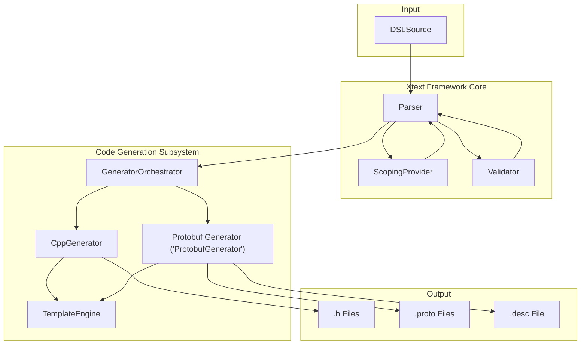
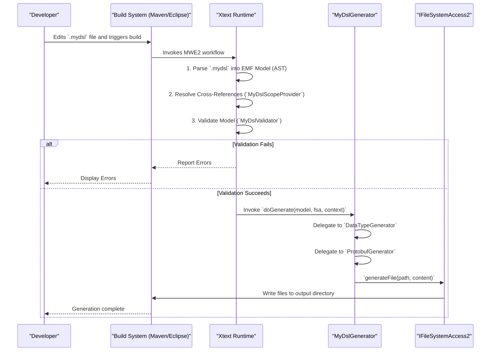
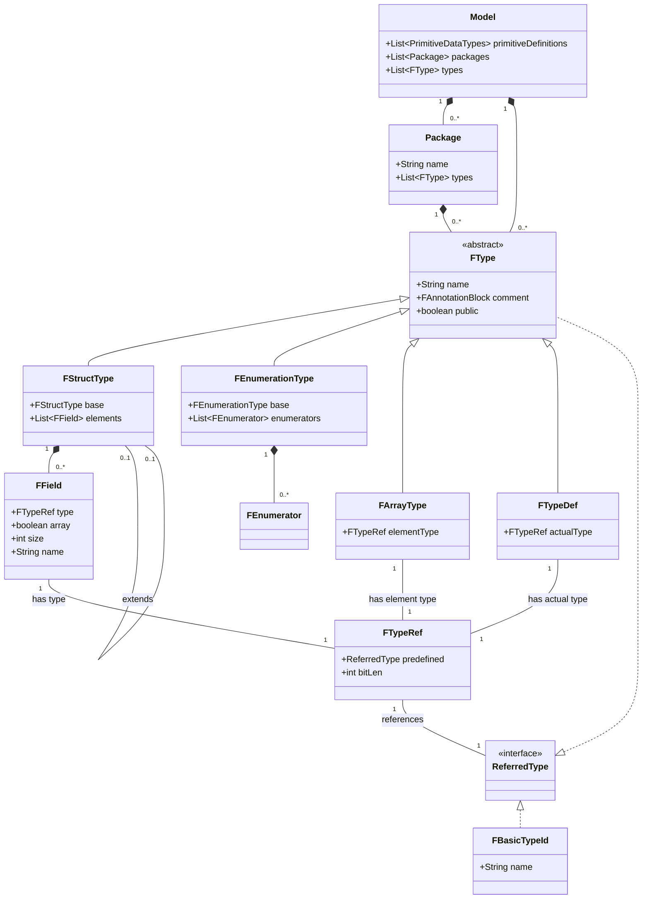

# An Architectural Analysis of the MyDsl IDL Code Generation Framework

### Executive Summary

This report provides an exhaustive architectural analysis of the MyDsl IDL Code Generation Framework, a sophisticated system designed to transform a custom Interface Definition Language (IDL) into two distinct, high-performance target languages: C++ and Protocol Buffers (Protobuf). The system is architected around the Eclipse Xtext framework, exemplifying a model-driven engineering approach that ensures a clear separation of concerns between the DSL grammar definition, semantic model validation, and the final template-based code generation.

The core of the framework is a well-defined DSL that allows for the declaration of complex data structures, including structs with inheritance, enumerations, and type aliases, organized within packages. This DSL is processed by a robust Xtext-generated parser, which constructs an in-memory Abstract Syntax Tree (AST). This AST is then semantically enriched through custom scoping and validation logic, ensuring that all cross-references are resolved and that the model adheres to both language-specific and target-specific correctness rules.

The code generation stage is handled by two modular, parallel subsystems. The C++ generator produces a set of header-only libraries, complete with a `CMakeLists.txt` file for seamless integration into C++ projects. The Protobuf generator produces standard `.proto` schema files and, notably, a binary descriptor set (`.desc` file), an advanced feature enabling runtime schema reflection.

Key architectural strengths of the system include its remarkable robustness in handling incomplete or erroneous models through a resilient fallback mechanism in its type-mapping logic. This design significantly enhances the developer experience by providing partial output even when the source model is not perfectly valid. Furthermore, the framework is supported by a comprehensive, dual-strategy testing harness that combines high-level, file-based integration tests with granular, feature-specific unit tests, ensuring a high degree of reliability and maintainability. The entire process is orchestrated by a fully automated build chain managed by Maven and MWE2, providing a seamless path from DSL source to packaged artifacts.

## Section 1: System Architecture and Process Flow

This section establishes the high-level architecture of the system, illustrating how the various components interact within the Xtext framework and how the build system orchestrates the entire process from DSL source to generated code.

### 1.1. High-Level Component Architecture

The system is designed as a classic model-driven code generator, leveraging the Eclipse Xtext framework to manage the lifecycle from parsing to code generation. The architecture is composed of several distinct, modular components that collaborate to achieve the final output.

The diagram below illustrates the static, high-level architecture of the components and their primary relationships.

The process begins with a user-defined `.mydsl` source file. The Xtext framework, using a parser generated from the 

`MyDsl.xtext` grammar, transforms this text into an in-memory EMF (Eclipse Modeling Framework) model, which serves as the Abstract Syntax Tree (AST). This model is initially just a syntactic representation.

To transform it into a semantically coherent model, two critical components are invoked:

1. **`MyDslScopeProvider`**: This component is responsible for linking cross-references within the AST. For instance, when a field is declared with a type `MyStruct`, the scope provider finds the definition of `MyStruct` and establishes a direct link from the reference to the declaration.
2. **`MyDslValidator`**: After linking, this component traverses the model to enforce custom semantic rules that cannot be expressed in the grammar alone, such as checking for duplicate type names or circular inheritance.

Once a valid, linked model is available, it is passed to the `MyDslGenerator`, which acts as the central orchestrator for code generation. It delegates the generation task to specialized components: the `DataTypeGenerator` for C++ output and the `ProtobufGenerator` for Protobuf output. Both of these generators utilize a shared `TemplateLoader` utility to load external template files from the `resources/templates` directory and populate them with data extracted from the model. Finally, the generated content is written to the filesystem, producing the target C++ header files, Protobuf schema files, and the binary Protobuf descriptor set.

### 1.2. End-to-End Generation Workflow

The dynamic behavior of the system, from a developer's action to the final generated artifacts, follows a well-defined workflow orchestrated by the build system.

The following activity diagram visualizes this end-to-end process.

The workflow is typically initiated when a developer saves a `.mydsl` file in an Eclipse environment or runs a Maven build from the command line. This action triggers the build system, which executes the MWE2 (Modeling Workflow Engine 2) workflow defined in `GenerateMyDsl.mwe2`.

The Xtext runtime then takes over, performing the three crucial steps of semantic model construction:

1. **Parsing:** The `.mydsl` source text is converted into an EMF model.
2. **Linking/Scoping:** The `MyDslScopeProvider` is invoked to resolve all symbolic names and establish links between references and their declarations.
3. **Validation:** The `MyDslValidator` checks the now-linked model against a set of semantic rules.

If any errors are found during these steps, they are reported back to the developer, and the process halts. If the model is valid, the Xtext runtime invokes the `doGenerate` method of the main `MyDslGenerator` class, passing it the validated model and an instance of `IFileSystemAccess2`, which is a service for writing files. The 

`MyDslGenerator` then orchestrates the C++ and Protobuf generation, using the `IFileSystemAccess2` service to write the final text and binary artifacts to the designated output directory (typically `generated/`).

### 1.3. Xtext Framework Integration and Build Lifecycle

The seamless integration of all components and the automation of the build process are managed by a combination of the MWE2 workflow, Guice dependency injection, and the Maven build tool.

#### MWE2 Workflow (`GenerateMyDsl.mwe2`)

The `GenerateMyDsl.mwe2` file is the blueprint for the Xtext language infrastructure itself. It instructs the 

`XtextGenerator` component to automatically generate the foundational code required for the DSL, including:

- The parser and lexer.
- The EMF model classes that represent the AST (e.g., `FStructType`, `FField`).
- Abstract base classes for the validator, scope provider, and generator, which are then extended by the custom implementations in the project.
- The necessary Eclipse plugin metadata.

This declarative workflow allows developers to focus on the unique aspects of their language (the grammar and the custom logic) while Xtext handles the generation of the complex boilerplate infrastructure.

#### Guice Dependency Injection (`MyDslRuntimeModule.java`)

The `MyDslRuntimeModule.java` class is responsible for wiring the custom components into the Xtext runtime using Google Guice for dependency injection. It overrides methods from its generated abstract base class to bind custom implementations to framework interfaces. For example:

- `bindIGenerator2()` returns `MyDslGenerator.class`, telling Xtext to use this custom class as the main code generator.
- `bindIScopeProvider()` returns `MyDslScopeProvider.class`, plugging in the custom logic for reference resolution.

Furthermore, the `configure` method explicitly binds the `TemplateLoader`, `DataTypeGenerator`, and `ProtobufGenerator` classes as eager singletons. This ensures that only one instance of each of these classes is created and shared throughout the application, which is an efficient design for stateless service components.

#### Maven Build Process (`pom.xml`)

The `pom.xml` file defines a fully automated, integrated build chain that manages the entire lifecycle from source to packaged plugin. A single Maven command (

`mvn clean install`) orchestrates a complex sequence of events.

1. **Source Generation:** During the `generate-sources` phase, the `exec-maven-plugin` is configured to run the MWE2 launcher, executing the `GenerateMyDsl.mwe2` workflow. This step generates the core language infrastructure into the `src-gen` and `model/generated` directories.
2. **Dependency Management:** A notable aspect of the build is how it handles the `protobuf-java` dependency. Since this is a standard JAR and not an OSGi bundle, it cannot be a simple dependency for an `eclipse-plugin`. The solution employed is to use the `maven-dependency-plugin` to copy the `protobuf-java.jar` into the project's `lib/` directory during the `generate-resources` phase. This directory is then added to the `Bundle-ClassPath` in the `META-INF/MANIFEST.MF` file, making the library available to the plugin at runtime. This demonstrates a standard and effective pattern for managing non-OSGi dependencies in an Eclipse/OSGi environment.
3. **Compilation:** Following source generation, the `xtend-maven-plugin` and `maven-compiler-plugin` compile all sources—both the handwritten code in `src/` and the Xtext-generated code in `src-gen/`—into Java bytecode. The build properties ensure that all necessary source folders are included in the compilation path.
4. **Packaging:** Finally, the project is packaged as an `eclipse-plugin`. The `maven-assembly-plugin` is also configured to create a standalone executable JAR that bundles all dependencies, with `DataTypeGeneratorTest` as its main class, providing a convenient way to run the test harness from the command line.

This tightly integrated build chain ensures that the language infrastructure is always generated and up-to-date before the custom generator logic is compiled, creating a clear, causal dependency flow that is robust and fully automated.

## Section 2: The DataType DSL: Grammar and Ecore Model (`MyDsl.xtext`)

This section provides a deep analysis of the Domain-Specific Language itself, as defined in `MyDsl.xtext`. It explains the data structures the language allows users to define and how those structures are represented in the underlying Ecore model that the Xtext framework generates.

### 2.1. Analysis of Core Language Constructs

The grammar defines a rich set of constructs for specifying data types, organized hierarchically.

- **`Model`**: This is the root rule of any `.mydsl` file. It acts as a container for all other top-level definitions, allowing for zero or more `PrimitiveDataTypes` blocks, `Package` definitions, and globally defined `FType`s. This flexible structure allows a single file to be self-contained or to be part of a larger, multi-file project.
- **`Package`**: This construct provides a namespacing mechanism, analogous to packages in Java or namespaces in C++. It is declared with the `package` keyword followed by a `FQN` (Fully Qualified Name), such as `com.example.data`. All types defined within its curly braces (`{...}`) belong to that namespace. This is essential for organizing types in large projects and preventing naming collisions.
- **`FType`**: This is an abstract grammar rule that serves as a common supertype for all user-definable data structures. A definition can be an `FStructType`, `FEnumerationType`, `FArrayType`, or `FTypeDef`. This polymorphic design allows different parts of the system, such as fields or type references, to refer to any kind of user-defined type in a uniform way.
- **`FStructType`**: This is the primary construct for defining complex data records, similar to a `struct` in C or a class with only data members. It is defined with the `struct` keyword and a name. A key feature is its support for single inheritance via the `extends` keyword, which allows a struct to inherit the fields of a base struct. This enables the creation of hierarchical and reusable data models. The body of the struct contains a list of `FField` definitions.
- **`FEnumerationType`**: This construct defines a set of named integer constants, similar to an `enum class` in modern C++. It is declared with the `enumeration` keyword, a name, and a body containing a comma-separated list of `FEnumerator`s. Each `FEnumerator` has a name and an optional integer value assigned with `=`.
- **`FField`**: This rule defines a member within a `FStructType`. Its syntax is `type name`, where `type` is an `FTypeRef` (a reference to another type). A notable feature is the concise inline syntax for fixed-size arrays: `type[size] name`. This allows for the direct embedding of C-style arrays within struct definitions.
- **`PrimitiveDataTypes` & `FBasicTypeId`**: These rules provide a mechanism for defining the fundamental building blocks of the type system. A `define` block contains a set of `type` definitions. Each `FBasicTypeId` declares a primitive type (e.g., `uint32`, `String`, `float64`) and allows for the specification of its physical properties, such as `length` (in bits) and `encoding` (e.g., `little-endian`, `iee754`). This allows the DSL to be abstracted from the concrete types of the target language while still providing the necessary information for the generator to map them correctly.

### 2.2. The Type Referencing Mechanism (`FTypeRef`)

The `FTypeRef` grammar rule is central to the language's power and flexibility, as it defines how types are used and referenced throughout the model.

- **What:** It defines a reference to another type, which can be either a primitive `FBasicTypeId` or a user-defined `FType`. The core of the rule is `predefined=`, which uses an Xtext cross-reference (`[...]`) to establish a semantic link to the referenced type's definition.
- **Why:** This design effectively decouples the usage of a type from its definition. It allows any part of the model that needs a type—such as a struct field, a typedef, or an array's element type—to refer to any other type defined anywhere in the model, be it a primitive, a struct in the same file, or a type in a different package.
- **How:** The cross-reference mechanism relies on the `MyDslScopeProvider` to find the correct declaration for the given `FQN`. In addition to the reference itself, `FTypeRef` supports an optional block of modifiers in curly braces (`{...}`). This block can contain properties like `len` for bit length or `init` for a default value. This allows for context-specific augmentation of a type. For example, a developer can use the primitive `uint32` but specify `{len 24}` to indicate that only 24 bits are used in a particular context, without needing to define a whole new primitive type.

### 2.3. Generated Ecore Model

From the grammar in `MyDsl.xtext`, the MWE2 workflow generates a corresponding Ecore model, which defines the structure of the AST as a set of Java classes. This object model is what the validator and generators operate on.

The class diagram below represents the key entities and relationships in this generated Ecore model.

A notable design choice is evident in the parsing of annotations. The `FAnnotationBlock` and `AnnotationText` rules in the grammar are designed for maximum flexibility. The 

`AnnotationText` rule is a "catch-all" that uses a long list of terminals plus `ANY_OTHER` to capture any sequence of characters between `<**` and `**>`. This captured text is stored as a single `rawText` string in the `FAnnotation` object. This approach makes it very easy for developers to write free-form, multi-line comments. However, it comes at the cost of being unable to parse or validate structured metadata within the comments (e.g., key-value pairs like `@version("1.0")`). The parser does not create a structured model of the annotation's content; it is treated as an opaque block of text. Consequently, the validator cannot enforce rules on annotation content, and the generators can only render it as a monolithic comment block, as seen in the `generateComment` method of `DataTypeGenerator`. This reflects a deliberate design decision to prioritize ease of writing documentation over the complexity of machine-readable, structured annotations.

## Section 3: Semantic Model Analysis: Validation and Scoping

This section analyzes the two pillars of semantic model construction: resolving names (scoping) and enforcing correctness rules (validation). These processes transform the raw AST from the parser into a fully linked and logically consistent model, ready for code generation.

### 3.1. Cross-Reference Resolution (`MyDslScopeProvider.java`)

The `MyDslScopeProvider` class defines the logic for resolving cross-references within the DSL. This is how the framework determines what a given name refers to.

- **What:** This class provides the implementation for Xtext's `IScopeProvider` interface. Its primary function is to return a "scope," which is a collection of all elements that are visible and can be referenced from a specific point in the model.
- **Why:** The parser only recognizes that a name has been used; it does not know what that name refers to. The scope provider is essential for turning the parsed syntax tree into a linked graph, where references (like the type of a field) are connected to their corresponding declarations. This linking is a prerequisite for both validation and code generation.
- **When:** The Xtext framework automatically invokes the `getScope` method during the "linking" phase, which occurs after parsing. It calls this method for every cross-reference in the grammar (e.g., `base=`).
- **How:** The `getScope` method acts as a dispatcher, checking the context and the specific reference being resolved, and then delegating to a more specialized method. The most critical of these is `scope_FTypeRef_predefined`, which handles the resolution for all type references (`FTypeRef`).

The logic within `scope_FTypeRef_predefined` is as follows :

1. It finds the root `Model` object to gain access to all definitions.
2. It creates a list of `IEObjectDescription`s, which are Xtext's way of representing a linkable element.
3. It iterates through all `PrimitiveDataTypes` definitions and adds every `FBasicTypeId` to the list.
4. It iterates through all top-level `FType` definitions and adds them to the list.
5. It iterates through every `Package` and adds all `FType`s defined within them.

This implementation leads to a "global namespace" scoping strategy. When adding types from a package, the provider adds two entries for each type: one with its simple name (e.g., `Data`) and one with its fully qualified name (e.g., `com.example.Data`). This means a type 

`com.example.Data` can be referred to simply as `Data` from anywhere in the model, even from within a different package. While this design offers convenience by reducing the need for fully qualified names in many cases, it can lead to ambiguity if two different packages define a type with the same simple name. In such a scenario, Xtext's linking service would correctly flag the ambiguous reference as an error, forcing the developer to use a fully qualified name to disambiguate. This design choice prioritizes developer convenience for smaller models over the strict namespace enforcement that might be preferable for very large, complex systems.

### 3.2. Model Integrity and Validation (`MyDslValidator.java`)

The `MyDslValidator` class defines a suite of custom semantic rules that are checked after the model has been parsed and linked.

- **What:** This class extends Xtext's `AbstractMyDslValidator` and contains methods annotated with `@Check`. These methods implement custom validation logic that goes beyond the syntactic correctness enforced by the grammar.
- **Why:** The grammar can ensure a struct is defined with the correct keywords and structure, but it cannot prevent a developer from defining two structs with the same name or creating a circular inheritance loop. The validator is responsible for catching these logical and semantic errors.
- **When:** The Xtext framework automatically invokes the `@Check` methods during the validation phase, which runs after parsing and linking. The framework intelligently calls the appropriate method based on its parameter type (e.g., a method with an `FStructType` parameter will be called for every `FStructType` instance in the model).
- **How:** Each `@Check` method implements a specific rule and uses methods like `error()`, `warning()`, or `info()` to report issues. These issues are then displayed to the developer in the editor.

Key validation rules implemented in `MyDslValidator` include:

- **`checkDuplicateTypeNames`**: This method uses a `HashSet` to track type names at the global scope and within each package scope, ensuring that all type names are unique within their respective namespaces.
- **`checkUniqueFieldNames`**: For a given `FStructType`, this rule collects all field names from its base classes recursively and then checks that the fields defined in the current struct do not conflict with inherited names.
- **`checkCircularInheritance`**: This rule validates the inheritance hierarchy. Starting from a given `FStructType`, it traverses up the `base` property chain, keeping track of visited types in a `Set`. If a type is encountered a second time, a circular dependency has been detected, and an error is reported.
- **`checkEnumHasZeroValue`**: This rule checks if an enumeration contains a member with the value 0. If not, it issues a warning. This is a prime example of a target-aware validation rule. The Protobuf 3 language specification requires that the default value for an enum is its zero-defined member. The absence of a zero value can lead to undefined behavior or unexpected defaults when deserializing messages. By placing this check in the validator, the system proactively informs the developer of this potential issue before code generation is even attempted, preventing a more obscure compile-time or runtime error in the generated Protobuf code later. This demonstrates a mature design where the validation layer is aware of the constraints and conventions of the code generation targets, leading to a much better developer experience.
- **Naming Conventions**: A set of checks (`checkFieldNamingConvention`, `checkStructNamingConvention`, etc.) enforce consistent naming styles, such as `camelCase` for fields and `PascalCase` for types, by using regular expressions. These rules issue warnings, guiding the user toward best practices without causing the build to fail.

## Section 4: C++ Code Generation Subsystem (`DataTypeGenerator.xtend`)

This section provides a detailed deconstruction of the C++ code generator, `DataTypeGenerator.xtend`. It examines its architecture, core logic, and its highly robust type-mapping strategy, which is a cornerstone of the system's design.

### 4.1. Architectural Overview and Template Strategy

The C++ generator is designed as a modular, template-driven system. The core logic, written in Xtend, is responsible for traversing the validated EMF model, extracting relevant data (like type names, field names, and inheritance relationships), and preparing this data for rendering. The actual C++ syntax is defined in external `.template` files located in the `resources/templates/cpp/` directory.

This separation of concerns is a classic and effective generator pattern:

- **Logic (Xtend):** Handles the complexity of model traversal, data transformation, and decision-making. Xtend is particularly well-suited for this role due to its powerful features like template expressions (`'''...'''`), extension methods, and null-safe navigation, which result in more concise and readable generator code compared to plain Java.
- **Presentation (Templates):** Handles the static structure and syntax of the target language (C++). This allows the C++ code style and structure to be modified independently of the generator's logic, improving maintainability.

The generator produces a set of header-only C++ files, a common practice for data type libraries. It also generates a `CMakeLists.txt` file to make the generated code easily consumable by C++ build systems.

As a prelude to the detailed analysis of the type mapping logic, the following table summarizes the translation of common DSL primitive types to their C++ and Protobuf equivalents. This provides a high-level overview of the generator's core responsibility.

| DSL Type Name       | C++ Generated Type | Protobuf Generated Type |
| ------------------- | ------------------ | ----------------------- |
| `uint8`, `byte`     | `uint8_t`          | `uint32` / `bytes`      |
| `int8`              | `int8_t`           | `int32`                 |
| `uint16`            | `uint16_t`         | `uint32`                |
| `int16`             | `int16_t`          | `int32`                 |
| `uint32`, `uint`    | `uint32_t`         | `uint32`                |
| `int32`, `int`      | `int32_t`          | `int32`                 |
| `uint64`, `ulong`   | `uint64_t`         | `uint64`                |
| `int64`, `long`     | `int64_t`          | `int64`                 |
| `float32`, `float`  | `float`            | `float`                 |
| `float64`, `double` | `double`           | `double`                |
| `String`, `string`  | `std::string`      | `string`                |
| `bool`, `boolean`   | `bool`             | `bool`                  |

### 4.2. Core Generation Logic (`generate` method)

The `generate` method in `DataTypeGenerator.xtend` serves as the main entry point and orchestrates the entire C++ generation process. Its execution flow is as follows:

1. **Initialization:** It ensures the `TemplateLoader` is initialized and sets the base path for templates to `/templates/`.
2. **Generate Aggregator Header (`generateTypesHeader`):** It first calls `generateTypesHeader`. This method iterates through all types in the model (both top-level and within packages) to build a list of `#include` directives. It then uses the `types_header.template` to generate a single `Types.h` file that includes all other generated type headers. This provides a convenient single header for consumers of the generated library.
3. **Generate Individual Headers:** It then iterates through all top-level `FType`s and all `FType`s within each `Package`. For each type, it invokes `generateTypeHeader`, which is responsible for creating a dedicated `.h` file for that type (e.g., `Person.h`).
4. **Generate Build System File (`generateCMakeFile`):** After all headers are generated, it calls `generateCMakeFile`. This method uses the `CMakeLists.template` to create a `CMakeLists.txt` file that defines a header-only `INTERFACE` library, making the generated types easily usable in a CMake-based C++ project.
5. **Error Handling:** The entire process is wrapped in a high-level `try-catch` block to handle and report major failures. Additionally, finer-grained `try-catch` blocks are used within the loops for individual type generation. This robust error handling ensures that the failure to generate one file does not halt the entire process; a warning is printed, and generation continues with the next type.

### 4.3. Type-Specific Generation Methods

The generation of content for specific types is handled by a set of dedicated methods.

- **`generateTypeHeader`**: This method prepares the context for a single header file. It calculates the output file path (including the package subdirectory if applicable), generates a standard C++ include guard name (e.g., `COM_EXAMPLE_PERSON_H`), and determines the C++ namespace based on the DSL package. It then calls `generateTypeContent` to get the core C++ definition and populates the main `header.template` with all the necessary components (includes, guards, namespaces, content).
- **`generateTypeContent`**: This method acts as a dispatcher. It uses an Xtend `switch` expression to examine the concrete class of the `FType` object and delegate to the appropriate generation method: `generateStructWithTemplate`, `generateEnumWithTemplate`, `generateArrayWithTemplate`, or `generateTypeDefWithTemplate`.
- **`generateStructWithTemplate`**: This method is responsible for generating a C++ `struct`. It iterates through all `FField` elements of the `FStructType`. For each field, it calls `generateFieldWithTemplate` to get the C++ field declaration string. It aggregates these strings and prepares other variables like the struct name, base class (if any), and comments. Finally, it processes the `struct.template` to produce the complete C++ struct definition.
- **`generateEnumWithTemplate`**: This method generates a C++ `enum class`. It iterates through the `FEnumerator`s, constructing a comma-separated list of enumerator definitions, including their names and assigned integer values. It also determines the underlying type (defaulting to `int32_t`). This data is then used to populate the `enum.template`.

### 4.4. DSL-to-C++ Type Mapping (`mapTypeRef` method)

The `mapTypeRef` method is the most critical and architecturally significant part of the C++ generator. It is responsible for translating a DSL `FTypeRef` into a C++ type string (e.g., `uint32` to `uint32_t`). Its implementation showcases a highly resilient design pattern.

The method operates on a dual-path logic:

1. **The Ideal Path (Resolved Reference):** The code first checks if `typeRef.predefined` is not `null`. This condition is true if the 

   `MyDslScopeProvider` successfully resolved the type reference during the linking phase. In this case:

   - If the resolved type is an `FBasicTypeId` (a primitive), it calls `mapBasicType`, which uses a `switch` statement to map the primitive name to a specific C++ type (e.g., "uint32" -> "uint32_t", "String" -> "std::string").
   - If the resolved type is a user-defined `FType` (like a struct), it simply returns the type's name, which will be the correct C++ type name.

2. **The Fallback Path (Unresolved Reference):** If `typeRef.predefined` is `null`, it means the linking phase failed for this reference (e.g., the type was misspelled or not defined). Instead of failing, the generator enters a robust fallback mode.

   - It uses `NodeModelUtils.findActualNodeFor(typeRef)` to get the raw AST node from the parse tree that corresponds to the source text of the type reference.
   - It then meticulously extracts the type name as a raw string from this node, either by using `NodeModelUtils.getTokenText(node)` or by iterating through the node's "leaf" tokens to find the first meaningful identifier.
   - This extracted string (e.g., "MyTypoedType") is then passed to `mapBasicTypeByName`. This method attempts to map the string to a known primitive type. If it's not a primitive, it checks if the name starts with an uppercase letter. If it does, it assumes it's a user-defined type and returns the name as-is.

This dual-path logic constitutes a **Resilient Generator Pattern**. It allows the generator to produce useful, albeit potentially non-compilable, output even when the input `.mydsl` model is incomplete or contains errors. For a developer in the middle of writing a model, seeing a generated C++ file with `MyTypoedType field;` is far more useful than the generator crashing with a `NullPointerException`. It correctly reflects the developer's intent and allows them to see the structure of the rest of the generated code, providing immediate feedback and accelerating the development workflow. This design choice demonstrates a deep understanding of practical development needs and elevates the tool from a simple translator to a helpful development assistant.

## Section 5: Protobuf Generation Subsystem (`ProtobufGenerator.xtend`)

This section provides a detailed analysis of the `ProtobufGenerator.xtend` class, which is responsible for generating Protocol Buffers artifacts. It examines the dual-output architecture, the process of creating `.proto` files, the DSL-to-Protobuf type mapping, and the advanced feature of generating a binary descriptor set.

### 5.1. Architectural Overview

The Protobuf generator, like its C++ counterpart, is a modular, template-driven component. However, its architecture is distinguished by its dual-output nature :

1. **`.proto` Text Files:** It generates human-readable schema definition files (`.proto`) that can be used with the `protoc` compiler to generate language-specific bindings (e.g., for C++, Java, Python).
2. **Binary Descriptor Set (`.desc` file):** It also programmatically constructs and writes a binary `FileDescriptorSet`. This is a compiled, machine-readable representation of the Protobuf schema. This advanced feature is highly valuable for systems that need to perform runtime reflection or dynamic interpretation of Protobuf messages without access to the original `.proto` source files.

The generator also adheres to Protobuf conventions, such as converting `camelCase` DSL field names into `snake_case` for the generated `.proto` files, using the `toSnakeCase` utility method.

### 5.2. Generation of `.proto` Files

The generation of `.proto` files is orchestrated by the `generate` method, which creates a main file and separate files for each package.

- **Main `.proto` File (`generateProtoFileWithTemplate`):** This method is responsible for creating `generated/proto/datatypes.proto`. It constructs the file by:
  - Setting the syntax to `proto3`.
  - Defining a top-level package, `datatypes`.
  - Adding standard Java options (`java_package`, `java_outer_classname`, etc.) for compatibility with Java-based Protobuf tooling.
  - Iterating through all top-level `FType`s in the model and generating their corresponding `message` or `enum` definitions.
  - Adding `import` statements for each package-specific `.proto` file, ensuring all types are accessible.
  - Finally, processing the `/templates/proto/file.template` with this aggregated data.
- **Package-Specific `.proto` Files (`generatePackageProtoFileWithTemplate`):** For each `Package` in the DSL model, this method generates a corresponding `.proto` file (e.g., `com_example.proto`). The logic is similar to the main file generation, but the Protobuf `package` is derived from the DSL package name, and it only contains the `message` and `enum` definitions for types within that specific DSL package.
- **Type-Specific Generation (`generateProtoType`):** This method acts as a dispatcher, calling `generateProtoMessageWithTemplate` for `FStructType`s and `generateProtoEnumWithTemplate` for `FEnumerationType`s. It correctly notes that `FArrayType` and `FTypeDef` do not map to top-level Protobuf definitions; instead, arrays are handled by the `repeated` keyword on fields, and typedefs are resolved to their underlying actual type.

### 5.3. DSL-to-Protobuf Type Mapping (`mapToProtoType` method)

Similar to the C++ generator, the `mapToProtoType` method is the core of the translation logic. It also employs the same resilient, dual-path pattern to handle both resolved and unresolved type references.

- **Resolved Path:** If the `FTypeRef`'s `predefined` link is valid, it calls `mapBasicToProto` for primitives or returns the name for user-defined types.
- **Unresolved Path:** If the link is broken, it falls back to using `NodeModelUtils` to extract the type name as a string from the AST and passes it to `mapBasicToProtoByName`.

The mapping logic in `mapBasicToProtoByName` and `mapBasicToProto` is tailored for Protobuf's type system. A key characteristic is the mapping of smaller integer types from the DSL to Protobuf's 32-bit integer types. For example, `int8`, `uint8`, `int16`, and `uint16` are all mapped to `int32` or `uint32`. This is a standard practice because Protobuf's wire format for integers (Varint) is efficient for small numbers regardless of the declared type, so there is no performance benefit to using smaller types in the 

`.proto` definition.

### 5.4. Binary Descriptor Set Generation (`generateDescriptorSet`)

This is one of the most advanced features of the generator, demonstrating a sophisticated understanding of the Protobuf ecosystem.

- **What:** The `generateDescriptorSet` method programmatically builds a `FileDescriptorSet` object in memory. This object is itself a Protobuf message, defined in Google's `descriptor.proto`, and it serves as a complete, self-contained description of a set of `.proto` schemas.
- **Why:** Providing a binary descriptor allows downstream systems to perform dynamic operations on Protobuf data. For example, a generic message-parsing service could load this `.desc` file at runtime to understand the structure of incoming messages, validate them, or transcode them to another format like JSON, all without needing to be compiled against the specific message types beforehand.
- **How:** The method leverages the `protobuf-java` library's builder API.
  1. It creates a `FileDescriptorProto.newBuilder()` for the main `datatypes.proto` file and for each package.
  2. It traverses the DSL model, and for each `FStructType`, it calls `buildMessageDescriptor`. This helper method creates a `DescriptorProto` by setting the message name and iterating through its fields. For each field, it creates a `FieldDescriptorProto`, setting its name (converted to snake_case), number, label (`LABEL_REPEATED` for arrays), and type. The field's type is determined by `setFieldType`, which in turn calls `mapBasicToProtoType` to get the appropriate `FieldDescriptorProto.Type` enum.
  3. Similarly, for each `FEnumerationType`, it calls `buildEnumDescriptor` to create an `EnumDescriptorProto`.
  4. All the constructed `FileDescriptorProto` objects are added to a `FileDescriptorSet.newBuilder()`.
  5. Finally, `setBuilder.build().toByteArray()` is called to serialize the entire in-memory structure into its binary wire format, resulting in a `byte`.

The `writeBinaryDescriptor` method is then tasked with persisting this byte array to a file. A critical implementation detail here is the deliberate avoidance of Xtext's standard `IFileSystemAccess2.generateFile` method. Instead, it uses a raw Java `FileOutputStream` and `fos.write(data)`. The 

`IFileSystemAccess` framework is primarily designed for text files and may attempt to apply character encodings, which would corrupt the binary data. By dropping down to standard Java I/O for this specific task, the implementation ensures byte-perfect writing of the descriptor file, showcasing a nuanced understanding of the framework's capabilities and limitations and the correct way to work around them for specialized requirements.

## Section 6: Supporting Infrastructure and Quality Assurance

This section covers the shared components that support the code generators and the comprehensive testing strategy that ensures the reliability and correctness of the entire system.

### 6.1. The Templating Engine (`TemplateLoader.xtend`)

The `TemplateLoader` is a crucial utility class that provides a centralized mechanism for loading and processing the external template files used by both the C++ and Protobuf generators.

- **What:** It is a singleton service responsible for reading template files from the project and performing simple variable substitution.
- **Why:** Externalizing the C++ and Protobuf syntax into template files separates the presentation logic from the model traversal logic. This makes the system more maintainable, as changes to code style or formatting can be made in the `.template` files without modifying the Xtend generator code.
- **When:** It is injected into `DataTypeGenerator` and `ProtobufGenerator` and is called whenever a generator needs to produce a block of code, such as a struct definition or a complete header file.
- **How:**
  - **Loading (`loadTemplate`):** The loading mechanism is designed to be robust. It first checks a `ConcurrentHashMap` cache to avoid redundant file I/O. If the template is not cached, it attempts to load it from the Java classpath first, which is the standard location for resources in a packaged plugin. As a fallback, it also attempts to load from several relative paths on the file system, which is useful during development and testing when running the code outside of a packaged environment.
  - **Processing (`processTemplate`):** The processing mechanism is straightforward but effective. It takes a map of key-value pairs and performs a simple string replacement on the template content, substituting placeholders of the form `{{VARIABLE_NAME}}` with their corresponding values.
  - **Caching:** The use of a `ConcurrentHashMap` for the template cache is a good practice, ensuring thread safety even though the current generator implementation is single-threaded. Caching significantly improves performance during the generation of large models with many files, as each template only needs to be read from disk once.

### 6.2. The Testing Framework

The project employs a comprehensive and multi-faceted testing strategy, utilizing two distinct test harnesses: `DataTypeGeneratorTest.java` and `MyDslGeneratorTest.xtend`. This dual approach provides layered quality assurance.

#### `DataTypeGeneratorTest.java`

This class is structured as a standalone command-line application that serves as a high-level integration test runner.

- **Structure:** It contains a `main` method that takes the path to a `.mydsl` file as an argument. It initializes the full Xtext environment, loads and validates the specified model file, and then invokes the main `MyDslGenerator`.
- **Model Loading:** It loads models directly from external files on the filesystem, mimicking the exact workflow of an end-user. It explicitly calls `EcoreUtil.resolveAll()` to ensure the model is fully linked before generation.
- **Assertions:** Its assertions are primarily implicit. The test is considered successful if the entire process—loading, validation, and generation—completes without throwing any exceptions and if files are created in the output directory. It prints model statistics and the final directory tree to the console for manual verification. This harness is excellent for end-to-end system validation and for testing the generator against large, canonical model files.

#### `MyDslGeneratorTest.xtend`

This class is structured as a more traditional unit and integration test suite, also runnable as a standalone application.

- **Structure:** It contains a series of dedicated test methods (e.g., `testBasicStructGeneration`, `testProtobufGeneration`), each designed to verify a specific feature of the DSL and generator. It uses `setUp` and `tearDown` methods for a clean test environment and runs all tests within an `InMemoryFileSystemAccess`, which stores generated files in memory.
- **Model Loading:** It primarily uses small, inline string literals to define the DSL models for each test case. A helper method, `loadModel`, writes these strings to temporary files for the Xtext parser to consume. This approach makes the tests self-contained and easy to understand, as the input for each test is located directly within the test method itself.
- **Assertions:** This harness uses explicit, automatable assertions. After generation, it retrieves the generated file content from the in-memory file system and uses `content.contains(...)` to check for the presence of specific keywords, type names, and syntactic structures. For example, it verifies that a generated struct contains the correct field names and types or that a Protobuf message has the correct `syntax` declaration.

This combination of testing strategies is highly effective. The `DataTypeGeneratorTest.java` runner provides confidence that the entire system works together correctly in a realistic use case. The `MyDslGeneratorTest.xtend` suite provides a fine-grained safety net, allowing developers to test individual features in isolation and quickly catch regressions when modifying the generator logic. This layered approach is a hallmark of a high-quality, maintainable software project, ensuring both broad system integrity and specific feature correctness.

## Section 7: Synthesis and Architectural Recommendations

This final section synthesizes the findings from the preceding analysis to provide a holistic assessment of the system's architecture, summarizing its key strengths and offering concrete, actionable recommendations for potential future enhancements.

### 7.1. Summary of Design Strengths

The MyDsl IDL Code Generation Framework exhibits a mature and robust architecture characterized by several key strengths:

- **Modularity and Separation of Concerns:** The system demonstrates a clear separation between the DSL definition (grammar), semantic analysis (scoping and validation), and code generation. Furthermore, the generation logic is cleanly divided between a C++ subsystem and a Protobuf subsystem, each using its own set of templates. This modularity makes the system easier to understand, maintain, and extend.
- **Robustness and Resilience:** The dual-path type-mapping logic in both generators is a standout feature. By providing a fallback mechanism that inspects the raw AST when a cross-reference is unresolved, the generator can produce partial and often useful output even from incomplete or erroneous models. This resilience significantly improves the developer experience and makes the tool more practical for iterative development.
- **Extensibility:** The architecture is inherently extensible. Adding support for a new target language (e.g., Python, Java) would be a straightforward process of creating a new generator class (e.g., `PythonGenerator.xtend`) and a corresponding set of templates. The core model, validator, and scoper could be reused with minimal or no changes.
- **Advanced Capabilities:** The inclusion of features like binary Protobuf descriptor set generation indicates that the system was designed for sophisticated use cases beyond simple code translation. This capability enables advanced runtime reflection and dynamic message processing, positioning the tool for integration into complex, schema-driven architectures.
- **Comprehensive Quality Assurance:** The dual-strategy testing framework, combining a high-level integration test runner with a granular, feature-specific test suite, ensures a high degree of reliability. This comprehensive approach to quality assurance increases confidence in the correctness of the generated code and protects against regressions during future development.
- **Automated Build and Integration:** The project leverages Maven and MWE2 to create a fully automated build lifecycle. This seamless integration of language infrastructure generation, dependency management, and compilation simplifies the development and deployment process.

### 7.2. Opportunities for Enhancement

While the current architecture is robust and well-designed, several opportunities exist for future enhancement to further increase its power and usability.

- **Introduce Structured Annotations:** The current annotation system is flexible but limited to unstructured text. The grammar could be evolved to support structured annotations (e.g., `@attribute(key="value")`). This would enable the capture of machine-readable metadata, which could then be used by the validator to enforce more complex rules or by the generators to control code generation in more sophisticated ways (e.g., adding serialization hints, generating API documentation).

- **Generate C++ Source Files (`.cpp`):** The C++ generator currently produces a header-only library. A valuable extension would be to optionally generate `.cpp` source files containing implementations for common operations like serialization and deserialization (e.g., to/from JSON or a binary stream). This would significantly reduce the amount of boilerplate code that consumers of the generated library need to write.

- **Refine Scoping for Large-Scale Projects:** The current "global namespace" scoping strategy is convenient but could lead to name clashes in very large projects with many packages. An enhancement would be to offer an optional "strict" scoping mode, perhaps enabled by a keyword in the `.mydsl` file, that would require types outside the current package or explicit `import` statements to be referenced by their fully qualified names.

- **Implement Formal Logging:** The current use of `System.err.println` for warnings and errors is functional but inflexible. Replacing these calls with a standard logging framework like Log4j (which is already declared as an imported package in 

  `MANIFEST.MF`) would be a significant improvement. This would allow users to configure log levels, format log messages, and direct output to various destinations (e.g., console, file), making debugging and integration into larger systems much easier.

- **Upgrade the Templating Engine:** The simple string-replacement templating mechanism is effective for the current templates. However, if more complex logic were required within the templates (e.g., loops, conditionals), it could become cumbersome. For future extensions, consider migrating to Xtend's more powerful and type-safe template expressions. This would allow complex presentation logic to be expressed more cleanly and safely directly within the generator's Xtend code, improving maintainability.