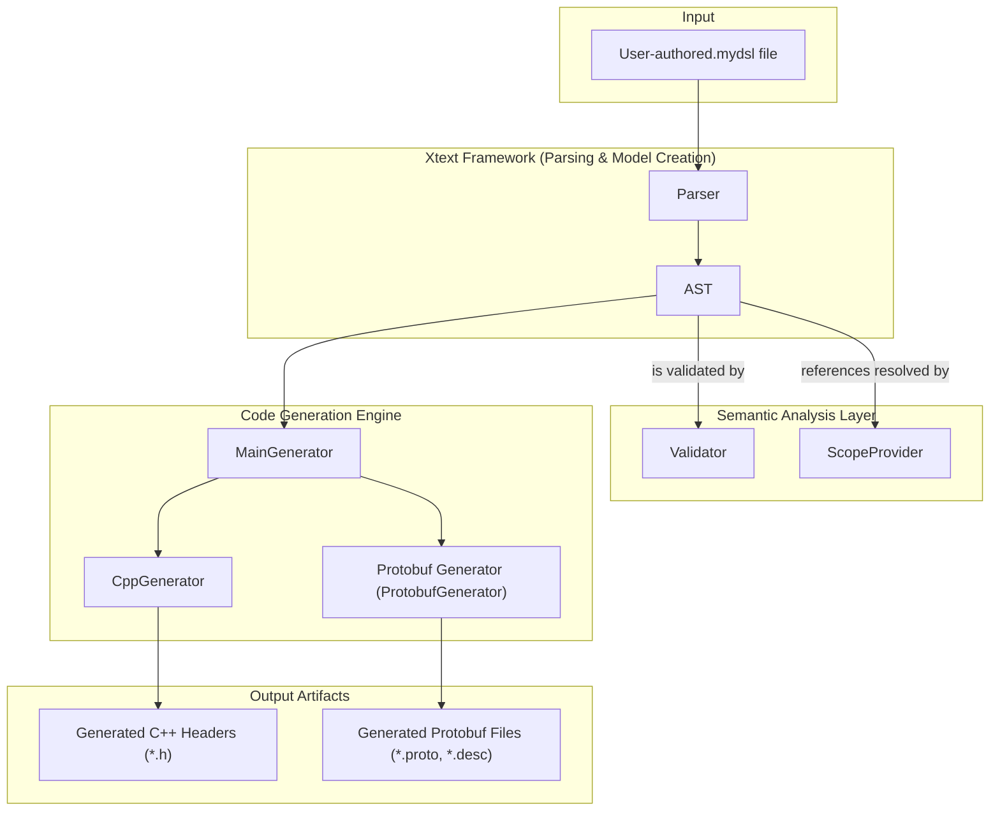
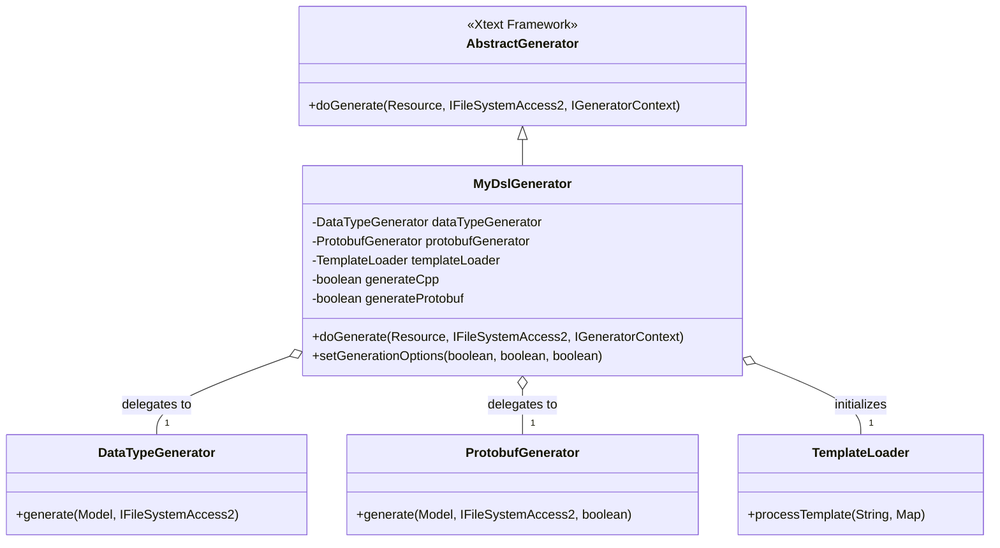
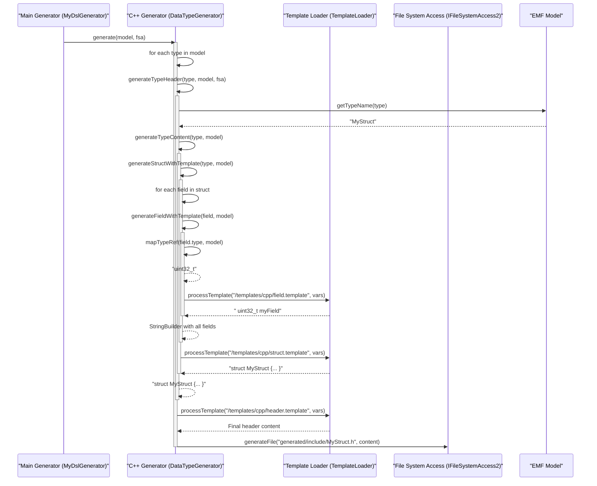

# An In-Depth Analysis of the 'MyDsl' Xtext Project: Grammar, Validation, and Multi-Target Code Generation

## Executive Summary

This report provides an exhaustive analysis of the `org.xtext.example.mydsl` project, a Domain-Specific Language (DSL) created with the Xtext framework. The DSL is designed for modeling complex data structures and types, enabling developers to define data models in a high-level, human-readable format.

The project's primary function is to parse `.mydsl` files, validate the defined data models against a set of semantic rules, and subsequently generate source code for multiple target platforms. The generation process produces two key outputs: C++ header files for native application development and Protocol Buffers (Protobuf) schema files, including binary descriptors, for cross-platform data serialization and communication.

The project represents a mature, well-architected example of model-driven engineering. It features a clear separation of concerns between the language definition (grammar), semantic validation (scoping and validation rules), and a highly extensible, multi-target, template-driven code generation engine. This architecture not only facilitates the creation of C++ and Protobuf artifacts but also provides a robust foundation for supporting additional target languages in the future.

## Section 1: Architectural Overview of the 'MyDsl' Xtext Project

This section provides a high-level view of the system's architecture, establishing the context for the detailed component analysis that follows. The project is built upon the Xtext framework, leveraging its powerful features for language creation, parsing, and integration into development environments.

### 1.1 The Xtext DSL Development Workflow

The project adheres to the standard, highly effective workflow prescribed by the Xtext framework. This workflow transforms a formal language definition into a fully-featured language server and code generation infrastructure. The process can be summarized in the following stages:

1. **Grammar Definition:** The entire process begins with the `MyDsl.xtext` file. This is the foundational artifact where the language's syntax—its keywords, structure, and rules—is formally defined.
2. **MWE2 Workflow Execution:** The Modeling Workflow Engine 2 (MWE2) file, `GenerateMyDsl.mwe2`, acts as a build script for the language itself. It reads the grammar definition and orchestrates the generation of the core language components, including an ANTLR-based parser, an Ecore/EMF model representing the Abstract Syntax Tree (AST), and boilerplate code for serialization, validation, and scoping.
3. **AST Creation:** When a user writes a `.mydsl` file, the generated parser consumes the text and produces an in-memory representation of the code, structured as an EMF model (the AST). This model is the canonical, object-oriented representation of the user's data definitions.
4. **Custom Logic Implementation:** With the core infrastructure in place, the project's developers have implemented custom logic to enrich the language with advanced features:
   - **Validation:** The `MyDslValidator.java` class defines custom rules to check for semantic errors that go beyond simple syntax, such as duplicate type names or circular inheritance.
   - **Scoping:** The `MyDslScopeProvider.java` class implements the logic for resolving cross-references within the model, for instance, linking a field's type to its definition.
   - **Code Generation:** The `generator` package contains the Xtend classes responsible for traversing the validated AST and generating the final C++ and Protobuf output files.

This structured workflow ensures a robust separation of concerns, where the language's syntax, semantics, and code generation are handled by distinct, specialized components.

### 1.2 Component Breakdown and Interaction Diagram

The end-to-end process, from a user-authored `.mydsl` file to the final generated artifacts, involves a series of interactions between these components. The following diagram illustrates this data flow and the relationships between the major architectural blocks.



### 1.3 Key Architectural Design Philosophies

A close examination of the project's structure reveals several sophisticated design choices that contribute to its robustness and extensibility.

#### Multi-Target, Template-Driven Generation Architecture

The code generation engine is not monolithic. Instead, it is designed as a modular system that separates generation logic from the final text output. The main entry point, `MyDslGenerator.xtend`, acts as a dispatcher, delegating the generation task to specialized sub-generators: `DataTypeGenerator` for C++ and `ProtobufGenerator` for Protobuf.

Furthermore, these sub-generators do not contain hardcoded strings for the output code. They rely on a `TemplateLoader` utility to read external `.template` files from the `resources/templates` directory. The Xtend code in the generators is responsible for traversing the AST, performing logic like type mapping, and collecting the necessary data. This data is then passed to the `TemplateLoader`, which substitutes placeholders (e.g., `{{STRUCT_NAME}}`) in the template files to produce the final source code.

This separation of logic (in Xtend) from presentation (in templates) is a powerful architectural pattern. It makes the system highly extensible; adding a new target language, such as Python or C#, would involve creating a new generator class and a new set of templates without modifying the existing language parser or validation rules. It also allows the output syntax to be fine-tuned by editing the simple template files, potentially by team members who are not Xtend developers.

#### Resilience Against Scoping Failures

The system is engineered to be resilient, particularly in its type-mapping logic. In a complex DSL, it's possible for Xtext's cross-reference resolution mechanism (the "linker") to fail, for instance, if a type is used before it is defined in a way that the scope provider cannot handle. A naive generator would crash in this scenario upon encountering a null reference.

The `DataTypeGenerator` demonstrates a more robust approach. In its `mapTypeRef` method, it first attempts to use the resolved cross-reference (`typeRef.predefined`). If this reference is null, indicating a linking failure, the generator does not fail. Instead, it employs a fallback mechanism, using Xtext's `NodeModelUtils` to access the underlying concrete syntax tree (the raw parse tree). From this node model, it extracts the name of the type as plain text and attempts to map it based on a list of known primitive type names.

This defensive programming makes the generator remarkably resilient. It can often produce correct or nearly-correct code even when the IDE reports linking errors in the source `.mydsl` file. This is a critical feature for ensuring that the code generation process can succeed in automated build environments where IDE-level validation may not be present.

## Section 2: The 'MyDsl' Language Grammar (`MyDsl.xtext`)

The syntax and structure of the `MyDsl` language are formally defined in the `MyDsl.xtext` file. This grammar serves as the blueprint from which Xtext generates the parser and the corresponding EMF model classes. A detailed analysis of this file reveals a flexible and extensible type system.

### 2.1 Grammar Header and Imports

The file begins with standard Xtext declarations:

- `grammar org.xtext.example.mydsl.MyDsl with org.eclipse.xtext.common.Terminals`: This line declares the grammar's name and specifies that it inherits a set of common terminal rules, such as `ID` (for identifiers), `STRING` (for string literals), and `INT` (for integer literals), from the standard Xtext library.
- `import "http://www.eclipse.org/emf/2002/Ecore" as ecore`: This imports the Ecore metamodel, which is the foundation of EMF. It allows the grammar to use primitive Ecore types, such as `ecore::EString`, for rule return types.
- `generate myDsl "http://www.xtext.org/example/mydsl/MyDsl"`: This directive instructs Xtext to generate an Ecore model and a corresponding `.genmodel` for the language. These generated models define the Java classes that will represent the AST (e.g., `FStructType`, `FField`).

### 2.2 Top-Level Structural Rules

The grammar defines the overall structure of a `.mydsl` file through its top-level rules.

- **`Model` rule (Lines 7-11):** This is the root rule of the grammar, representing the entire content of a file.

  ```
  Model:
      (primitiveDefinitions+=PrimitiveDataTypes)*
      (packages+=Package)*
      (types+=FType)*
  ;
  ```

  The `Model` element acts as a container. The `*` quantifier indicates that a file can contain zero or more `PrimitiveDataTypes` definitions, zero or more `Package` blocks, and zero or more top-level `FType` definitions. The `+=` operator signifies that the parsed elements will be added to a list-like feature in the resulting `Model` object.

- **`Package` rule (Lines 14-18):** This rule allows for the organization of types into namespaces.

  ```
  Package:
      'package' name=FQN '{'
          (types+=FType)*
      '}'
  ;
  ```

  It requires the `package` keyword, followed by a fully qualified name (`FQN`, e.g., `com.example.data`), and a body enclosed in curly braces containing zero or more type definitions.

### 2.3 Type Definition Rules (`FType`)

The core of the language lies in its ability to define various kinds of types. The `FType` rule is an abstract super-rule that dispatches to concrete type definitions, allowing any of them to appear where a type is expected.

- **`FStructType` (Lines 128-135):** This rule defines a structure, similar to a C `struct` or a Java `class`.
  - `public?='public'`: The `?` makes the `public` keyword optional, and the assignment creates a boolean feature named `public` in the AST.
  - `'extends' base=`: This optional clause defines inheritance. The syntax `` declares a **cross-reference**. It instructs Xtext that the text parsed by the `FQN` rule (a qualified name) must be resolvable to another `FStructType` definition elsewhere in the model. This is the syntactic basis for linking, which is later implemented by the `MyDslScopeProvider`.
  - `(elements+=FField)*`: The body of the struct contains a list of `FField` definitions.
- **`FEnumerationType` (Lines 145-152):** Defines an enumeration type. Its structure is similar to `FStructType`, including an optional `extends` clause and a body containing a comma-separated list of `FEnumerator` elements.
- **`FArrayType` (Lines 115-118):** Provides a way to create a named alias for an array or vector of a specific type. The key component is `elementType=FTypeRef`, which references the type of the elements the array will hold.
- **`FTypeDef` (Lines 121-125):** Defines a type alias, similar to `typedef` in C++. The `actualType=FTypeRef` part is a cross-reference to the underlying type being aliased.

### 2.4 The Core of Type Referencing (`FTypeRef`)

The `FTypeRef` rule is central to the language's type system, defining how types are referenced within field definitions, typedefs, and arrays.

```
FTypeRef returns FTypeRef:
    predefined=
    ('{' 
        ('len' bitLen=INT)? 
        //... other modifiers
    '}')?
;
```

- `predefined=`: This is the rule's most critical part. It establishes a cross-reference to a `ReferredType`. The `ReferredType` rule is a helper that allows the reference to point to either a primitive type (`FBasicTypeId`) or a user-defined type (`FType`). This single mechanism enables users to write both `uint32 id;` and `MyCustomStruct data;`.
- Optional Modifiers: The optional block enclosed in curly braces allows for additional metadata to be attached to a type usage. For example, `'len' bitLen=INT` captures a bit length, which can be used by the code generator to select a more precise C++ integer type (e.g., `uint16_t` for a length of 16) or to validate data.

### 2.5 Primitive Type System (`PrimitiveDataTypes` and `FBasicTypeId`)

A notable feature of this DSL is its extensible primitive type system. The language does not have a fixed, hardcoded set of primitive types. Instead, it provides a mechanism for users to define them within a `define` block.

```
PrimitiveDataTypes:
    'define' name=ID '{' dataType+=FBasicTypeId* '}'
;

FBasicTypeId:
    'type' name=ID
    (
        //... properties like category, length, encoding
    )*
;
```

This design makes the DSL's type system self-contained and highly adaptable. Users can define a set of base types tailored to a specific domain (e.g., `define AUTOSAR_Types { type uint8... }`). These definitions are parsed into `FBasicTypeId` objects. The `MyDslScopeProvider` then makes these objects available for referencing throughout the rest of the model via the `FTypeRef` rule. This provides a powerful mechanism for creating a foundational type library directly within the DSL.

## Section 3: The Code Generation Engine

The primary purpose of the `MyDsl` language is to serve as a source for generating code. The project's code generation engine is implemented in Xtend and is located in the `org.xtext.example.mydsl.generator` package. It is a sophisticated, multi-stage system designed for modularity and resilience.

### 3.1 Orchestration Layer (`MyDslGenerator.xtend`)

The central orchestrator of the code generation process is the `MyDslGenerator` class. It serves as the single entry point that the Xtext framework interacts with and is responsible for dispatching tasks to more specialized generators.

#### Low-Level Design of `MyDslGenerator`

- **What?** The `MyDslGenerator` class is the main dispatcher for the code generation process, extending Xtext's `AbstractGenerator`.
- **Why?** Its purpose is to provide a single, consistent entry point (`doGenerate`) that the Xtext framework calls after a model has been successfully parsed and validated. This design decouples the high-level generation trigger from the specific implementation details of each target language (C++ and Protobuf), promoting a clean separation of concerns.
- **How?** The class leverages the Google Guice framework for dependency injection. The `@Inject` annotation is used to obtain singleton instances of `DataTypeGenerator`, `ProtobufGenerator`, and `TemplateLoader`. This approach promotes loose coupling, as `MyDslGenerator` does not need to know how to construct its dependencies, and enhances testability by allowing mock objects to be injected during unit tests.
- **When?** The `doGenerate` method is invoked automatically by the Xtext framework. In an IDE context like Eclipse, this typically happens whenever a `.mydsl` file is saved. In a headless build environment (e.g., Maven or Gradle), it is invoked as part of the build lifecycle.

#### Static Class Diagram



#### Method Analysis: `doGenerate` (Lines 25-43)

This method is the heart of the orchestration layer. Its execution proceeds as follows:

1. **Line 26: `val model = resource.contents.head as Model`** This line retrieves the root object of the in-memory EMF model (the AST) from the `Resource` object provided by the framework. This `model` object is the starting point for traversing all defined types, packages, and other elements.
2. **Lines 29-32: `if (templateLoader!== null) {... }`** This block performs essential initialization of the `TemplateLoader` utility. It sets the base path for locating template files and enables caching for performance.
3. **Lines 35-37: `if (generateCpp) { dataTypeGenerator.generate(model, fsa) }`** This conditional block controls the C++ generation. The `generateCpp` flag, which can be configured via `setGenerationOptions`, allows this entire stage to be enabled or disabled. If enabled, the method delegates the entire C++ generation task to the `DataTypeGenerator`, passing it the model to process and the `IFileSystemAccess2` handle (`fsa`) for writing the output files.
4. **Lines 40-42: `if (generateProtobuf) { protobufGenerator.generate(model, fsa, generateBinaryDescriptor) }`** Similarly, this block controls the Protobuf generation. If enabled, it delegates to the `ProtobufGenerator`. It also passes the `generateBinaryDescriptor` flag, allowing the caller to control whether the advanced binary descriptor generation should be performed.

This clear, delegating structure makes the top-level generator easy to understand and extend.

### 3.2 C++ Code Generation (`DataTypeGenerator.xtend`)

The `DataTypeGenerator` class is responsible for the complete lifecycle of C++ code generation, from traversing the model to formatting the final header files using external templates.

#### Low-Level Design of `DataTypeGenerator`

- **What?** A stateful generator component that transforms the DSL's EMF model into a set of C++ header files (`.h`) and a corresponding `CMakeLists.txt` build file.
- **Why?** To encapsulate all logic specific to the C++ target. This includes C++-specific type mappings (e.g., `String` to `std::string`), file naming conventions, include guard generation, and the processing of C++-specific templates.
- **How?** The generator's primary method, `generate`, iterates through the packages and types defined in the model. For each model element, it invokes specialized helper methods (e.g., `generateTypeHeader`, `generateStructWithTemplate`) that are responsible for generating a specific piece of code. It heavily utilizes the injected `TemplateLoader` to populate templates with data extracted from the model, thereby separating structural logic from textual representation.
- **When?** Its `generate` method is invoked by the `MyDslGenerator` during the main generation cycle.

#### Dynamic Interaction Diagram

The following sequence diagram illustrates the flow of control when generating a single C++ header file for a struct type.



#### Method Analysis: `generate` (Lines 29-68)

This method serves as the high-level orchestrator for the entire C++ generation process. It executes a systematic sequence of operations:

1. It first calls `generateTypesHeader` to create a global `Types.h` file, which acts as a convenient single include for consumers of the generated library.
2. It then iterates through all top-level types defined in the model and calls `generateTypeHeader` for each one.
3. Next, it iterates through all packages and the types defined within them, again calling `generateTypeHeader`. This ensures that types in packages are placed into appropriate subdirectories in the output.
4. Finally, it calls `generateCMakeFile` to produce a `CMakeLists.txt` file, making the generated code immediately buildable.

A key design feature for robustness is the use of `try-catch` blocks around the generation of each individual type header (Lines 43-47 and 53-58). This ensures that an unexpected error while processing one type (e.g., a malformed element) will be logged to the console but will not terminate the entire generation process. The generator will simply skip the problematic type and continue with the next one.

#### Method Analysis: `generateTypeHeader` (Lines 102-144)

This method is responsible for producing a single C++ header file for a given `FType` from the model. Its logic can be broken down as follows:

- **Lines 104-106:** It constructs the output file path and name. If the type is part of a package, it creates a corresponding subdirectory (e.g., `generated/include/com.example/MyType.h`).
- **Line 108:** It generates a standard C++ include guard name from the package and type name (e.g., `COM_EXAMPLE_MYTYPE_H`) to prevent issues with multiple file inclusions. This is accomplished using an Xtend template expression: `'''«IF pkg!== null»«pkg.name.toUpperCase.replace(".", "_")»_«ENDIF»«typeName.toUpperCase»_H'''`.
- **Lines 111-113:** It delegates the generation of the `#include` statements to the `generateCustomIncludes` method and processes the `includes.template`.
- **Lines 116-117:** It generates the `namespace` block declarations if the type belongs to a package.
- **Line 120:** This is a critical delegation step. The `generateTypeContent` method is called, which uses a `switch` statement to invoke the correct generation logic based on the concrete type of the object (e.g., `generateStructWithTemplate` for an `FStructType`).
- **Lines 123-133:** All the generated string fragments (guard name, includes, namespace, content) are collected into a `HashMap`.
- **Line 134:** The `templateLoader` is invoked to process the main `header.template`, substituting all placeholders with the collected values.
- **Line 136:** The final, fully-formed string content is written to the file system using `fsa.generateFile`.

#### Method Analysis: `mapTypeRef` (Lines 371-429)

This method is the cornerstone of the C++ generator's type system, responsible for translating a DSL `FTypeRef` into its corresponding C++ type string. It employs a sophisticated, multi-stage fallback strategy to ensure maximum robustness.

- **Stage 1: Resolved Reference (Lines 377-389):** The method first attempts to access the resolved cross-reference via `typeRef.predefined`. If the reference was successfully linked by the Xtext framework, this will return a valid object.
  - If the object is an `FBasicTypeId` (a primitive type from a `define` block), it calls `mapBasicType` to perform the mapping (e.g., `uint32` -> `uint32_t`).
  - If the object is a user-defined `FType` (like an `FStructType`), it simply returns the type's name. This is the ideal "happy path."
- **Stage 2: Node Model Fallback (Lines 391-415):** If `typeRef.predefined` is `null`, it signifies a linking failure. Instead of failing, the generator falls back to the concrete syntax tree.
  - `val node = NodeModelUtils.findActualNodeFor(typeRef)`: This line retrieves the raw parse node associated with the `FTypeRef`.
  - `val text = NodeModelUtils.getTokenText(node)`: It then extracts the literal text that the user wrote in the `.mydsl` file (e.g., "String"). This bypasses the failed linking mechanism entirely.
- **Stage 3: Name-Based Mapping (Lines 417-425):** The extracted text is then used to perform a name-based lookup.
  - `if (extractedTypeName.equals("String")) { return "std::string" }`: A special case handles the common `String` type.
  - `return mapBasicTypeByName(extractedTypeName, typeRef)`: The text is passed to a large `switch` statement that maps a wide variety of common type names (`int`, `uint8`, `float`, etc.) to their precise C++ counterparts (`int32_t`, `uint8_t`, `float`).
- **Stage 4: Final Default (Line 428):** If all previous stages fail to produce a valid type, the method returns a safe default, `uint32_t`, rather than `void` or `null`. This prevents a compile error in the generated code and ensures that the overall generation process can complete.

This layered approach makes the generator exceptionally resilient to common DSL development issues like unresolved references.

### 3.3 Protobuf Code Generation (`ProtobufGenerator.xtend`)

The `ProtobufGenerator` class is responsible for generating `.proto` schema files and their binary descriptor representations. It showcases advanced generation techniques that go beyond simple text templating.

#### Method Analysis: `generate` (Lines 50-107)

Similar to its C++ counterpart, this method orchestrates the generation of Protobuf files. It iterates through the model to generate a main `datatypes.proto` file and separate `.proto` files for each package. The most notable feature is the conditional block at **Line 85**, `if (generateBinary)`, which triggers the generation of a binary descriptor set. This is a powerful feature that allows for dynamic schema inspection and reflection at runtime in applications that consume the Protobuf data.

#### Method Analysis: `generateDescriptorSet` (Lines 687-727)

This method is a prime example of **direct metamodel manipulation for code generation**. Instead of building a `.proto` file as a string and then invoking the `protoc` compiler, this code constructs the Protobuf schema programmatically using Google's own Protobuf Java library.

1. **Instantiation (Line 688):** It begins by creating a `FileDescriptorProto.newBuilder()`. This `builder` is an in-memory object that represents a `.proto` file, conforming to the Protobuf metamodel.
2. **Programmatic Construction (Lines 691-701):** It then calls methods on this builder, such as `.setName("datatypes.proto")`, `.setPackage("datatypes")`, and `.setOptions(...)`, to populate the schema's properties.
3. **Recursive Building (Lines 704-706, 732-779):** It iterates through the types in the DSL model. For each `FStructType`, it calls `buildMessageDescriptor`, which in turn creates a `DescriptorProto` builder and programmatically adds fields to it using `FieldDescriptorProto.newBuilder()`. This process mirrors the structure of the source DSL model within the target Protobuf metamodel.
4. **Serialization (Line 726):** Finally, `setBuilder.build().toByteArray()` is called. This command serializes the entire in-memory Protobuf schema model into its compact, binary wire format, producing the final `datatypes.desc` file content as a byte array.

This approach is more robust and less error-prone than text templating for a complex, structured format like Protobuf. It guarantees that the output is syntactically and structurally correct according to the Protobuf library itself and enables the direct creation of binary artifacts.

#### Method Analysis: `writeBinaryDescriptor` (Lines 113-203)

This method demonstrates a sophisticated workaround for a common limitation in Xtext's file generation API. The standard `IFileSystemAccess2.generateFile` method is designed for text (`CharSequence`) and can cause corruption when writing raw binary data due to character encoding issues.

This method correctly bypasses the standard API for binary files.

1. **Direct Java I/O:** It uses Java's `FileOutputStream` to write the `byte` data directly to the file system, ensuring no data corruption occurs.
2. **Intelligent Path Resolution:** A significant challenge when bypassing the framework's API is determining the correct output directory. The code handles this intelligently by checking the runtime type of the `fsa` object.
   - If it is a `JavaIoFileSystemAccess` (used in production), it inspects the object's internal configuration to find the correct output path.
   - If it is an `InMemoryFileSystemAccess` (used in testing), it writes to a predictable location and also generates a `.marker` file in the in-memory system to signal that a binary file was created.
3. **Fallback Mechanism:** If writing to the file system fails for any reason (e.g., permissions issues), the method calls `generateBase64Fallback` (Line 201). This fallback encodes the binary data as a Base64 string and saves it to a text file with instructions on how to decode it. This is a robust final measure to prevent data loss.

This method shows a deep, practical understanding of the Xtext framework's internals and demonstrates how to engineer reliable solutions to work around its limitations.

### 3.4 The Template Engine (`TemplateLoader.xtend` and `resources/templates`)

The foundation of the text-based generation is the `TemplateLoader` class and the associated set of template files.

#### Low-Level Design of `TemplateLoader`

- **What?** A straightforward utility class for loading template files from disk and performing simple placeholder substitution.
- **Why?** To abstract the details of file I/O and provide a single, consistent interface for the various generator components to use. It also introduces a caching layer to improve performance by avoiding repeated disk access for the same template.
- **How?** The `loadTemplate` method implements a search strategy, first checking its internal cache, then trying to load the template as a classpath resource, and finally attempting to load it from several locations on the file system. The `processTemplate` method performs a simple but effective `string.replace()` operation for all placeholders in the format `{{VARIABLE_NAME}}`.
- **When?** This class is used extensively by both the `DataTypeGenerator` and `ProtobufGenerator` whenever they need to produce text-based output.

#### Analysis of Template Files

The template files themselves, located in `src/resources/templates`, are plain text files that define the structure of the output code. For example, the 

`struct.template` defines the skeleton of a C++ struct:

```c++
{{COMMENT}}
struct {{STRUCT_NAME}}{{BASE_CLASS}} {
{{FIELDS}}

    // Default constructor
    {{STRUCT_NAME}}() = default;
    
    //... other boilerplate...
};
```

The placeholders `{{COMMENT}}`, `{{STRUCT_NAME}}`, `{{BASE_CLASS}}`, and `{{FIELDS}}` are filled in by the Xtend generator logic. This design choice keeps the templates simple and readable, delegating any complex logic like loops or conditionals to the more powerful Xtend language. This makes it easy for developers to modify the "look and feel" of the generated code without needing to understand the intricacies of the generator's traversal logic.

## Section 4: Semantic Model Analysis and Validation

Beyond parsing syntax and generating code, a robust DSL must understand the meaning (semantics) of the model and enforce its logical consistency. In this project, this is achieved through two key components: the Scope Provider and the Validator.

### 4.1 Scoping and Reference Resolution (`MyDslScopeProvider.java`)

The `MyDslScopeProvider` is responsible for one of the most critical functions in the language: resolving cross-references. It breathes life into the AST, transforming it from a simple tree of elements into a connected graph of meaningful relationships.

#### Low-Level Design of `MyDslScopeProvider`

- **What?** A class that implements the logic for resolving named references within the DSL. It tells Xtext which elements are "visible" or "in scope" from any given point in the model.
- **Why?** The parser only understands that a certain sequence of characters matches the `FQN` rule in a cross-reference like `base=`. It does not know which `FStructType` that name refers to. The scope provider's job is to provide a list of all valid `FStructType` candidates so the Xtext linker can resolve the reference. Without this, the language would lack a coherent type system.
- **How?** It extends Xtext's `AbstractDeclarativeScopeProvider` and overrides the `getScope` method. This method acts as a central dispatcher. Based on the type of the model element containing the reference (`context`) and the specific reference being resolved (`reference`), it calls more specialized methods (e.g., `scope_FTypeRef_predefined`). These methods build and return an `IScope` object, which is essentially a collection of all elements that are valid targets for the reference.
- **When?** The Xtext framework automatically invokes the `getScope` method during the "linking" phase of processing, which occurs immediately after parsing.

#### Method Analysis: `scope_FTypeRef_predefined` (Lines 63-126)

This is the most significant method in the class, as it defines the scope for all type references (`FTypeRef`), which are used in fields, typedefs, and arrays. It constructs a global scope containing every type definition available in the model.

1. **Collect Primitive Types (Lines 72-83):** The method begins by iterating through all `PrimitiveDataTypes` (`define`) blocks in the model. For each `FBasicTypeId` found, it creates an `EObjectDescription` and adds it to the list of candidates. This makes all defined primitive types globally visible.
2. **Collect Top-Level Types (Lines 85-94):** It then iterates through all `FType` definitions at the top level of the model (i.e., not inside a package) and adds them to the scope.
3. **Collect Packaged Types (Lines 96-122):** Finally, it iterates through each `Package` in the model. For every `FType` inside a package, it performs a crucial step: it adds the type to the scope twice.
   - **Simple Name:** It adds the type using its simple name (e.g., `QualifiedName.create("MyType")`). This allows users to refer to types within the same or other packages by their simple name, provided it is unambiguous.
   - **Fully Qualified Name:** It also adds the type using its fully qualified name (e.g., `QualifiedName.create("com", "example", "MyType")`). This allows users to disambiguate when multiple types share the same simple name.

This comprehensive scope-building strategy provides a powerful and intuitive type system for the DSL user, closely mirroring the behavior of established programming languages like Java or C#.

### 4.2 Static Validation Rules (`MyDslValidator.java`)

The `MyDslValidator` enforces the semantic integrity of the model. It implements a series of checks that go beyond syntax to find logical errors, enforce best practices, and ensure the model is suitable for code generation.

#### Low-Level Design of `MyDslValidator`

- **What?** A collection of custom validation rules that are executed against the parsed and linked AST.
- **Why?** To detect and report errors that are impossible for the parser to find. For example, the parser can validate that `struct MyStruct extends BaseStruct` is syntactically correct, but it cannot know if `BaseStruct` is a valid, non-circular base type. The validator is responsible for these deeper semantic checks.
- **How?** The class extends `AbstractMyDslValidator`. Each validation rule is a public method annotated with `@Check`. The Xtext framework automatically discovers these methods and invokes them on the appropriate type of model element as it traverses the AST. Inside these methods, `error()`, `warning()`, and `info()` are called to report issues, which are then displayed to the user in the IDE.
- **When?** The validator is run automatically by the Xtext framework after the parsing and linking phases are complete. In an IDE, this typically happens on every file save, providing immediate feedback to the user.

#### Analysis of Key Validation Rules

The validator implements a comprehensive set of rules that significantly improve the quality and correctness of the DSL models.

- **`checkDuplicateTypeNames` (Lines 34-62):** This is a fundamental check that ensures every type defined within the same scope (either globally or within a single package) has a unique name. It uses a `HashSet` to efficiently track the names it has already encountered.
- **`checkCircularInheritance` (Lines 106-124):** This is a more complex semantic check that prevents invalid inheritance hierarchies. It detects cycles like `struct A extends B` and `struct B extends A`. The implementation traverses the inheritance chain upwards from the current struct (`struct.getBase()`), adding each ancestor to a `Set` of visited types. If it ever encounters an ancestor that is already in the set, it has detected a cycle and reports an error. This is critical for preventing infinite loops or recursion in the code generator.
- **`checkEnumHasZeroValue` (Lines 159-183):** This rule is a prime example of a **target-aware validation**. The rule itself is not strictly necessary for the logical consistency of the `MyDsl` language. However, the Protobuf 3 specification requires that all enums have a default value of 0. This validator rule checks if an enumerator with the value 0 exists. If not, it issues a `warning` to the user. This demonstrates a mature DSL design that considers the requirements of its downstream tooling (the Protobuf compiler) and guides the user to create models that will generate compatible code.
- **Naming Convention Checks (e.g., `checkFieldNamingConvention`, Lines 208-226):** The validator includes several rules that check for adherence to common coding style guidelines, such as type names starting with an uppercase letter (`PascalCase`) and field names starting with a lowercase letter (`camelCase`). These rules issue `warning`s rather than `error`s, as they do not represent logical inconsistencies but rather deviations from best practice. These checks help enforce a consistent and readable style across all `.mydsl` files in a project.

## Section 5: Build and Runtime Configuration

The final set of components to analyze are the configuration files that define the project's build process, its dependencies, and its runtime behavior within the Xtext framework. These files are the "scaffolding" that holds the entire DSL implementation together.

### 5.1 Xtext Generation Workflow (`GenerateMyDsl.mwe2`)

The `GenerateMyDsl.mwe2` file is the master script that drives Xtext's own code generation process. It is not used to generate the C++ or Protobuf code, but rather to generate the Java code for the DSL's infrastructure (the parser, EMF model, etc.) from the `MyDsl.xtext` grammar.

- **Purpose:** To configure and execute the Xtext code generator, which translates the grammar definition into a fully functional language plugin.
- **Key Configurations:**
  - **`StandardProjectConfig` (Lines 12-25):** This section defines the project's base name (`org.xtext.example.mydsl`) and enables the generation of associated Eclipse plugin and test projects.
  - **`StandardLanguage` (Lines 33-59):** This is the core language configuration. It specifies the language's qualified name (`org.xtext.example.mydsl.MyDsl`), its file extension (`mydsl`), and settings for various language components. For instance, `generateXtendStub = true` under the `generator` block instructs Xtext to create an initial stub for the `MyDslGenerator.xtend` class.

### 5.2 Runtime Dependency Injection (`MyDslRuntimeModule.java`)

This Java class is used to configure the Google Guice dependency injection container, which Xtext uses to wire together different components at runtime.

- **Purpose:** To override Xtext's default runtime bindings with the project's custom implementations.
- **Analysis of Bindings:**
  - **`bindIGenerator2()` (Lines 18-20):** This method is overridden to return `MyDslGenerator.class`. This tells the Xtext framework to instantiate and use our custom generator instead of the default, do-nothing generator stub. This is the primary hook for integrating the code generation engine.
  - **`bindIScopeProvider()` (Lines 23-25):** This binding tells Xtext to use our custom `MyDslScopeProvider.class` for resolving all cross-references in the language.
  - **`configure(Binder binder)` (Lines 28-42):** This method is used for more fine-grained bindings. Here, it is used to register the generator's helper classes (`TemplateLoader`, `DataTypeGenerator`, `ProtobufGenerator`) with Guice as eager singletons. This ensures that only one instance of each class is created and that they can be `@Inject`ed into each other where needed.

### 5.3 Project Build and Dependencies (`pom.xml`)

The `pom.xml` file is the Maven Project Object Model, which defines the project's dependencies, build lifecycle, and plugins. It is essential for building the project outside of the Eclipse IDE and for managing external libraries.

- **Purpose:** To provide a standard, reproducible build process for the DSL plugin using Apache Maven.
- **Key Sections:**
  - **Dependencies (Lines 11-20):** This section declares a dependency on `com.google.protobuf:protobuf-java`. This is critical, as the `ProtobufGenerator` uses classes from this library to programmatically build the binary descriptor set.
  - **`maven-dependency-plugin` (Lines 26-50):** This plugin configuration addresses a common challenge in projects that must function in both Maven and Eclipse PDE environments. The `pom.xml` needs the Protobuf JAR on its classpath for compilation, while the Eclipse runtime needs the JAR to be included in the plugin's bundle. This plugin is configured to physically copy the `protobuf-java-3.21.12.jar` file into the project's `lib/` directory during the Maven build. The `META-INF/MANIFEST.MF` file then references this JAR in its `Bundle-ClassPath` entry, ensuring the library is available in both build environments. This is a well-engineered solution for maintaining build consistency.
  - **`exec-maven-plugin` (Lines 53-91):** This plugin is configured to execute the MWE2 workflow (`GenerateMyDsl.mwe2`) during the `generate-sources` phase of the Maven build. This integrates Xtext's language generation step seamlessly into the standard Maven lifecycle.
  - **`xtend-maven-plugin` (Lines 92-108):** This plugin is responsible for compiling the Xtend source files (e.g., `MyDslGenerator.xtend`) into standard Java source files. These generated Java files are then compiled along with the other Java sources by the `maven-compiler-plugin`.

## Conclusions

The `org.xtext.example.mydsl` project is a comprehensive and well-engineered implementation of a Domain-Specific Language using the Xtext framework. The analysis reveals a system built on sound architectural principles, including separation of concerns, modularity, and robustness.

- **Language Design:** The DSL grammar is thoughtfully designed with an extensible primitive type system and a powerful, unified mechanism for type referencing (`FTypeRef`), providing a flexible foundation for data modeling.
- **Semantic Layer:** The custom scope provider and validator add a crucial layer of semantic intelligence. The scope provider enables a rich, intuitive type system with support for namespaces and both simple and fully qualified name resolution. The validator enforces logical consistency and includes target-aware rules that guide users toward creating models compatible with downstream tools like the Protobuf compiler.
- **Code Generation:** The generation engine is the project's most sophisticated component. Its multi-target, template-driven architecture makes it highly maintainable and extensible. It demonstrates advanced techniques, including resilient fallback mechanisms for type mapping, direct metamodel manipulation for generating complex binary artifacts, and robust workarounds for framework limitations regarding binary file I/O.
- **Build Integration:** The project's build and runtime configurations are meticulously crafted to ensure seamless operation in both interactive IDE environments and automated Maven-based build systems. The handling of the Protobuf JAR dependency is a clear example of this thoughtful integration.

In summary, the project serves as an exemplary case study in model-driven engineering. It effectively leverages the Xtext framework to create a powerful DSL and complements it with a custom, resilient, and extensible code generation engine capable of targeting multiple platforms. The design patterns and implementation techniques employed throughout the codebase demonstrate a deep and practical understanding of DSL development, resulting in a robust and highly capable system.