# Design and Architecture Report for the MyDsl Generator Framework

### Executive Summary

This report provides a comprehensive architectural analysis of the Xtend-based code generation framework for the `org.xtext.example.mydsl` Domain-Specific Language (DSL). The system is designed as a configurable, multi-target pipeline capable of producing C++ source code and Protocol Buffers (`.proto`) definitions from a single DSL model. The architecture is centered around a main orchestrator, `MyDslGenerator`, which delegates responsibilities to two specialized generators: `DataTypeGenerator` for C++ artifacts and `ProtobufGenerator` for Protobuf files. A key supporting component, `TemplateLoader`, provides a robust, environment-agnostic mechanism for loading and processing external template files, decoupling generation logic from output formatting.

The framework's design embodies several key architectural patterns. It employs a Strategy pattern, where `MyDslGenerator` selects and invokes different generation strategies (C++ or Protobuf) based on configuration flags. It heavily utilizes Delegation, with the orchestrator offloading all complex generation logic to the specialized components. The system is engineered for resilience, featuring a defensive type-mapping mechanism that can process DSL models with unresolved cross-references by directly analyzing the Abstract Syntax Tree (AST). A notable advanced feature is the capability of `ProtobufGenerator` to produce not only textual `.proto` files but also a binary `FileDescriptorSet`. This metadata enables sophisticated runtime applications, such as dynamic message brokers or data validators, to perform reflection on the generated message types. The test suite, implemented as a standalone application, provides comprehensive integration testing, validating the entire pipeline from model parsing to file generation and ensuring the system's reliability.

## Section 1: System Architecture Overview

This section presents a holistic view of the generator framework, illustrating the collaboration between its core components. The architecture is designed to be modular and extensible, facilitating the translation of the abstract DSL model into multiple concrete code representations.

### 1.1. Component Collaboration Diagram

The following diagram illustrates the high-level interactions within the generator system. The `MyDslGenerator` class serves as the central entry point, orchestrating the workflow. It receives the parsed DSL `Model` and delegates the generation tasks to the `DataTypeGenerator` and `ProtobufGenerator`. Both of these specialized generators depend on the `TemplateLoader` utility to read and populate template files and use the `IFileSystemAccess2` service, provided by the Xtext framework, to write the final output to the filesystem. The `ProtobufGenerator` also has an external dependency on the Google Protobuf Java library to construct binary descriptors programmatically.

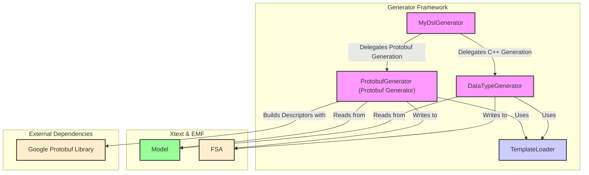
```mermaid
graph TD
    %% Style definitions for clarity
    classDef generator fill:#f9f,stroke:#333,stroke-width:2px
    classDef utility fill:#ccf,stroke:#333,stroke-width:2px
    classDef model fill:#9f9,stroke:#333,stroke-width:2px
    classDef external fill:#fec,stroke:#333,stroke-width:2px
    %% Nodes
    subgraph "Generator Framework"
        MyDslGenerator:::generator
        DataTypeGenerator:::generator
        ProtobufGenerator["ProtobufGenerator (Protobuf Generator)"]:::generator
        TemplateLoader:::utility
    end
    subgraph "Xtext & EMF"
        Model:::model
        FSA:::external
    end
    
    subgraph "External Dependencies"
        ProtobufLib["Google Protobuf Library"]:::external
    end
    %% Interactions
    MyDslGenerator -- "Delegates C++ Generation" --> DataTypeGenerator
    MyDslGenerator -- "Delegates Protobuf Generation" --> ProtobufGenerator
    
    DataTypeGenerator -- "Reads from" --> Model
    DataTypeGenerator -- "Uses" --> TemplateLoader
    DataTypeGenerator -- "Writes to" --> FSA
    
    ProtobufGenerator -- "Reads from" --> Model
    ProtobufGenerator -- "Uses" --> TemplateLoader
    ProtobufGenerator -- "Writes to" --> FSA
    ProtobufGenerator -- "Builds Descriptors with" --> ProtobufLib
```

### 1.2. Class Summary Table

This table provides a concise summary of the primary role and key dependencies of each Xtend class within the `org.xtext.example.mydsl` project. It serves as a quick reference to the system's components and their responsibilities.

| Class                | Core Responsibility                                          | Key Dependencies                                             | Source File                         |
| -------------------- | ------------------------------------------------------------ | ------------------------------------------------------------ | ----------------------------------- |
| `MyDslGenerator`     | Main entry point and orchestrator for the code generation process. | `DataTypeGenerator`, `ProtobufGenerator`, `TemplateLoader`   | `generator/MyDslGenerator.xtend`    |
| `DataTypeGenerator`  | Generates C++ header files (`.h`) and `CMakeLists.txt` from the DSL model. | `TemplateLoader`, `IFileSystemAccess2`, DSL `Model`          | `generator/DataTypeGenerator.xtend` |
| `ProtobufGenerator`  | Generates Protobuf definition files (`.proto`) and a binary descriptor set. | `TemplateLoader`, `IFileSystemAccess2`, DSL `Model`, Google Protobuf Library | `generator/ProtobufGenerator.xtend` |
| `TemplateLoader`     | Loads and processes external template files from the classpath or file system. | (None within the analyzed scope)                             | `generator/TemplateLoader.xtend`    |
| `MyDslGeneratorTest` | Provides a standalone test suite for validating the entire generation pipeline. | `MyDslGenerator`, `InMemoryFileSystemAccess`, EMF/Xtext infrastructure | `test/MyDslGeneratorTest.xtend`     |

### 1.3. Consolidated Class Diagram

The diagram below presents the static relationships and dependencies between the primary Xtend classes. It highlights the use of dependency injection (`@Inject`) to link the components, a practice configured in `MyDslRuntimeModule.java`.

`MyDslGenerator` holds references to the two specialized generators and the template loader. Both `DataTypeGenerator` and `ProtobufGenerator` in turn depend on `TemplateLoader`. The `MyDslGeneratorTest` class instantiates and drives the `MyDslGenerator` to validate its behavior.

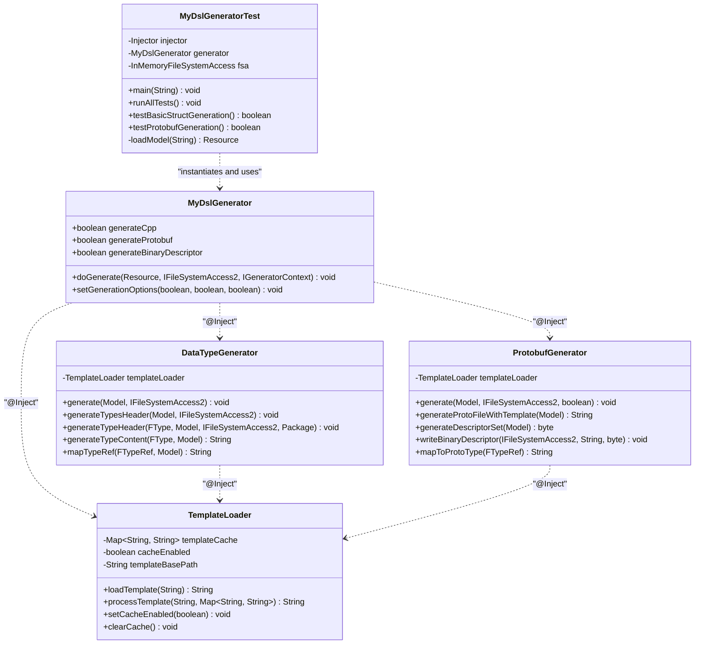
```mermaid
classDiagram
    %% Define classes and their members
    class MyDslGenerator {
        +boolean generateCpp
        +boolean generateProtobuf
        +boolean generateBinaryDescriptor
        +doGenerate(Resource, IFileSystemAccess2, IGeneratorContext) void
        +setGenerationOptions(boolean, boolean, boolean) void
    }

    class DataTypeGenerator {
        -TemplateLoader templateLoader
        +generate(Model, IFileSystemAccess2) void
        +generateTypesHeader(Model, IFileSystemAccess2) void
        +generateTypeHeader(FType, Model, IFileSystemAccess2, Package) void
        +generateTypeContent(FType, Model) String
        +mapTypeRef(FTypeRef, Model) String
    }

    class ProtobufGenerator {
        -TemplateLoader templateLoader
        +generate(Model, IFileSystemAccess2, boolean) void
        +generateProtoFileWithTemplate(Model) String
        +generateDescriptorSet(Model) byte
        +writeBinaryDescriptor(IFileSystemAccess2, String, byte) void
        +mapToProtoType(FTypeRef) String
    }

    class TemplateLoader {
        -Map~String, String~ templateCache
        -boolean cacheEnabled
        -String templateBasePath
        +loadTemplate(String) String
        +processTemplate(String, Map~String, String~) String
        +setCacheEnabled(boolean) void
        +clearCache() void
    }
    
    class MyDslGeneratorTest {
        -Injector injector
        -MyDslGenerator generator
        -InMemoryFileSystemAccess fsa
        +main(String) void
        +runAllTests() void
        +testBasicStructGeneration() boolean
        +testProtobufGeneration() boolean
        -loadModel(String) Resource
    }

    %% Define relationships
    MyDslGenerator..> DataTypeGenerator : "@Inject"
    MyDslGenerator..> ProtobufGenerator : "@Inject"
    MyDslGenerator..> TemplateLoader : "@Inject"
    DataTypeGenerator..> TemplateLoader : "@Inject"
    ProtobufGenerator..> TemplateLoader : "@Inject"
    MyDslGeneratorTest..> MyDslGenerator : "instantiates and uses"
```

### 1.4. Architectural Characteristics

The overall architecture exhibits several notable characteristics that contribute to its effectiveness and maintainability.

First, the system is designed as a **configurable, multi-target generation pipeline**. The boolean flags `generateCpp`, `generateProtobuf`, and `generateBinaryDescriptor` within `MyDslGenerator` are not merely implementation details; they represent a deliberate design choice to make the generator adaptable to different development and deployment scenarios. A team focused solely on a C++ application can disable Protobuf generation to simplify their build process, while a team focused on microservices might only require the Protobuf output. The 

`setGenerationOptions` method further enhances this flexibility, allowing the generator's behavior to be controlled programmatically, as demonstrated by its use in the test suite. This transforms the generator from a monolithic tool into a modular component that can be integrated into diverse and complex build systems.

Second, the architecture promotes **decoupling through dependency injection and a service-oriented utility**. The pervasive use of the `@Inject` annotation, managed by Google Guice and configured in `MyDslRuntimeModule.java`, ensures that components are loosely coupled.

`MyDslGenerator` does not construct its dependencies; it receives them from the framework. This adheres to the Dependency Inversion Principle and significantly improves testability. For instance, a mock implementation of `DataTypeGenerator` could be injected for testing purposes without altering the orchestrator's code. The `TemplateLoader` exemplifies a well-designed, reusable service. It is entirely agnostic of the code it is generating (C++ or Protobuf), focusing solely on the task of loading and populating templates. This separation of concerns makes the `TemplateLoader` a highly cohesive and reusable asset within the framework.

## Section 2: Analysis of the Orchestrator: `MyDslGenerator`

The `MyDslGenerator` class is the central nervous system of the code generation framework. While its own logic is straightforward, its primary role is to orchestrate the entire process, delegating the complex tasks of code generation to specialized components. It extends the `AbstractGenerator` class provided by the Xtext framework.

### 2.1. Class Diagram: `MyDslGenerator`

This diagram provides a detailed view of the `MyDslGenerator` class. Its attributes consist of references to the injected generator components (`DataTypeGenerator`, `ProtobufGenerator`, `TemplateLoader`) and a set of boolean flags that control which generation targets are active. Its public interface is minimal, consisting of the main `doGenerate` method called by the Xtext framework and a `setGenerationOptions` method for external configuration.

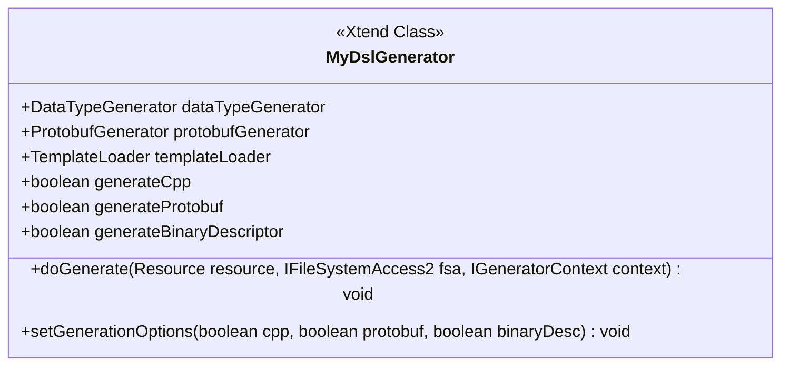
```mermaid
classDiagram
    direction LR
    class MyDslGenerator {
        <<Xtend Class>>
        %% Attributes
        +DataTypeGenerator dataTypeGenerator
        +ProtobufGenerator protobufGenerator
        +TemplateLoader templateLoader
        +boolean generateCpp
        +boolean generateProtobuf
        +boolean generateBinaryDescriptor
        %% Methods
        +doGenerate(Resource resource, IFileSystemAccess2 fsa, IGeneratorContext context) void
        +setGenerationOptions(boolean cpp, boolean protobuf, boolean binaryDesc) void
    }
```

### 2.2. Sequence Diagram: `doGenerate()` Method

The sequence diagram below illustrates the flow of control when the Xtext framework invokes the `doGenerate` method. The `MyDslGenerator` first performs a one-time initialization of the `TemplateLoader`, setting its base path and enabling the cache. It then proceeds to check its configuration flags. If `generateCpp` is true, it delegates the entire C++ generation task to the `DataTypeGenerator`. Similarly, if `generateProtobuf` is true, it delegates to the `ProtobufGenerator`, passing along the `generateBinaryDescriptor` flag to control the generation of the binary schema. This demonstrates the class's role as a pure orchestrator.

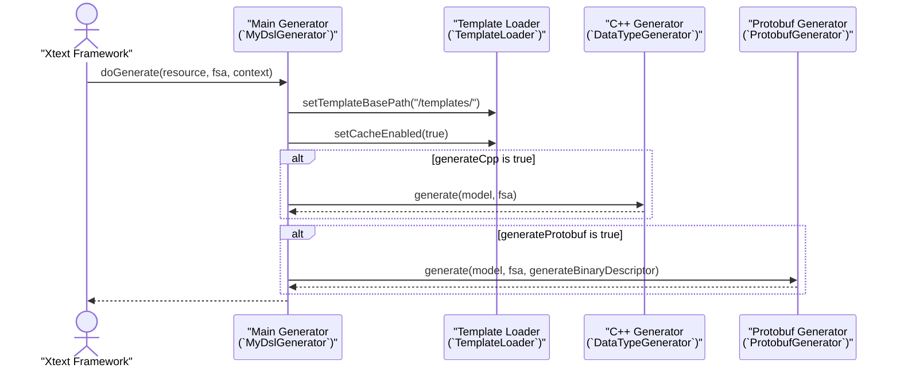
```mermaid
sequenceDiagram
    %% Participants
    actor User as "Xtext Framework"
    participant MyDslGenerator as "Main Generator<br>(`MyDslGenerator`)"
    participant TemplateLoader as "Template Loader<br>(`TemplateLoader`)"
    participant DataTypeGenerator as "C++ Generator<br>(`DataTypeGenerator`)"
    participant ProtobufGenerator as "Protobuf Generator<br>(`ProtobufGenerator`)"

    %% Flow
    User->>MyDslGenerator: doGenerate(resource, fsa, context)
    
    MyDslGenerator->>TemplateLoader: setTemplateBasePath("/templates/")
    MyDslGenerator->>TemplateLoader: setCacheEnabled(true)
    
    alt generateCpp is true
        MyDslGenerator->>DataTypeGenerator: generate(model, fsa)
        DataTypeGenerator-->>MyDslGenerator: 
    end
    
    alt generateProtobuf is true
        MyDslGenerator->>ProtobufGenerator: generate(model, fsa, generateBinaryDescriptor)
        ProtobufGenerator-->>MyDslGenerator: 
    end
    
    MyDslGenerator-->>User: 
```

### 2.3. Sequence Diagram: `setGenerationOptions()` Method

This diagram shows the simple interaction for configuring the generator's behavior. An external component, such as the `MyDslGeneratorTest` suite, can call `setGenerationOptions` to dynamically enable or disable the C++, Protobuf, and binary descriptor generation targets. This allows for fine-grained control over the generator's output during testing or in different build configurations.

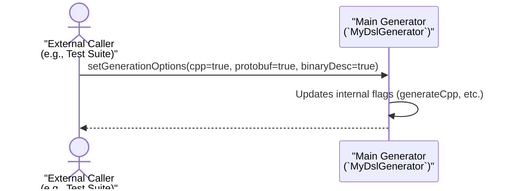
```mermaid
sequenceDiagram
    %% Participants
    actor Caller as "External Caller<br>(e.g., Test Suite)"
    participant MyDslGenerator as "Main Generator<br>(`MyDslGenerator`)"

    %% Flow
    Caller->>MyDslGenerator: setGenerationOptions(cpp=true, protobuf=true, binaryDesc=true)
    MyDslGenerator->>MyDslGenerator: Updates internal flags (generateCpp, etc.)
    MyDslGenerator-->>Caller: 
```

## Section 3: Analysis of the C++ Generator: `DataTypeGenerator`

The `DataTypeGenerator` class is a sophisticated component responsible for translating the DSL model into C++ header files and a corresponding `CMakeLists.txt` build file. It navigates the model's structure, maps DSL types to their C++ equivalents, and uses a template-based approach to generate the final source code.

### 3.1. Class Diagram: `DataTypeGenerator`

This class diagram details the internal structure of `DataTypeGenerator`. It is a singleton managed by Guice and holds a reference to the `TemplateLoader`. Its public API is dominated by the `generate` method. The class is composed of numerous protected and private helper methods, each responsible for a specific, granular part of the generation process, such as generating a header for a single type, generating the content for a struct, mapping a type reference, or formatting a comment block. This modular design enhances maintainability.

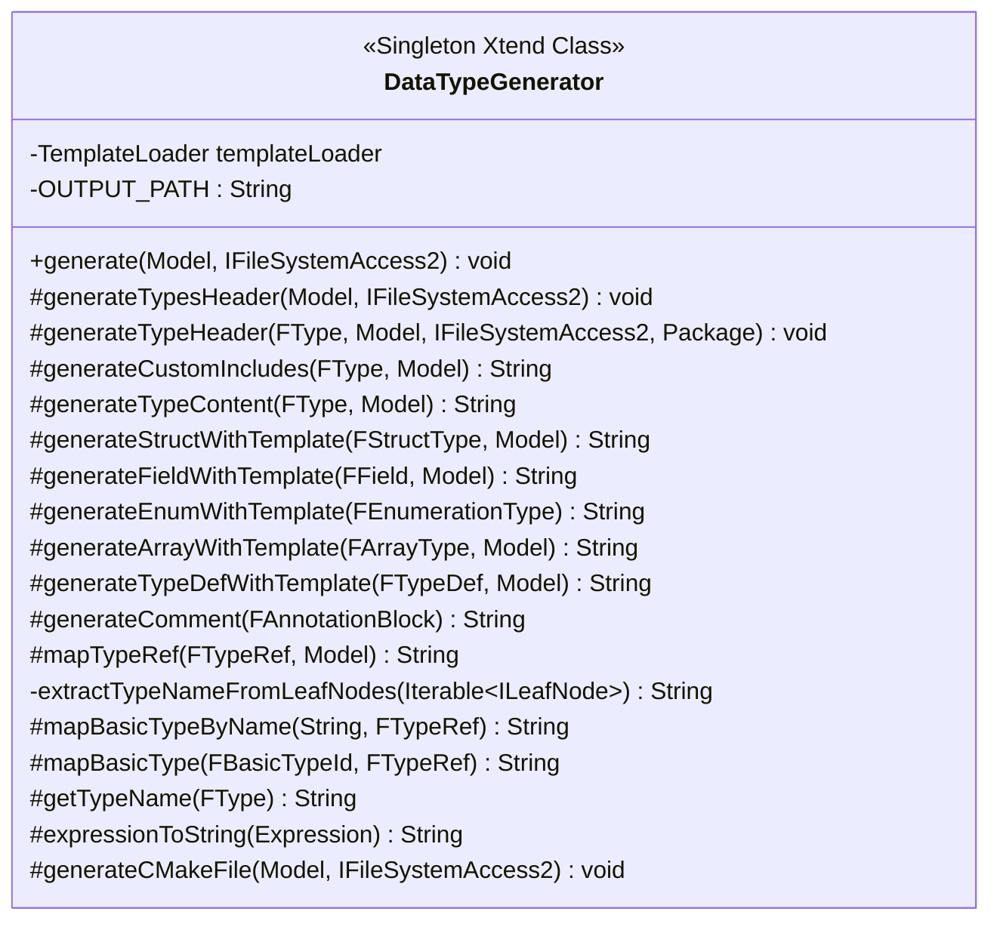
```mermaid
classDiagram
    class DataTypeGenerator {
        <<Singleton Xtend Class>>
        -TemplateLoader templateLoader
        -OUTPUT_PATH : String
        +generate(Model, IFileSystemAccess2) void
        #generateTypesHeader(Model, IFileSystemAccess2) void
        #generateTypeHeader(FType, Model, IFileSystemAccess2, Package) void
        #generateCustomIncludes(FType, Model) String
        #generateTypeContent(FType, Model) String
        #generateStructWithTemplate(FStructType, Model) String
        #generateFieldWithTemplate(FField, Model) String
        #generateEnumWithTemplate(FEnumerationType) String
        #generateArrayWithTemplate(FArrayType, Model) String
        #generateTypeDefWithTemplate(FTypeDef, Model) String
        #generateComment(FAnnotationBlock) String
        #mapTypeRef(FTypeRef, Model) String
        -extractTypeNameFromLeafNodes(Iterable~ILeafNode~) String
        #mapBasicTypeByName(String, FTypeRef) String
        #mapBasicType(FBasicTypeId, FTypeRef) String
        #getTypeName(FType) String
        #expressionToString(Expression) String
        #generateCMakeFile(Model, IFileSystemAccess2) void
    }
```

### 3.2. Sequence Diagram: `generate()` Method

The sequence of operations within the main `generate` method is depicted below. Upon invocation by the orchestrator, it first configures the `TemplateLoader`. It then proceeds systematically through the generation tasks:

1. It calls `generateTypesHeader` to create a single `Types.h` file that will include all other generated headers.
2. It iterates through all top-level types defined directly in the model, calling `generateTypeHeader` for each to produce a corresponding `.h` file.
3. It iterates through all packages in the model and, for each type within a package, calls `generateTypeHeader` with the package context, resulting in headers being placed in subdirectories (e.g., `include/pkg_name/TypeName.h`).
4. Finally, it calls `generateCMakeFile` to produce the `CMakeLists.txt` file for the entire generated library.

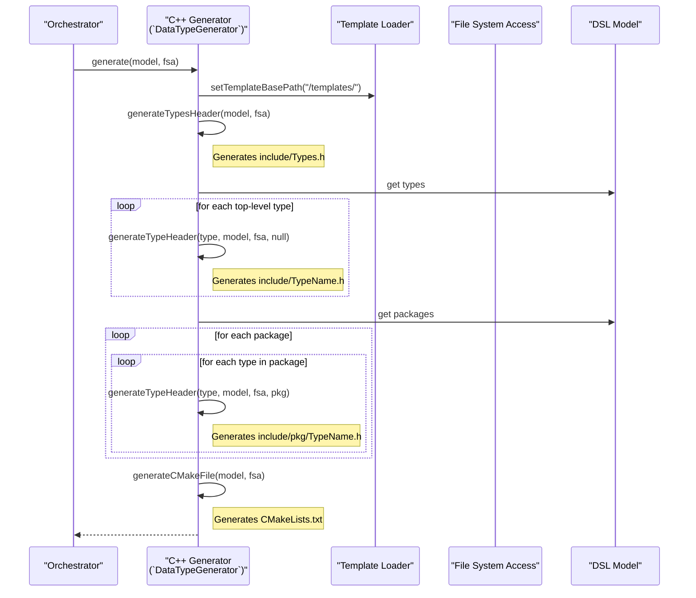
```mermaid
sequenceDiagram
    %% Participants
    participant MyDslGenerator as "Orchestrator"
    participant DataTypeGenerator as "C++ Generator<br>(`DataTypeGenerator`)"
    participant TemplateLoader as "Template Loader"
    participant FSA as "File System Access"
    participant Model as "DSL Model"

    %% Flow
    MyDslGenerator->>DataTypeGenerator: generate(model, fsa)
    
    DataTypeGenerator->>TemplateLoader: setTemplateBasePath("/templates/")
    
    DataTypeGenerator->>DataTypeGenerator: generateTypesHeader(model, fsa)
    note right of DataTypeGenerator: Generates include/Types.h
    
    DataTypeGenerator->>Model: get types
    loop for each top-level type
        DataTypeGenerator->>DataTypeGenerator: generateTypeHeader(type, model, fsa, null)
        note right of DataTypeGenerator: Generates include/TypeName.h
    end
    
    DataTypeGenerator->>Model: get packages
    loop for each package
        loop for each type in package
            DataTypeGenerator->>DataTypeGenerator: generateTypeHeader(type, model, fsa, pkg)
            note right of DataTypeGenerator: Generates include/pkg/TypeName.h
        end
    end
    
    DataTypeGenerator->>DataTypeGenerator: generateCMakeFile(model, fsa)
    note right of DataTypeGenerator: Generates CMakeLists.txt
    
    DataTypeGenerator-->>MyDslGenerator: 
```

### 3.3. Sequence Diagram: `generateTypeHeader()` and `mapTypeRef()` Interaction

This diagram details the process of generating a single C++ header for a struct, focusing on the critical interaction between content generation and type mapping. When `generateTypeHeader` is called, it delegates to `generateTypeContent`, which in turn calls `generateFieldWithTemplate` for each field in the struct. The core of the logic resides in the call to `mapTypeRef`. This method first attempts to use the `predefined` property of the `FTypeRef`, which is populated by Xtext if the cross-reference was successfully resolved. If this property is null, the generator enters a fallback path: it uses `NodeModelUtils` to access the raw AST node for the type reference, extracts the type name as a string, and then attempts to map this string to a C++ type using `mapBasicTypeByName`. This two-tiered approach ensures that code can be generated even if the DSL model is not perfectly valid or fully linked.

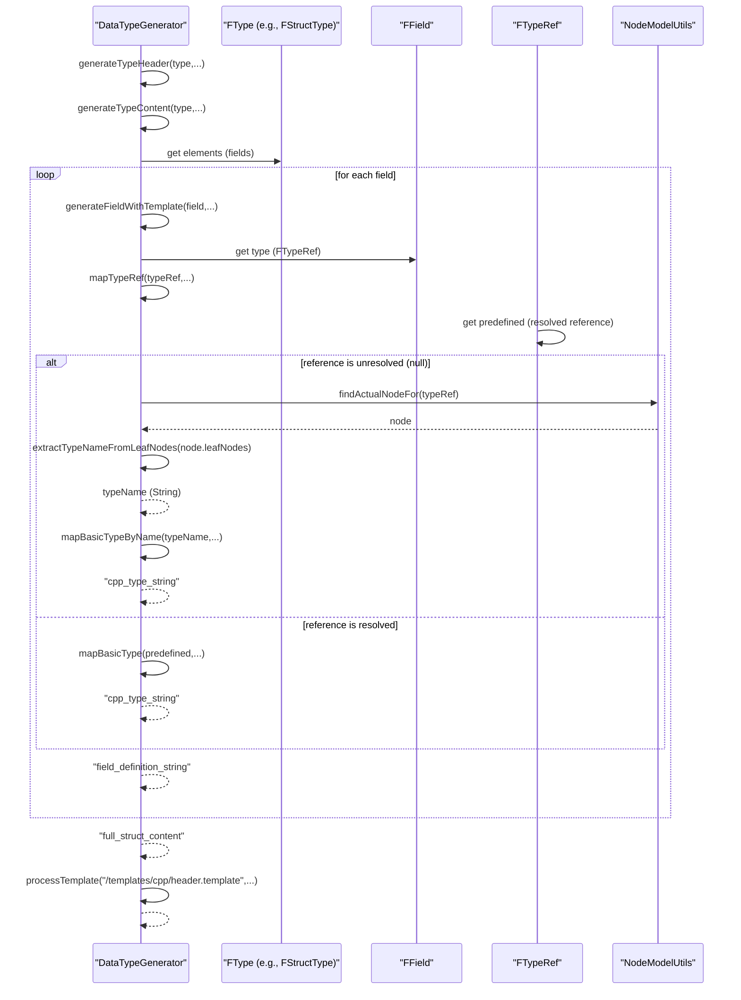
```mermaid
sequenceDiagram
    %% Participants
    participant DTypeGen as "DataTypeGenerator"
    participant FType as "FType (e.g., FStructType)"
    participant FField as "FField"
    participant FTypeRef as "FTypeRef"
    participant NodeModelUtils as "NodeModelUtils"

    %% Flow
    DTypeGen->>DTypeGen: generateTypeHeader(type,...)
    
    DTypeGen->>DTypeGen: generateTypeContent(type,...)
    DTypeGen->>FType: get elements (fields)
    
    loop for each field
        DTypeGen->>DTypeGen: generateFieldWithTemplate(field,...)
        DTypeGen->>FField: get type (FTypeRef)
        
        DTypeGen->>DTypeGen: mapTypeRef(typeRef,...)
        
        FTypeRef->>FTypeRef: get predefined (resolved reference)
        
        alt reference is unresolved (null)
            DTypeGen->>NodeModelUtils: findActualNodeFor(typeRef)
            NodeModelUtils-->>DTypeGen: node
            DTypeGen->>DTypeGen: extractTypeNameFromLeafNodes(node.leafNodes)
            DTypeGen-->>DTypeGen: typeName (String)
            DTypeGen->>DTypeGen: mapBasicTypeByName(typeName,...)
            DTypeGen-->>DTypeGen: "cpp_type_string"
        else reference is resolved
            DTypeGen->>DTypeGen: mapBasicType(predefined,...)
            DTypeGen-->>DTypeGen: "cpp_type_string"
        end
        
        DTypeGen-->>DTypeGen: "field_definition_string"
    end
    
    DTypeGen-->>DTypeGen: "full_struct_content"
    
    DTypeGen->>DTypeGen: processTemplate("/templates/cpp/header.template",...)
    
    DTypeGen-->>DTypeGen: 
```

### 3.4. Architectural Characteristics

The design of the `DataTypeGenerator` is characterized by its robustness and maintainability.

A key design principle is **robustness through defensive type mapping**. The `mapTypeRef` method does not operate under the assumption that the Xtext scoping provider has successfully resolved all type references within the model. Instead, it implements a fallback mechanism. If a reference is unresolved (

`typeRef.predefined` is null), the generator does not fail. It proactively inspects the underlying AST using `NodeModelUtils.findActualNodeFor(typeRef)` to extract the raw text of the type name. This string is then passed to a name-based mapping function (

`mapBasicTypeByName`). This defensive strategy is particularly important for handling references to primitive types like `String` or `uint32`, which might be defined in a separate `PrimitiveDataTypes` block that the scoping mechanism does not fully link. This approach significantly improves the DSL's user experience, as it allows developers to write models that are syntactically correct but may have minor linkage issues, with the confidence that the generator will likely produce the correct output. The responsibility for strict type checking is effectively deferred to the C++ compiler, prioritizing generation success.

Furthermore, the component exhibits a **granular, template-driven generation** strategy. The generation logic is not monolithic. Instead, it is decomposed into a set of small, highly focused methods, each responsible for a specific DSL element (e.g., `generateStructWithTemplate`, `generateEnumWithTemplate`, `generateFieldWithTemplate`). Each of these methods corresponds directly to a small, dedicated template file (e.g., 

`struct.template`, `enum.template`). This separation of concerns—keeping the traversal and mapping logic in Xtend and the output formatting in template files—makes the system highly maintainable and extensible. To alter the generated C++ for all structs, a developer only needs to modify 

`struct.template`. To add support for a new DSL construct, a developer can add a new case to the `generateTypeContent` switch, implement a corresponding generation method, and create a new template file, minimizing changes to existing code.

## Section 4: Analysis of the Protobuf Generator: `ProtobufGenerator`

The `ProtobufGenerator` class is responsible for creating Protocol Buffers (`.proto`) definition files from the DSL model. It shares several architectural patterns with the `DataTypeGenerator`, such as its reliance on templates and a robust type-mapping system. However, it introduces unique complexities, including the generation of a binary schema descriptor and pragmatic handling of filesystem interactions.

### 4.1. Class Diagram: `ProtobufGenerator`

The diagram below details the structure of the `ProtobufGenerator`. As a Guice-managed singleton, it depends on the `TemplateLoader`. Its public API includes the main `generate` method and static methods for accessing a binary data cache used in testing. The class contains a suite of methods for generating textual `.proto` files (`generateProtoFileWithTemplate`, `mapToProtoType`, etc.). It also includes a distinct set of methods (`generateDescriptorSet`, `buildMessageDescriptor`, etc.) that use the Google Protobuf Java library to programmatically construct and serialize a binary `FileDescriptorSet`.

Code snippet

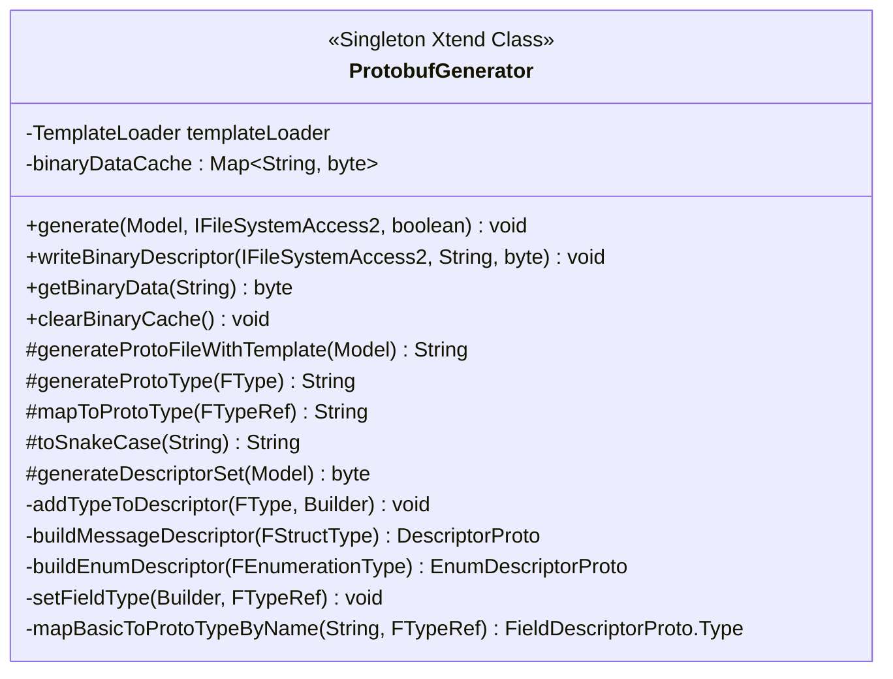
```mermaid
classDiagram
    class ProtobufGenerator {
        <<Singleton Xtend Class>>
        -TemplateLoader templateLoader
        -binaryDataCache : Map~String, byte~
        +generate(Model, IFileSystemAccess2, boolean) void
        +writeBinaryDescriptor(IFileSystemAccess2, String, byte) void
        +getBinaryData(String) byte
        +clearBinaryCache() void
        #generateProtoFileWithTemplate(Model) String
        #generateProtoType(FType) String
        #mapToProtoType(FTypeRef) String
        #toSnakeCase(String) String
        #generateDescriptorSet(Model) byte
        -addTypeToDescriptor(FType, Builder) void
        -buildMessageDescriptor(FStructType) DescriptorProto
        -buildEnumDescriptor(FEnumerationType) EnumDescriptorProto
        -setFieldType(Builder, FTypeRef) void
        -mapBasicToProtoTypeByName(String, FTypeRef) FieldDescriptorProto.Type
    }
```

### 4.2. Sequence Diagram: `generate()` and `writeBinaryDescriptor()`

This sequence diagram illustrates the workflow of the `ProtobufGenerator`. The `generate` method first creates the main `datatypes.proto` file and then iterates through any packages in the model to create corresponding package-specific `.proto` files. If the `generateBinary` flag is true, it enters a secondary phase:

1. It calls `generateDescriptorSet` to build the binary schema in memory.
2. It passes the resulting byte array to `writeBinaryDescriptor`. This method attempts to write the binary data directly to the filesystem, bypassing the standard text-oriented `IFileSystemAccess2` where necessary. It includes logic to try multiple output paths and, as a last resort, generates a Base64-encoded text file if all binary write attempts fail.
3. Finally, it generates a companion `.desc.info` file containing metadata about the binary descriptor.

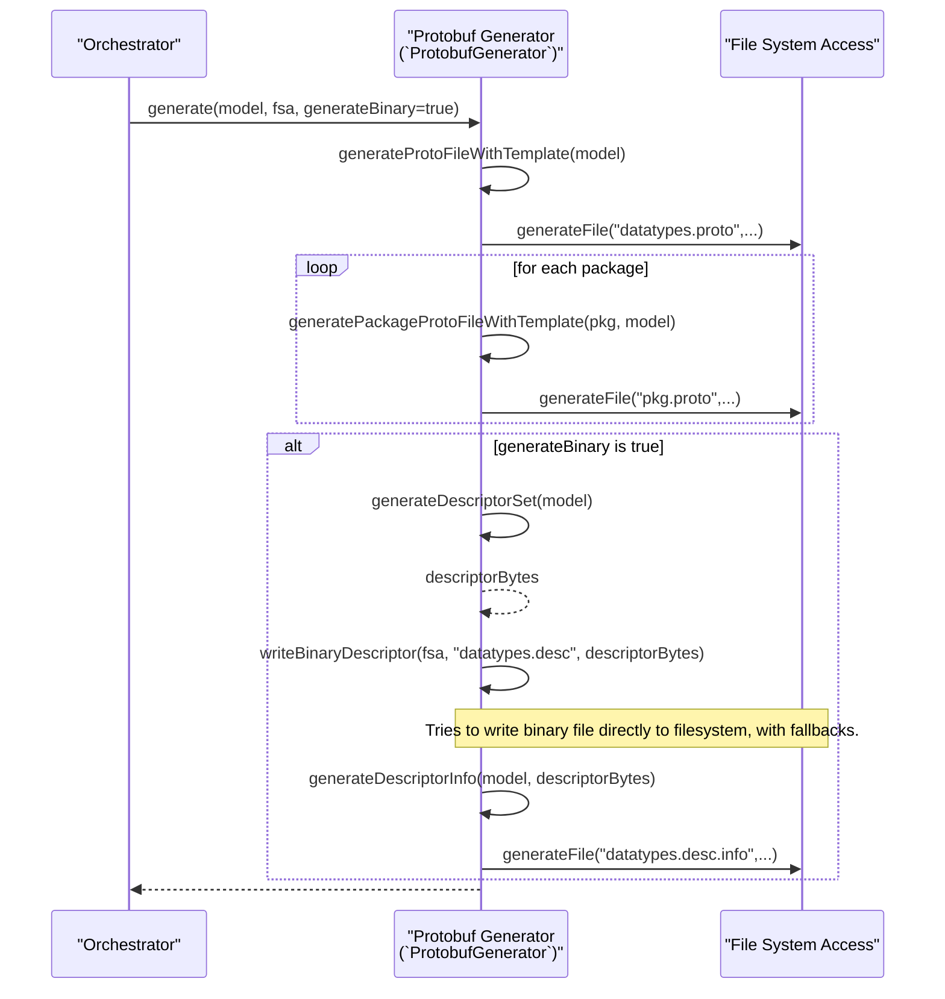
```mermaid
sequenceDiagram
    %% Participants
    participant MyDslGenerator as "Orchestrator"
    participant ProtobufGenerator as "Protobuf Generator<br>(`ProtobufGenerator`)"
    participant FSA as "File System Access"
    
    %% Flow
    MyDslGenerator->>ProtobufGenerator: generate(model, fsa, generateBinary=true)
    
    ProtobufGenerator->>ProtobufGenerator: generateProtoFileWithTemplate(model)
    ProtobufGenerator->>FSA: generateFile("datatypes.proto",...)
    
    loop for each package
        ProtobufGenerator->>ProtobufGenerator: generatePackageProtoFileWithTemplate(pkg, model)
        ProtobufGenerator->>FSA: generateFile("pkg.proto",...)
    end
    
    alt generateBinary is true
        ProtobufGenerator->>ProtobufGenerator: generateDescriptorSet(model)
        ProtobufGenerator-->>ProtobufGenerator: descriptorBytes
        
        ProtobufGenerator->>ProtobufGenerator: writeBinaryDescriptor(fsa, "datatypes.desc", descriptorBytes)
        note over ProtobufGenerator, FSA: Tries to write binary file directly to filesystem, with fallbacks.
        
        ProtobufGenerator->>ProtobufGenerator: generateDescriptorInfo(model, descriptorBytes)
        ProtobufGenerator->>FSA: generateFile("datatypes.desc.info",...)
    end
    
    ProtobufGenerator-->>MyDslGenerator: 
```

### 4.3. Sequence Diagram: `generateDescriptorSet()`

Generating the binary descriptor is a complex process that involves direct interaction with the Google Protobuf Java library. This diagram shows the key steps:

1. A `FileDescriptorSet.Builder` is created to hold the final result.
2. For the main model and each package, a `FileDescriptorProto.Builder` is instantiated.
3. The generator iterates through the types in the DSL model.
4. For each `FStructType`, it calls `buildMessageDescriptor`, which creates a `DescriptorProto.Builder`, sets its name, and iterates through the struct's fields, adding each one by creating and configuring a `FieldDescriptorProto`.
5. The completed `DescriptorProto` is added to the `FileDescriptorProto.Builder`. A similar process occurs for enumerations.
6. Once all types are processed, the `FileDescriptorProto` is built and added to the main `FileDescriptorSet.Builder`.
7. Finally, the `FileDescriptorSet` is built and serialized to a byte array.

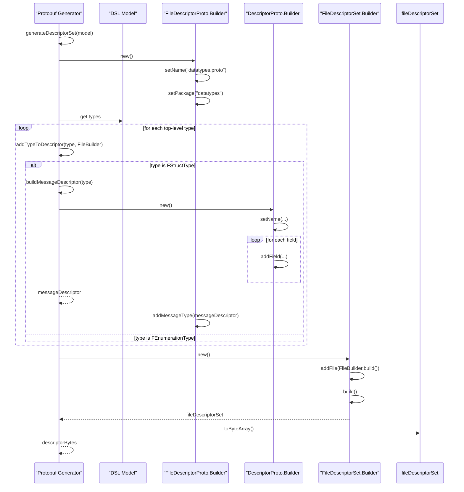
```mermaid
sequenceDiagram
    %% Participants
    participant ProtobufGenerator as "Protobuf Generator"
    participant Model as "DSL Model"
    participant FileBuilder as "FileDescriptorProto.Builder"
    participant MsgBuilder as "DescriptorProto.Builder"
    participant SetBuilder as "FileDescriptorSet.Builder"

    %% Flow
    ProtobufGenerator->>ProtobufGenerator: generateDescriptorSet(model)
    
    ProtobufGenerator->>FileBuilder: new()
    FileBuilder->>FileBuilder: setName("datatypes.proto")
    FileBuilder->>FileBuilder: setPackage("datatypes")
    
    ProtobufGenerator->>Model: get types
    loop for each top-level type
        ProtobufGenerator->>ProtobufGenerator: addTypeToDescriptor(type, FileBuilder)
        
        alt type is FStructType
            ProtobufGenerator->>ProtobufGenerator: buildMessageDescriptor(type)
            ProtobufGenerator->>MsgBuilder: new()
            MsgBuilder->>MsgBuilder: setName(...)
            loop for each field
                MsgBuilder->>MsgBuilder: addField(...)
            end
            ProtobufGenerator-->>ProtobufGenerator: messageDescriptor
            FileBuilder->>FileBuilder: addMessageType(messageDescriptor)
        else type is FEnumerationType
            %%... similar flow for enums...
        end
    end
    
    ProtobufGenerator->>SetBuilder: new()
    SetBuilder->>SetBuilder: addFile(FileBuilder.build())
    
    %% Loop for packages would be similar
    
    SetBuilder->>SetBuilder: build()
    SetBuilder-->>ProtobufGenerator: fileDescriptorSet
    
    ProtobufGenerator->>fileDescriptorSet: toByteArray()
    ProtobufGenerator-->>ProtobufGenerator: descriptorBytes
```

### 4.4. Architectural Characteristics

The `ProtobufGenerator` demonstrates a sophisticated understanding of its target ecosystem and a pragmatic approach to overcoming toolchain limitations.

The most significant design decision is the inclusion of **advanced metadata generation for dynamic systems**. The generator does not stop at producing textual `.proto` files; it also creates a binary `FileDescriptorSet`. This binary artifact is not typically needed for simple compile-time code generation. Its presence indicates that the DSL is intended to be a "source of truth" for runtime systems that rely on reflection. For example, a generic message bus, a data validation gateway, or a dynamic monitoring tool could load this 

`FileDescriptorSet` at runtime to understand the schema of any message type without having prior compiled knowledge of it. This elevates the generator from a simple source-to-source translator to a tool that produces critical metadata for driving the core infrastructure of a larger, more dynamic application.

The implementation also showcases **pragmatic handling of toolchain limitations**. The Xtext framework's `IFileSystemAccess2` interface is primarily designed for handling text files, and writing raw binary data can be unreliable across different environments. The `writeBinaryDescriptor` method addresses this head-on. It contains logic to detect the type of file system access being used (

`JavaIoFileSystemAccess` vs. `InMemoryFileSystemAccess`) to determine the correct output path. It then uses standard Java `FileOutputStream` to write the byte array directly, bypassing the Xtext API's text-encoding layers. The implementation goes further by including a list of alternative fallback paths to try if the initial write fails and, as a final failsafe, an option to generate a Base64-encoded text file with decoding instructions. This multi-layered, defensive approach demonstrates significant foresight and experience, ensuring that this critical binary artifact can be generated reliably across different build environments, from an Eclipse IDE to a command-line Maven build or a CI/CD pipeline.

## Section 5: Analysis of the Utility: `TemplateLoader`

The `TemplateLoader` class is a foundational utility that provides a centralized, robust, and efficient mechanism for loading external template files. It is used by all generator components and is designed to be flexible and performant, abstracting away the details of resource location.

### 5.1. Class Diagram: `TemplateLoader`

This diagram illustrates the public API and internal state of the `TemplateLoader`. It is a singleton class with configuration options for caching and a base path. Its core functionality is exposed through the `loadTemplate` and `processTemplate` methods. Internally, it uses a `ConcurrentHashMap` for caching and contains private methods for attempting to load templates from different sources.

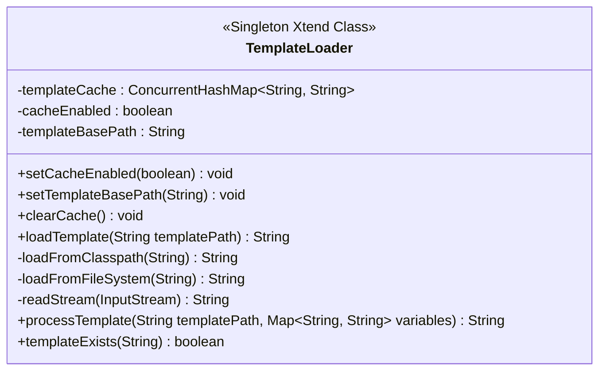
```mermaid
classDiagram
    class TemplateLoader {
        <<Singleton Xtend Class>>
        -templateCache : ConcurrentHashMap~String, String~
        -cacheEnabled : boolean
        -templateBasePath : String
        +setCacheEnabled(boolean) void
        +setTemplateBasePath(String) void
        +clearCache() void
        +loadTemplate(String templatePath) String
        -loadFromClasspath(String) String
        -loadFromFileSystem(String) String
        -readStream(InputStream) String
        +processTemplate(String templatePath, Map~String, String~ variables) String
        +templateExists(String) boolean
    }
```

### 5.2. Sequence Diagram: `processTemplate()` and `loadTemplate()`

The following diagram traces the execution flow when a generator requests a processed template. The call to `processTemplate` first triggers `loadTemplate`. The `loadTemplate` method's logic prioritizes performance and flexibility:

1. It first checks the `templateCache` for the requested path. If found, the cached content is returned immediately.
2. If not in the cache, it attempts to load the resource from the Java classpath, which is typical for resources bundled within a JAR or an Eclipse plugin.
3. If the classpath lookup fails, it falls back to the filesystem, checking several common project directory structures.
4. If the template is successfully loaded from any source, its content is stored in the cache for subsequent requests.
5. If the template cannot be found in any location, an empty string is returned to prevent generation failures.
6. Finally, `processTemplate` takes the loaded content and substitutes all `{{VARIABLE_NAME}}` placeholders with values from the provided map.

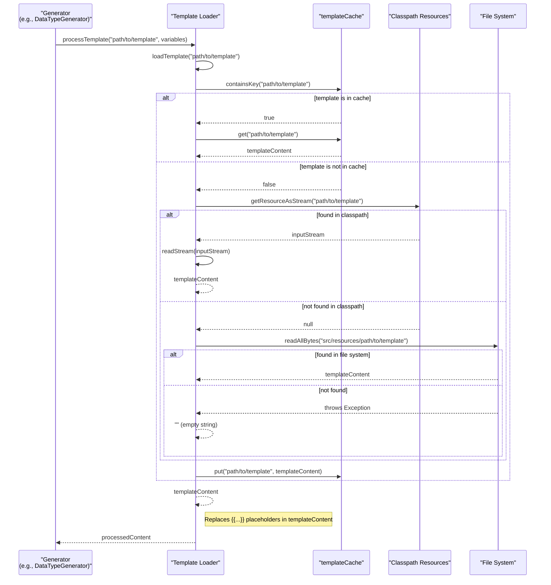
```mermaid
sequenceDiagram
    %% Participants
    participant Generator as "Generator<br>(e.g., DataTypeGenerator)"
    participant TemplateLoader as "Template Loader"
    participant Cache as "templateCache"
    participant Classpath as "Classpath Resources"
    participant FileSystem as "File System"

    %% Flow
    Generator->>TemplateLoader: processTemplate("path/to/template", variables)
    
    TemplateLoader->>TemplateLoader: loadTemplate("path/to/template")
    
    TemplateLoader->>Cache: containsKey("path/to/template")
    alt template is in cache
        Cache-->>TemplateLoader: true
        TemplateLoader->>Cache: get("path/to/template")
        Cache-->>TemplateLoader: templateContent
    else template is not in cache
        Cache-->>TemplateLoader: false
        TemplateLoader->>Classpath: getResourceAsStream("path/to/template")
        
        alt found in classpath
            Classpath-->>TemplateLoader: inputStream
            TemplateLoader->>TemplateLoader: readStream(inputStream)
            TemplateLoader-->>TemplateLoader: templateContent
        else not found in classpath
            Classpath-->>TemplateLoader: null
            TemplateLoader->>FileSystem: readAllBytes("src/resources/path/to/template")
            
            alt found in file system
                FileSystem-->>TemplateLoader: templateContent
            else not found
                FileSystem-->>TemplateLoader: throws Exception
                TemplateLoader-->>TemplateLoader: "" (empty string)
            end
        end
        
        TemplateLoader->>Cache: put("path/to/template", templateContent)
    end
    
    TemplateLoader-->>TemplateLoader: templateContent
    
    note right of TemplateLoader: Replaces {{...}} placeholders in templateContent
    
    TemplateLoader-->>Generator: processedContent
```

### 5.3. Architectural Characteristics

The design of the `TemplateLoader` is centered on **environment-agnostic resource loading**. The `loadTemplate` method does not assume a single, fixed location for template files. Instead, it systematically searches in a prioritized sequence of locations: first the in-memory cache, then the Java classpath, and finally multiple common filesystem paths (`src/resources`, the current working directory, etc.). This multi-location lookup strategy makes the entire generator framework highly portable and robust. It ensures that the generator will function correctly whether it is executed from within the Eclipse IDE (where resources are typically on the classpath), as part of a Maven build (which uses the 

`src/resources` convention), or as a standalone JAR file run from the command line. This flexibility is essential for a tool intended for use in diverse development and continuous integration environments. The inclusion of a cache also demonstrates a consideration for performance, preventing redundant file I/O for frequently used templates.

## Section 6: Analysis of Test Implementation: `MyDslGeneratorTest`

The `MyDslGeneratorTest.xtend` class provides a comprehensive test suite for the entire code generation pipeline. It is designed as a standalone application, allowing it to be run without a dedicated test runner like JUnit, which enhances its portability. The testing strategy provides valuable information about the generator's expected behavior and quality assurance process.

### 6.1. Class Diagram: `MyDslGeneratorTest`

This diagram details the structure of the test class. It contains setup and teardown logic, a series of individual test case methods (one for each major feature of the DSL), and several helper methods. Key helpers include `loadModel`, which parses a DSL model from a string, and `writeFiles`, which can persist the in-memory results to disk for manual inspection. The use of `InMemoryFileSystemAccess` is central to its design, allowing tests to run quickly without actual disk I/O.

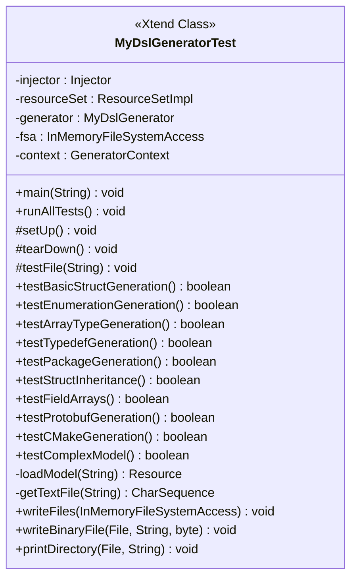
```mermaid
classDiagram
    class MyDslGeneratorTest {
        <<Xtend Class>>
        -injector : Injector
        -resourceSet : ResourceSetImpl
        -generator : MyDslGenerator
        -fsa : InMemoryFileSystemAccess
        -context : GeneratorContext
        +main(String) void
        +runAllTests() void
        #setUp() void
        #tearDown() void
        #testFile(String) void
        +testBasicStructGeneration() boolean
        +testEnumerationGeneration() boolean
        +testArrayTypeGeneration() boolean
        +testTypedefGeneration() boolean
        +testPackageGeneration() boolean
        +testStructInheritance() boolean
        +testFieldArrays() boolean
        +testProtobufGeneration() boolean
        +testCMakeGeneration() boolean
        +testComplexModel() boolean
        -loadModel(String) Resource
        -getTextFile(String) CharSequence
        +writeFiles(InMemoryFileSystemAccess) void
        +writeBinaryFile(File, String, byte) void
        +printDirectory(File, String) void
    }
```

### 6.2. Sequence Diagram: A Representative Test (`testBasicStructGeneration`)

The following diagram illustrates the execution flow of a typical test case. The `runAllTests` method invokes `testBasicStructGeneration`.

1. The test method first calls `tearDown` to ensure a clean state by creating a new `InMemoryFileSystemAccess` instance.
2. It uses the `loadModel` helper to parse an inline string containing a simple DSL model into an EMF `Resource`.
3. It then invokes the `doGenerate` method on the `MyDslGenerator` instance, passing the loaded resource and the in-memory file system.
4. After generation, the test asserts the expected outcome by querying the `InMemoryFileSystemAccess` instance. It checks for the existence of the expected output file (`Person.h`) and verifies that its content contains the correct C++ code fragments.
5. The method returns a boolean indicating whether the test passed or failed.

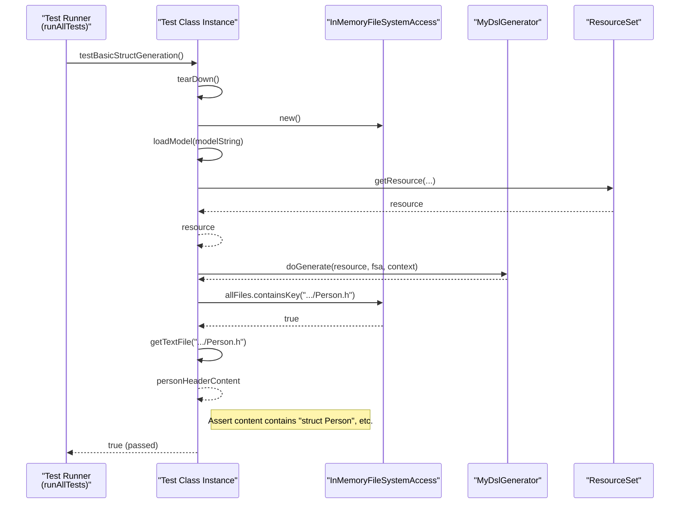
```mermaid
sequenceDiagram
    %% Participants
    participant TestRunner as "Test Runner<br>(runAllTests)"
    participant MyDslGeneratorTest as "Test Class Instance"
    participant Fsa as "InMemoryFileSystemAccess"
    participant Generator as "MyDslGenerator"
    participant ResourceSet as "ResourceSet"

    %% Flow
    TestRunner->>MyDslGeneratorTest: testBasicStructGeneration()
    
    MyDslGeneratorTest->>MyDslGeneratorTest: tearDown()
    MyDslGeneratorTest->>Fsa: new()
    
    MyDslGeneratorTest->>MyDslGeneratorTest: loadModel(modelString)
    MyDslGeneratorTest->>ResourceSet: getResource(...)
    ResourceSet-->>MyDslGeneratorTest: resource
    MyDslGeneratorTest-->>MyDslGeneratorTest: resource
    
    MyDslGeneratorTest->>Generator: doGenerate(resource, fsa, context)
    Generator-->>MyDslGeneratorTest: 
    
    MyDslGeneratorTest->>Fsa: allFiles.containsKey(".../Person.h")
    Fsa-->>MyDslGeneratorTest: true
    
    MyDslGeneratorTest->>MyDslGeneratorTest: getTextFile(".../Person.h")
    MyDslGeneratorTest-->>MyDslGeneratorTest: personHeaderContent
    
    note right of MyDslGeneratorTest: Assert content contains "struct Person", etc.
    
    MyDslGeneratorTest-->>TestRunner: true (passed)
```

### 6.3. Architectural Characteristics

The testing approach demonstrates a focus on **self-contained and comprehensive validation**. The test suite is not limited to narrow unit tests of individual methods. Instead, each test case validates the entire generation pipeline as an integrated whole. The process starts with a raw DSL model string, proceeds through parsing and code generation, and ends with an assertion on the final generated text. This integration testing strategy provides high confidence that the system works correctly from end to end.

The test suite covers a wide range of DSL features, including structs, enums, arrays, typedefs, packages, inheritance, and the generation of all target artifacts (C++, Protobuf, CMake). This breadth indicates a thorough approach to quality assurance. The use of 

`InMemoryFileSystemAccess` allows these comprehensive tests to execute quickly and efficiently, without the overhead and potential for state pollution associated with disk I/O. However, the inclusion of the `writeFiles` helper method provides a pragmatic escape hatch, allowing a developer to easily write the generated files to disk for manual inspection during debugging or test development. This combination of fast, in-memory validation with an optional on-disk output represents a powerful and practical testing pattern. The decision to implement the suite as a standalone runnable class further enhances its utility, making it easy to execute and integrate into any build system or CI pipeline.

## Section 7: Conclusions

The `org.xtext.example.mydsl` generator framework is a well-architected system for multi-target code generation. Its design exhibits a clear separation of concerns, modularity, and a focus on robustness and flexibility.

1. **Orchestration and Delegation:** The architecture effectively uses an orchestrator (`MyDslGenerator`) to manage a configurable workflow, delegating complex tasks to specialized components (`DataTypeGenerator`, `ProtobufGenerator`). This makes the system easy to understand and extend with new generation targets.
2. **Template-Driven and Maintainable:** The heavy reliance on external templates, managed by the `TemplateLoader` utility, decouples the generation logic from the output format. This design allows for easy modification of the generated code's style and structure without altering the core Xtend logic, significantly enhancing maintainability.
3. **Robustness and Pragmatism:** The framework is designed with real-world complexities in mind. The defensive type-mapping in `DataTypeGenerator` allows it to function even with partially unresolved models. The intricate file-writing logic in `ProtobufGenerator`, with its multiple fallbacks, demonstrates a pragmatic approach to overcoming toolchain limitations.
4. **Advanced Metadata Capabilities:** The ability to generate a binary Protobuf `FileDescriptorSet` is a standout feature. It indicates that the DSL is designed not just for compile-time code generation but also as a source of truth for dynamic, reflection-based runtime systems, a capability found in sophisticated, large-scale software ecosystems.
5. **Comprehensive Quality Assurance:** The standalone, integration-style test suite ensures a high degree of confidence in the entire generation pipeline. Its design for both fast in-memory execution and optional on-disk output provides a powerful and flexible testing solution.

In summary, the Xtend components of the `org.xtext.example.mydsl` project constitute a mature, robust, and thoughtfully designed code generation framework that is well-suited for its purpose and engineered for future extension and maintenance.