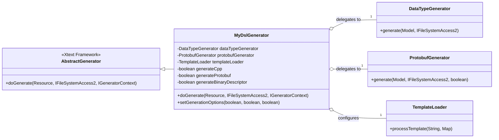
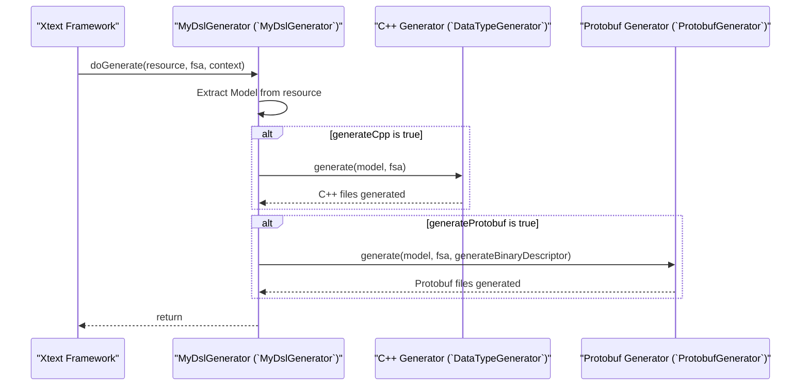
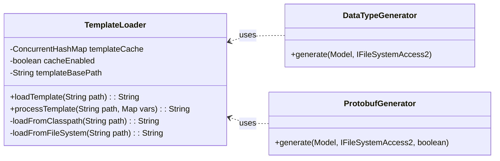
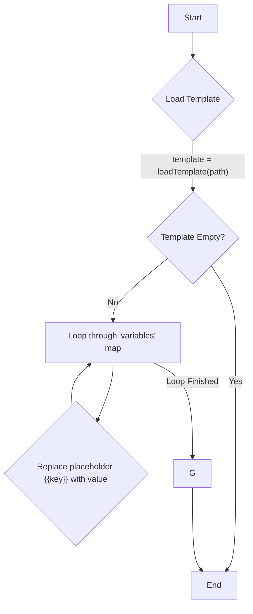
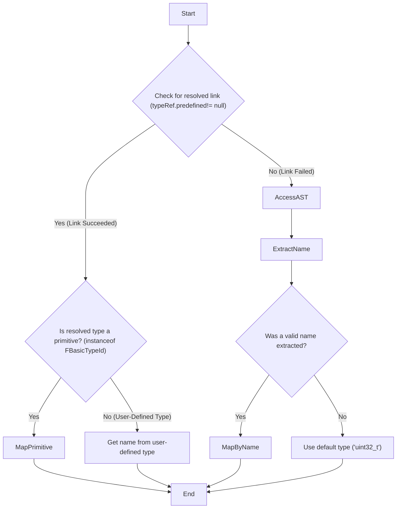

# Xtext DSL to C++/Protobuf Generation - A Deep Dive into the MyDsl Code Generation Architecture

### Executive Summary

This report provides an exhaustive technical analysis of the `org.xtext.example.mydsl` project's code generation framework. The system is architected as a model-driven engineering (MDE) solution, transforming a platform-agnostic data model, defined via a custom Domain-Specific Language (DSL), into two distinct, platform-specific representations: C++ header files for high-performance systems and Google Protocol Buffers (Protobuf) artifacts for interoperable data serialization. The core architectural pattern is that of a central orchestrator, `MyDslGenerator`, which delegates generation tasks to specialized, template-driven subsystems: `DataTypeGenerator` for C++ and `ProtobufGenerator` for Protobuf. Key design characteristics include a robust, defensive approach to type resolution that ensures generator resilience even when semantic model linking fails, and an advanced capability to programmatically generate a binary Protobuf descriptor file (`.desc`), enabling dynamic schema reflection and advanced runtime use cases.

## Section 1: The Generation Entry Point: Orchestration and Control Flow

The code generation process is initiated and managed through a well-defined control flow, starting from the Xtext runtime's dependency injection (DI) configuration and flowing through a central orchestrator class that directs the specialized generator components.

### 1.1 The Xtext Runtime and Module Configuration

The integration with the Xtext framework and the configuration of the generator's components are established in `MyDslRuntimeModule.java`. This class serves as the binding point for the Guice dependency injection container, which Xtext uses to manage object creation and wiring.

The first critical binding is the registration of the main generator class:

```c++
@Override
public Class<? extends IGenerator2> bindIGenerator2() {
    return MyDslGenerator.class;
}
```

This override (lines 18-20) instructs the Xtext runtime that whenever it needs to perform code generation for the `MyDsl` language, it must request an instance of the `MyDslGenerator` class. This makes 

`MyDslGenerator` the designated entry point for the entire process.

The second key function of this module is the configuration of the generator's constituent components as singletons:

```java
@Override
public void configure(Binder binder) {
    super.configure(binder);
    
    binder.bind(org.xtext.example.mydsl.generator.TemplateLoader.class)
         .asEagerSingleton();
    
    binder.bind(org.xtext.example.mydsl.generator.DataTypeGenerator.class)
         .asEagerSingleton();
    
    binder.bind(org.xtext.example.mydsl.generator.ProtobufGenerator.class)
         .asEagerSingleton();
}
```

This configuration (lines 27-42) explicitly binds `TemplateLoader`, `DataTypeGenerator`, and `ProtobufGenerator` as eager singletons. This is a deliberate and important design choice. By default, a DI container might create new instances of a class every time it is injected. By enforcing a singleton scope, the system guarantees that only one instance of each of these classes exists throughout the application's lifecycle. This is essential for components like 

`TemplateLoader`, which maintains an internal template cache (`templateCache` in `TemplateLoader.xtend`, line 24); a new instance upon each use would render this performance-enhancing cache ineffective. For the generator classes themselves, it is a performance optimization that avoids the overhead of repeated object instantiation when processing a large model that results in many generated files.

### 1.2 The Orchestrator: `MyDslGenerator.xtend`

The `MyDslGenerator` class is the central controller of the generation process, responsible for orchestrating the workflow but not for implementing the details of any specific output format.

#### Low-Level Design: `MyDslGenerator` Class

- **Why? (Purpose):** To serve as the primary entry point for the code generation process triggered by the Xtext framework. It is designed to manage the high-level workflow and delegate the complex, format-specific generation logic to specialized sub-components, promoting modularity and extensibility.
- **What? (Functionality):**
  - Receives the parsed DSL model (`Resource`) from the Xtext runtime.
  - Initializes and configures shared utilities, such as the `TemplateLoader`.
  - Uses feature flags (`generateCpp`, `generateProtobuf`) to conditionally invoke different generation subsystems.
  - Delegates the task of C++ generation to an injected `DataTypeGenerator` instance.
  - Delegates the task of Protobuf generation (both `.proto` and `.desc` files) to an injected `ProtobufGenerator` instance.
  - Provides a public API (`setGenerationOptions`) to allow external configuration of the generation flags, primarily for testing.
- **When? (Triggers):** The `doGenerate` method is invoked by the Xtext framework automatically after a `.mydsl` file is successfully parsed and validated, typically upon saving the file in an Eclipse environment or during a headless build process.
- **How? (Implementation):**
  - The class extends `AbstractGenerator`, the base class for Xtext generators.
  - It uses Guice's `@Inject` annotation to receive singleton instances of `DataTypeGenerator`, `ProtobufGenerator`, and `TemplateLoader` (lines 16-18).
  - The `doGenerate` method (line 25) extracts the root `Model` object from the resource's contents.
  - It then executes a sequence of conditional checks on its feature flags, calling the `generate` method of the corresponding injected generator if its flag is enabled. This implements a clear separation of concerns.

The architecture of this class is a direct implementation of the **Strategy Pattern**. The `MyDslGenerator` class acts as the "Context," defining the high-level generation algorithm. The concrete generation logic for each output format is encapsulated within separate "Strategy" objects (`DataTypeGenerator`, `ProtobufGenerator`). This design is highly extensible; to add a new output target, such as Python, one would create a new `PythonGenerator` class and add another conditional block to `doGenerate` without modifying the existing, tested C++ or Protobuf generation logic. This adheres to the Open/Closed Principle, allowing for extension without modification.

#### Diagrams for `MyDslGenerator`

##### Static Class Diagram

This diagram illustrates the composition of the `MyDslGenerator` and its relationship with the other generator components.



##### Dynamic Sequence Diagram (`doGenerate` method)

This diagram shows the sequence of calls initiated when `doGenerate` is executed.



## Section 2: Foundational Utilities: The Templating Engine

All file generation within this system is driven by a custom, lightweight templating utility. This component is responsible for loading template files from the project and populating them with dynamically generated content.

### 2.1 The `TemplateLoader` Class

The `TemplateLoader` class, defined in `TemplateLoader.xtend`, provides the core templating functionality for the entire generation framework.

#### Low-Level Design: `TemplateLoader` Class

- **Why? (Purpose):** To provide a centralized, reusable, and efficient mechanism for loading external template files and performing simple variable substitution. It is designed to decouple the static structure of the generated files (the "view") from the dynamic content generation logic (the "controller").
- **What? (Functionality):**
  - Loads template files from multiple locations (classpath, filesystem) to support different execution environments.
  - Caches loaded templates in memory to avoid redundant file I/O and improve performance.
  - Provides a method to process a template by replacing placeholders (e.g., `{{VARIABLE_NAME}}`) with provided string values.
  - Offers configuration options to enable/disable caching and set a base path for templates.
- **When? (Triggers):** An instance of `TemplateLoader` is used whenever a generator (`DataTypeGenerator` or `ProtobufGenerator`) needs to produce a file. The `processTemplate` method is called for each file to be generated.
- **How? (Implementation):**
  - **Caching:** It uses a `java.util.concurrent.ConcurrentHashMap` as a thread-safe cache (`templateCache`, line 24), mapping template paths to their string content.
  - **Loading Strategy:** The `loadTemplate` method (line 40) implements a chain-of-responsibility search strategy. It first checks the cache. If not found, it attempts to load from the Java classpath via `class.getResourceAsStream` (line 77). If that fails, it tries to load from the filesystem using several common relative paths (e.g., `src/resources/...`) (line 92). This multi-pronged approach enhances the loader's robustness.
  - **Processing:** The `processTemplate` method (line 143) is the workhorse. It first loads the template content using `loadTemplate`. Then, it iterates through a map of key-value pairs and performs a simple string replacement for each placeholder in the format `{{KEY}}` (line 153).

A significant design decision was the choice to implement this simple string-replacement engine instead of using Xtend's more powerful built-in rich strings (template literals). While Xtend's rich strings allow for embedded expressions, loops, and conditionals directly within the generator's source code, the use of external `.template` files offers a crucial advantage: **separation of concerns**. This decoupling allows the template files, which define the syntax and boilerplate of the target language (C++ or Protobuf), to be reviewed and modified by domain experts who may not be familiar with Java or Xtend. The trade-off is a reduction in template-level logic; all iteration and conditional structures must be implemented in the Xtend code, with the results being passed to the template as a single, pre-formatted string block.

#### Diagrams for `TemplateLoader`

##### Static Class Diagram



##### Dynamic Activity Diagram (`processTemplate` method)



## Section 3: Analysis of the C++ Generation Subsystem (`DataTypeGenerator`)

The `DataTypeGenerator` class is a specialized component responsible for translating the DSL model into a set of C++ header files. It leverages the `TemplateLoader` to populate predefined C++ templates with model-specific information.

### 3.1 Overall Generation Process (`generate` method)

The entry point for C++ generation is the `generate` method within `DataTypeGenerator.xtend`.

#### Low-Level Design: `generate` Method (in `DataTypeGenerator`)

- **Why? (Purpose):** To orchestrate the entire C++ code generation workflow for a given DSL model. It ensures that all necessary files are generated in the correct order and directory structure.
- **What? (Functionality):**
  - Initializes the `TemplateLoader` with the correct base path for templates.
  - Generates a main `Types.h` header file that includes all other generated type headers.
  - Iterates through all top-level types defined in the model and generates an individual C++ header file for each.
  - Iterates through all packages and their contained types, generating a corresponding namespaced C++ header file for each type in the appropriate subdirectory.
  - Generates a `CMakeLists.txt` file to facilitate building the generated code as a header-only library.
- **When? (Triggers):** This method is called by `MyDslGenerator` when the `generateCpp` flag is enabled.
- **How? (Implementation):**
  - The method follows a clear, sequential process (lines 29-68).
  - It first calls `generateTypesHeader` to create the main include file.
  - It then uses two separate `for` loops: one for `model.types` (top-level) and one for `model.packages` (packaged types). Inside these loops, it calls `generateTypeHeader` for each `FType` element.
  - Finally, it calls `generateCMakeFile` to produce the build system file.
  - Robust `try-catch` blocks are wrapped around the generation of individual type headers, preventing an error in one type from halting the entire process and instead printing a warning to the console.

### 3.2 Header File Construction (`generateTypeHeader` method)

The `generateTypeHeader` method (lines 102-144) is responsible for assembling the contents of a single C++ header file. It acts as a bridge between the DSL model and the 

`header.template` file.

The process is methodical:

1. **Determine File Path:** It constructs the output file path, dynamically inserting the package name as a subdirectory if one is present (e.g., `generated/include/MyType.h` or `generated/include/com.example/MyType.h`) (lines 105-106).
2. **Create Header Guard:** It generates a standard C++ header guard name by converting the package and type names to uppercase and replacing `.` with `_` (e.g., `COM_EXAMPLE_MYTYPE_H`) (line 108).
3. **Generate Includes:** It calls `generateCustomIncludes` to determine if any other generated headers need to be included (e.g., for a base class) and populates the `includes.template`.
4. **Handle Namespaces:** It generates `namespace... {` and `} // namespace...` strings if the type is within a package (lines 116-117).
5. **Generate Core Content:** It calls the `generateTypeContent` dispatch method to generate the actual C++ code for the struct, enum, or typedef.
6. **Process Template:** It populates a `HashMap` with all the generated pieces (`GUARD_NAME`, `INCLUDES`, `CONTENT`, etc.) and passes this map to `templateLoader.processTemplate` along with the path to `header.template`. The result is the final, complete content of the header file, which is then written to the filesystem via the `fsa` object.

### 3.3 Content Generation Logic (`generateTypeContent` and helpers)

The `generateTypeContent` method (lines 166-174) is a dispatch method that uses a `switch` statement on the specific EMF class of the `FType` object being processed. This is a classic polymorphic design that routes the object to the appropriate specialized generation method:

- `FStructType` is routed to `generateStructWithTemplate`.
- `FEnumerationType` is routed to `generateEnumWithTemplate`.
- `FArrayType` is routed to `generateArrayWithTemplate`.
- `FTypeDef` is routed to `generateTypeDefWithTemplate`.

Each of these helper methods follows the same pattern:

1. Initialize a `StringBuilder` or other variables to hold generated code fragments.
2. Iterate over the relevant parts of the input model object (e.g., fields of a struct, enumerators of an enum).
3. For each part, generate the corresponding C++ string representation, often by calling another helper method (e.g., `generateFieldWithTemplate`).
4. Assemble the fragments into larger content blocks (e.g., a single string containing all field definitions).
5. Populate a `HashMap` with these content blocks.
6. Call `templateLoader.processTemplate` with the appropriate template file (`struct.template`, `enum.template`, etc.) to get the final C++ content string.

For example, `generateStructWithTemplate` (lines 179-205) iterates through all `FField` elements in a struct, calls `generateFieldWithTemplate` for each, and appends the result to a `StringBuilder` named `fields`. This `fields.toString()` result is then put into the variables map with the key `"FIELDS"`, which corresponds to the `{{FIELDS}}` placeholder in `struct.template`.


### 3.4 Core Logic: C++ Type Mapping (`mapTypeRef`)


The most complex and critical logic within the `DataTypeGenerator` resides in its type mapping functions, primarily `mapTypeRef`. This method is responsible for the crucial task of translating a type reference from the DSL (`FTypeRef`) into a valid C++ type string.


#### Low-Level Design: `mapTypeRef` Method (in `DataTypeGenerator`)


- **Why? (Purpose):** To provide a single, robust point of translation between the DSL's abstract type system and the concrete C++ type system. It must be able to handle both successfully resolved type references and cases where the reference could not be linked by the Xtext framework.
- **What? (Functionality):**
  - Accepts an `FTypeRef` object from the DSL's semantic model.
  - First, it attempts to resolve the type using the `predefined` cross-reference, which is populated by Xtext's linker.
  - If the cross-reference is unresolved (`predefined` is null), it activates a fallback mechanism.
  - The fallback mechanism accesses the underlying Abstract Syntax Tree (AST) node for the `FTypeRef` using `NodeModelUtils`.
  - It manually extracts the raw text of the type name from the AST leaf nodes.
  - It passes this extracted text to a name-based mapping function (`mapBasicTypeByName`) to find the corresponding C++ type.
  - It returns a default type (`uint32_t`) as a last resort to prevent generation failure.
- **When? (Triggers):** This method is called whenever the generator needs to determine the C++ type for a struct field (`generateFieldWithTemplate`), an array element (`generateArrayWithTemplate`), or a typedef (`generateTypeDefWithTemplate`).
- **How? (Implementation):** The method's implementation (lines 371-429) reveals a highly defensive design philosophy.
  1. **The "Happy Path":** It first checks `typeRef.predefined` (line 377). If this field is not null, it means the Xtext linker, guided by `MyDslScopeProvider`, successfully resolved the reference. The method can then simply return the name of the referenced type.
  2. **The "Fallback Path":** If `predefined` is null, the generator does not fail. Instead, it assumes a linking failure and switches to a syntactic analysis (lines 391-425). It uses `NodeModelUtils.findActualNodeFor(typeRef)` to get the raw parse tree node. It then traverses the leaf nodes of this part of the tree to find the token corresponding to the type's name (e.g., the text "String" or "uint32"). This manual extraction is a powerful technique that makes the generator resilient to scoping errors.
  3. **Name-Based Mapping:** The extracted string is then passed to `mapBasicTypeByName` (lines 497-573), which contains a large `switch` statement. This `switch` acts as a dictionary, mapping known primitive type names from the DSL (e.g., "uint32", "float64", "String") to their precise C++ counterparts (e.g., "uint32_t", "double", "std::string"). It intelligently handles multiple common variations (e.g., "int" and "int32" both map to "int32_t").
  4. **Last Resort Default:** If all else fails, it returns `"uint32_t"` (line 428) instead of `"void"` or `null`. This ensures that the generated C++ code remains syntactically valid, even if a type is incorrect, preventing a cascade of compiler errors.

This two-tiered approach—attempting semantic resolution first, then falling back to syntactic analysis—is a hallmark of a robust, production-grade code generator. It prioritizes successful code generation over strict semantic correctness, a pragmatic choice that prevents minor model errors from blocking the entire development workflow.

#### Dynamic Activity Diagram (`mapTypeRef` Logic)



## Section 4: Analysis of the Protobuf Generation Subsystem (`ProtobufGenerator`)

The `ProtobufGenerator` is a sophisticated component with two distinct responsibilities: generating human-readable `.proto` text files and programmatically creating a serialized binary schema descriptor (`.desc`) file.

### 4.1 Textual `.proto` File Generation

The process for generating the textual `.proto` files is structurally similar to that of the C++ generator, relying on the `TemplateLoader` and a series of model-iterating methods.

The orchestration is handled by the `generate` method (lines 50-107), which calls `generateProtoFileWithTemplate` for top-level types and `generatePackageProtoFileWithTemplate` for packaged types. These methods assemble the components of a 

`.proto` file (syntax, package, options, and content) and populate the `file.template`.

Key transformations specific to Protobuf generation include:

- **Field Name Convention:** `generateProtoFieldWithTemplate` calls `toSnakeCase` (line 409) to convert the DSL's camelCase field names (e.g., `myField`) into the standard Protobuf snake_case convention (e.g., `my_field`).
- **Enum Zero-Value:** `generateProtoEnumWithTemplate` enforces a Protobuf best practice. It checks if any enumerator has the value 0. If not, it automatically injects a default `_UNSPECIFIED` enumerator with the value 0 (lines 421-429). This is crucial because Protobuf 3 requires that the default value for an enum field is its zero-numbered enumerator.
- **Type Mapping:** A separate set of mapping functions, such as `mapToProtoType` and `mapBasicToProtoByName` (lines 471-598), translate DSL types into their corresponding Protobuf scalar types (e.g., `uint32`, `string`, `float`, `bytes`). Like the C++ generator, this logic includes a resilient fallback mechanism that uses `NodeModelUtils` to parse type names from the raw AST if semantic linking fails.

### 4.2 Binary Descriptor (`.desc`) Generation

The most advanced feature of the `ProtobufGenerator` is its ability to create a binary schema descriptor file. This process does not use templates; instead, it directly leverages the official Google Protobuf Java library to construct a schema representation in memory and then serialize it.

#### Low-Level Design: `generateDescriptorSet` Method (in `ProtobufGenerator`)

- **Why? (Purpose):** To create a self-contained, machine-readable binary representation of the entire Protobuf schema (`FileDescriptorSet`). This file enables advanced use cases like dynamic message processing, schema reflection, and runtime data validation without requiring the compiled, language-specific Protobuf classes.
- **What? (Functionality):**
  - Programmatically constructs a `FileDescriptorSet` object, which is the root of the Protobuf schema description.
  - For the main model and each package, it creates a `FileDescriptorProto` object, setting metadata like name, syntax, and package.
  - It iterates through the DSL model's structs and enums.
  - For each `FStructType`, it builds a `DescriptorProto` object.
  - For each `FField` within a struct, it builds a `FieldDescriptorProto`, setting its name, number, label (`LABEL_OPTIONAL` or `LABEL_REPEATED`), and type.
  - For each `FEnumerationType`, it builds an `EnumDescriptorProto` with corresponding `EnumValueDescriptorProto` objects.
  - Finally, it serializes the completed `FileDescriptorSet` object into a `byte` array.
- **When? (Triggers):** This method is called from the main `generate` method if the `generateBinary` flag is true.
- **How? (Implementation):**
  - The method (lines 687-727) begins by creating a `FileDescriptorSet.Builder`.
  - It then creates a `FileDescriptorProto.Builder` for the top-level types, setting file-level properties like `setName`, `setSyntax`, and `setPackage` (lines 691-693).
  - It iterates through the model types, delegating the creation of message and enum descriptors to `buildMessageDescriptor` and `buildEnumDescriptor`, respectively.
  - The `buildMessageDescriptor` method (lines 742-779) is particularly notable. It creates a `DescriptorProto.Builder`, iterates through the struct's fields, and for each field, creates a `FieldDescriptorProto.Builder`. It sets the field's properties, including its type, which is determined by a dedicated mapping function, `mapBasicToProtoType`, that returns a `FieldDescriptorProto.Type` enum value.
  - After processing all types and packages, the final `FileDescriptorSet` is built and serialized to a byte array using `setBuilder.build().toByteArray()` (line 726).

This programmatic approach demonstrates a deep integration with the Protobuf library and enables a level of functionality far beyond simple `.proto` file generation. It positions the DSL as a source of truth not just for compile-time code generation but also for runtime schema services in a potentially complex microservices or data-interchange architecture.

### 4.3 Advanced Filesystem Interaction (`writeBinaryDescriptor`)

Writing the generated `byte` descriptor to a file presents a technical challenge, as the standard Xtext file access API is designed for text, not binary data.

#### Low-Level Design: `writeBinaryDescriptor` Method (in `ProtobufGenerator`)

- **Why? (Purpose):** To reliably write the binary `byte` data of the Protobuf descriptor to the correct location on the filesystem, bypassing the limitations of Xtext's text-oriented file access API.
- **What? (Functionality):**
  - Receives the target filename and the `byte` data.
  - Intelligently determines the correct output directory by inspecting the type and configuration of the provided `IFileSystemAccess2` object.
  - Uses standard Java I/O (`FileOutputStream`) to write the raw bytes directly to disk, ensuring data integrity.
  - Implements a fallback mechanism to try alternative, common output directories if the primary write fails.
  - As a final "last resort" fallback, it can generate a Base64-encoded text file containing the binary data if all direct write attempts fail.
- **When? (Triggers):** Called from the main `generate` method after `generateDescriptorSet` has successfully produced the binary data.
- **How? (Implementation):**
  - The method (lines 113-203) deliberately avoids `fsa.generateFile`. Using the text-based API would corrupt the binary data by attempting to apply a character encoding.
  - It first attempts to find the configured output directory by checking if the `fsa` is an instance of `JavaIoFileSystemAccess` and reading its output configuration (lines 124-129). This is a robust way to respect the project's build configuration.
  - It then uses `new FileOutputStream(file)` and `fos.write(data)` to perform a direct, unadulterated binary write (lines 155-157).
  - If this write fails, it contains a list of alternative paths (e.g., "src-gen", "target/generated-sources") and attempts to write to each of them (lines 166-194).
  - If all binary writes fail, it calls `generateBase64Fallback` (line 201), which encodes the byte array into a Base64 string and writes it as a regular text file using the standard `fsa` API. This ensures the valuable descriptor data is never lost, even if filesystem permissions are restrictive. This demonstrates exceptional fault tolerance.

## Section 5: A Comparative Analysis of Type Mapping Strategies

A comprehensive understanding of the generator requires synthesizing the type mapping logic from both the C++ and Protobuf subsystems. While the implementation details differ, the core philosophy of resilient, multi-layered resolution is shared.

### 5.1 Table: DSL to C++/Protobuf Type Mapping Comparison

This table consolidates the type translation rules from across the codebase into a single, definitive reference.

| DSL Type Name       | Example DSL Syntax        | Generated C++ Type              | Generated Protobuf Type | Notes / Key Generator Logic                                  |
| ------------------- | ------------------------- | ------------------------------- | ----------------------- | ------------------------------------------------------------ |
| `uint32`            | `uint32 myVar;`           | `uint32_t`                      | `uint32`                | Mapped in `DataTypeGenerator::mapBasicTypeByName` and `ProtobufGenerator::mapBasicToProtoByName`. |
| `String`            | `String myStr;`           | `std::string`                   | `string`                | Both generators contain special handling for the capitalized `String` name. |
| `float64`           | `float64 myDbl;`          | `double`                        | `double`                | Direct mapping to native 64-bit float types.                 |
| `bool`              | `bool myFlag;`            | `bool`                          | `bool`                  | Direct mapping.                                              |
| User-defined Struct | `MyStruct s;`             | `MyStruct`                      | `MyStruct`              | Assumes `MyStruct` is a defined type. In C++, this requires an `#include`. In Protobuf, it's a message type. |
| Field Array         | `uint32 arr;`             | `uint32_t arr;`                 | `repeated uint32 arr;`  | C++ generator produces a C-style fixed-size array. Protobuf generator uses the `repeated` keyword. |
| `FArrayType`        | `array MyArr of X;`       | `using MyArr = std::vector<X>;` | (No direct equivalent)  | The C++ generator creates a `using` alias for a `std::vector`. This concept is not directly represented in Protobuf but is realized through `repeated` fields. |
| `FTypeDef`          | `typedef MyId is uint32;` | `using MyId = uint32_t;`        | (No direct equivalent)  | The C++ generator creates a `using` alias. Protobuf generators use the underlying type (`uint32`) directly in field definitions. |

### 5.2 Handling Unresolved References: The `NodeModelUtils` Pattern


A core design philosophy shared by both `DataTypeGenerator` and `ProtobufGenerator` is their resilient handling of unresolved type references. This is achieved through a consistent fallback pattern that leverages Xtext's `NodeModelUtils`.

The pattern can be summarized as follows:

1. **Attempt Semantic Resolution:** First, try to use the resolved cross-reference from the semantic model (e.g., `typeRef.predefined`). This is the ideal, most reliable path.
2. **Detect Failure:** If the cross-reference is `null`, do not fail. Instead, treat this as a linking failure and proceed to the fallback.
3. **Access Syntactic Model:** Use `NodeModelUtils.findActualNodeFor(typeRef)` to retrieve the raw Abstract Syntax Tree (AST) node associated with the reference.
4. **Parse Raw Text:** Traverse the leaf nodes of the AST to extract the literal text of the type name that the user wrote in the source file.
5. **Map by Name:** Use a `switch` statement or map to translate the extracted string name into the target language's type string.

This pattern is a deliberate choice to make the generator robust against potential complexities and failures in the DSL's scoping rules (`MyDslScopeProvider`). It ensures that code generation can often succeed even if the IDE or linker reports an error, which is a highly pragmatic approach for maintaining developer velocity.

## Section 6: Architectural Summary and Key Design Patterns

The `org.xtext.example.mydsl` generator is a well-architected system that effectively employs several key software design patterns to achieve its goals of robustness, modularity, and extensibility.

### 6.1 Identified Design Patterns

- **Strategy Pattern:** The `MyDslGenerator` class uses this pattern to delegate generation tasks to concrete strategy implementations (`DataTypeGenerator`, `ProtobufGenerator`), allowing for easy extension with new output formats.
- **Template Method Pattern:** The Xtext framework itself imposes this pattern. `AbstractGenerator` defines the public `doGenerate` method, which subclasses like `MyDslGenerator` must implement, providing the "steps" of the algorithm.
- **Singleton Pattern:** Applied via the Guice DI configuration in `MyDslRuntimeModule` to all core generator components. This ensures that stateful services like the `TemplateLoader`'s cache are shared and that object creation overhead is minimized.
- **Facade Pattern (Implicit):** The `MyDslGenerator` acts as a simple facade, providing a single entry point (`doGenerate`) that hides the more complex and distinct subsystems for C++ and Protobuf generation.

### 6.2 System Strengths and Design Philosophy

The analysis of the codebase reveals a system with a clear and pragmatic design philosophy, resulting in several key strengths:

- **Robustness:** The generator is exceptionally resilient. The defensive type mapping that falls back to syntactic analysis, the error handling that isolates failures to a single file, and the binary-writing logic with its Base64 fallback all contribute to a system that prioritizes successful generation.
- **Separation of Concerns:** The design effectively separates distinct responsibilities. The use of external templates decouples the file structure (view) from the generation logic (controller). The delegation to specialized generator classes cleanly separates the C++ implementation details from the Protobuf implementation details.
- **Extensibility:** The use of the Strategy pattern makes the core architecture easy to extend. Adding support for a new programming language would involve creating a new generator class and adding a single delegation call in the orchestrator, with no changes to existing code.
- **Pragmatism:** The system demonstrates a pragmatic engineering approach. It leverages the powerful features of the Xtext framework (parsing, linking, DI) where they are effective but is not afraid to bypass them with custom solutions (manual AST parsing with `NodeModelUtils`, direct binary file I/O) to overcome limitations and achieve the required level of functionality and robustness.

In conclusion, the `org.xtext.example.mydsl` generator is not merely a simple code emitter. It is a sophisticated, resilient, and extensible MDE framework designed for a polyglot environment where data schemas must be managed rigorously and made available for both compile-time and dynamic runtime consumption.